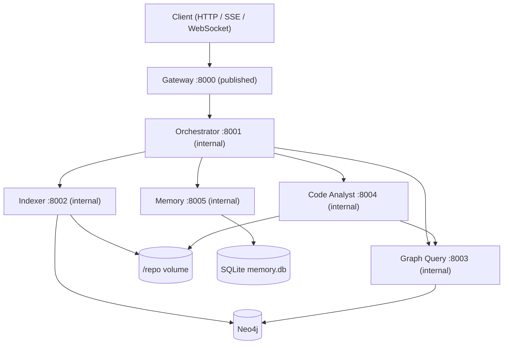
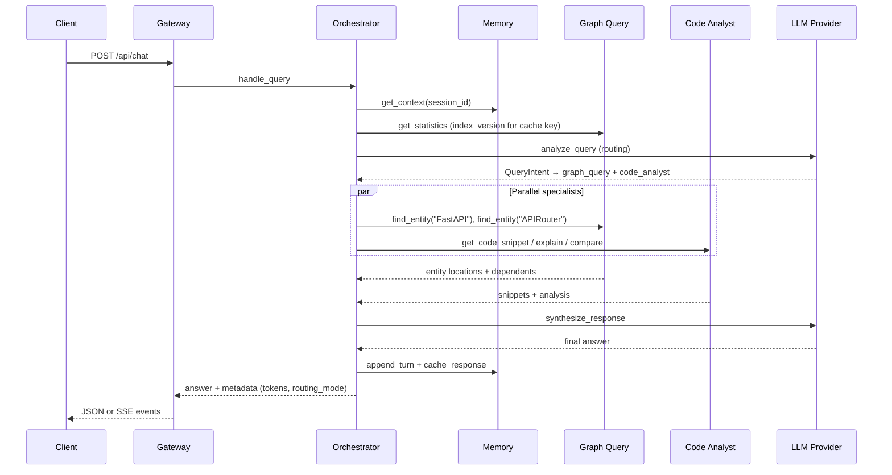

# FastAPI Repository Chat Agent

Five MCP servers (orchestrator, indexer, graph_query, code_analyst, memory) operate over a Neo4j knowledge graph of the [FastAPI](https://github.com/fastapi/fastapi) repository, fronted by a FastAPI gateway, all running in Docker Compose. The orchestrator routes natural-language questions to specialist agents, synthesizes a single answer, and persists conversation plus response cache in SQLite via the Memory agent.

## Overview

The system indexes a cloned Python repository into a typed Neo4j graph (modules, classes, functions, parameters, decorators, imports, docstrings, and their relationships). Users chat through the gateway; the orchestrator decides which agents to invoke, runs them in parallel where possible, and synthesizes a final answer. Context is queried on demand from the graph and Memory agent rather than baked into static prompt files.

### Architecture



### Complex query sequence

Example: *"Compare FastAPI and APIRouter implementations, then show who depends on them"*



---

## Setup

### Quick start

```bash
cp .env.example .env
# Export secrets in your shell (never commit them):
# export OPENROUTER_API_KEY=...
# export NEO4J_PASSWORD=...          # required; compose will not invent a default
# export NEO4J_AUTH=neo4j/$NEO4J_PASSWORD
# export GATEWAY_API_KEY=...         # compose defaults to dev-gateway-key

docker compose up --build -d
curl http://localhost:8000/health
make index          # clone + index FastAPI into Neo4j (~minutes first run)
make smoke          # MCP smoke via compose network: find_entity → get_dependents → explain_implementation
```

Index the graph before asking code questions. The indexer clones `REPO_URL` into the shared `/repo` Docker volume and upserts nodes/relationships into Neo4j.

### `.env.example` walkthrough

| Section | Key variables | Purpose |
| --- | --- | --- |
| Global | `APP_ENV`, `LOG_LEVEL`, `REPO_ROOT`, `REPO_URL` | Runtime profile (`development` / `testing` / `production`), repo clone target. `APP_ENV` loads `.env.{APP_ENV}` over `.env` |
| Neo4j | `NEO4J_URI`, `NEO4J_USER` | Bolt connection. `NEO4J_PASSWORD` / `NEO4J_AUTH` are required at compose time and are never committed |
| Gateway | `GATEWAY_PORT`, `GATEWAY_*_URL`, `GATEWAY_CACHE_TTL_SECONDS`, `GATEWAY_API_KEY`, `GATEWAY_RATE_LIMIT_REQUESTS`, `GATEWAY_RATE_LIMIT_WINDOW_S`, `GATEWAY_MAX_MESSAGE_CHARS` | HTTP bind, MCP upstream URLs, response cache TTL, chat/index API key (compose default `dev-gateway-key`), sliding-window rate limit (HTTP and WebSocket), max chat message size |
| Orchestrator | `ORCH_PORT`, `ORCH_ROUTING_STRATEGY`, `ORCH_RULES_MAX_QUERY_TOKENS`, `ORCH_SYNTHESIS_TIMEOUT_S`, `ORCH_SYNTHESIS_PROMPT_TOKEN_BUDGET`, `ORCH_SYNTHESIS_RESERVE_S`, `ORCH_PLAN_DEADLINE_S`, `ORCH_REQUEST_DEADLINE_S`, `ORCH_REQUEST_TOKEN_BUDGET`, `ORCH_REQUEST_COST_USD_MAX`, `ORCH_BREAKER_*` | Routing mode (`rules_first` default), ambiguity token threshold, synthesis LLM **cap**, time reserved for synthesis so the plan phase cannot starve it, heuristic refinement cutoff, outer request wall-clock, outer token and USD ceilings, per-agent circuit-breaker overrides |
| Indexer | `INDEXER_SKIP_TESTS`, `INDEXER_SKIP_DOCS`, `INDEXER_CLONE_ALLOWED_HOSTS`, `INDEXER_CLONE_ALLOWED_SCHEMES` | Fast profile only: skip `tests/` and `docs/` (default is a full index). Clone URL allowlist (default `https` + `github.com`) |
| Graph Query | `GQ_EMBEDDINGS_ENABLED` | Enable the hash-based lexical fallback (256-dim bag-of-words hash, not a semantic embedding model). Default off; the flag is authoritative even if a provider is injected |
| Code Analyst | `CA_GRAPH_QUERY_URL`, `CA_REPO_ROOT` | Graph lookup MCP URL, read-only source root |
| Memory | `MEM_DB_PATH`, `MEM_RECENT_TURNS`, `MEM_CACHE_TTL_SECONDS` | SQLite path on `memory_data` volume, rolling turn window |
| LLM | `OPENROUTER_MODEL`, `ORCH_MODEL_ROUTING`, `ORCH_MODEL_SYNTHESIS`, `CA_MODEL_ANALYSIS`, `OPENROUTER_BASE_URL`, `LLM_PROMPT_USD_PER_MILLION`, `LLM_COMPLETION_USD_PER_MILLION`, `LLM_CACHED_PROMPT_USD_PER_MILLION`, `LLM_MODEL_PRICES_JSON`, `LLM_PROMPT_CACHE` | Global model (default `anthropic/claude-sonnet-4.5`) for routing/analysis; synthesis defaults to `openai/gpt-4.1-mini`. Per-1M rates for the token ledger; Anthropic prompt caching on static system prompts |
| Observability | `OTEL_EXPORTER_OTLP_ENDPOINT` | OTLP HTTP traces when set; blank disables export |

**Secret precedence:** real environment variables → `.env.{APP_ENV}` overlay (`.env.development` / `.env.production` in the repo contain no secrets) → `.env` → code defaults. Repo env files intentionally exclude `OPENROUTER_API_KEY`, `NEO4J_PASSWORD`, `GATEWAY_API_KEY`, `MCP_SHARED_SECRET`, and `ANTHROPIC_API_KEY`. Compose sets `GATEWAY_API_KEY` (and the MCP shared secret) to `dev-gateway-key` when unset, and **requires** `NEO4J_PASSWORD` / `NEO4J_AUTH`. Agent MCP ports are internal-only; `make smoke` runs inside the compose network.

### Make targets

| Target | Description |
| --- | --- |
| `make up` | `docker compose up --build -d` (copies `.env.example` → `.env` if missing) |
| `make down` | Stop and remove containers |
| `make test` | Offline unit suite only (`pytest -m "not integration and not live"`, ≥79% coverage gate) |
| `make test-all` | Full pytest including integration/live markers |
| `make index` | Trigger `index_repository` inside the indexer container |
| `make smoke` | Day-2 MCP smoke via `docker compose exec` into the gateway (`python -m core.mcp.smoke`) |
| `make smoke-day3` | End-to-end gateway SSE smoke (cache hit + degraded path) via `scripts/smoke_day3.py` |
| `make eval` | Executed-plan routing checks, QA scorecard (offline stub; routing/retrieval only), trap tests |
| `make eval-live` | All 50 `evals/qa.jsonl` cases with a live LLM (`EVAL_PROVIDER=live`); writes the README eval block |
| `make eval-models` | Purpose-aware model bake-off on `evals/qa.jsonl` (routing + synthesis, `--repeats 3`) |
| `make prove-incremental` | Live-stack proof that unchanged files are skipped on re-index |
| `make lint` | `ruff check .` + `mypy` |
| `make tokens-report` | Token usage table for the nine sample queries (StubProvider harness) |

---

## Agents

All agents expose FastMCP tools over streamable HTTP. Business logic lives in `core/`; agent packages are thin adapters.

### Orchestrator (`:8001`)

**Responsibility:** Route queries, execute a specialist set concurrently, synthesize one answer, manage response cache keys (`query + index_version`), and return degraded answers instead of failing the query when specialists or synthesis fail. After a round with insufficient evidence, a heuristic refinement expands keywords/entities and missing agents (not an LLM replan).

**Tools**

| Tool | Signature | Returns |
| --- | --- | --- |
| `health()` | — | `HealthStatus` |
| `get_conversation_context(session_id, token_budget=3000)` | session + budget | `ConversationContext` |
| `analyze_query(query, context)` | NL query + context | `QueryIntent` (always LLM when called directly) |
| `route_to_agents(intent)` | `QueryIntent` | `ExecutionPlan` |
| `synthesize_response(query, agent_outputs, context)` | query + outputs | `str` |
| `handle_query(query, session_id)` | gateway entrypoint | `{answer, metadata}` |

**Design points:** Rules-first routing with LLM escalation on ambiguity (`ORCH_ROUTING_STRATEGY`, `ORCH_RULES_MAX_QUERY_TOKENS`). Cache lookup before routing. In-process token ledger per correlation ID. MCP client of the other four agents. `ExecutionPlan.agents` is a flat specialist set; the executor waits internally when `code_analyst` needs graph coordinates it does not already have. Comparison-shaped queries (`compare` in the text, including mixed “compare then who depends”) call `find_entity`, `compare_implementations`, and only the relationship tools the question names — not the full explanation/analyze/snippet set. Independent graph neighbor lookups still overlap the comparison call. Synthesis prompts are capped by `ORCH_SYNTHESIS_PROMPT_TOKEN_BUDGET` (order chosen from eval quality under budget pressure: snippet bodies, then long lists). If the synthesis LLM times out or errors after tokens have already been streamed, those tokens are returned as a partial answer (`metadata.partial=true`) instead of discarded. With no emitted tokens, `handle_query` returns an evidence-only markdown answer (`metadata.degraded=true`, `evidence_only=true`, `degraded_reason` = exception class) and the gateway responds HTTP 200 rather than discarding retrieved hits. Module citations omit line ranges (class and function ranges are kept). Coreference on follow-up turns is heuristic (pronoun regex + entity carry from recent user turns and the folded summary). The orchestrator FastMCP server uses streamable HTTP SSE (`json_response=False`) so synthesis tokens can leave the process as MCP progress notifications (`ctx.report_progress`). Specialist agents keep `json_response=True` because they do not stream. The gateway `handle_query` client forwards `progress_callback` through the session pool onto the existing SSE/WebSocket `answer` events. Clients that do not negotiate progress still get post-hoc chunks of the finished answer.

**Request budget and latency hierarchy**

These layers share one wall-clock; they are not independent timeouts stacked to 55s+.

1. **Outer request budget** (`RequestBudget` in `core/orchestration/budget.py`) spans routing + every specialist call + synthesis. Ceilings: `ORCH_REQUEST_DEADLINE_S` (default 55s), `ORCH_REQUEST_TOKEN_BUDGET`, `ORCH_REQUEST_COST_USD_MAX`. Spend is read from the token ledger's `cost_usd` (priced per purpose-resolved model via `core.llm.pricing`). When a ceiling trips mid-plan, no new calls are issued and synthesis uses evidence already gathered (`metadata.budget_exhausted` = `deadline` \| `tokens` \| `cost`).
2. **Plan deadline** (`ORCH_PLAN_DEADLINE_S`, default 35s) bounds heuristic refinement rounds. Specialist calls also stop once remaining request time drops to the effective synthesis reserve. `ORCH_SYNTHESIS_RESERVE_S` (default 20s) is the floor for a typical prompt; at runtime the reserve scales with the actual synthesis prompt token count from `core/orchestration/prompt_budget.py` so a bulky mixed (non-comparison) fan-out claims more wall-clock than the constant. Settings validation still requires `plan_deadline_s + synthesis_reserve_s <= request_deadline_s` on the configured constants only, not the scaled runtime reserve: a ~12k-token prompt raises that reserve to roughly 36s, `plan_remaining_s` clamps to zero, and heuristic refinement stops early so retrieval is starved in favour of synthesizing evidence already gathered. The same validation still requires `synthesis_reserve_s − synthesis_safety_margin_s >=` the bake-off synthesis p95 of the resolved `ORCH_MODEL_SYNTHESIS` model. After a full plan the derived synthesis timeout is 18s for a typical prompt, which covers `openai/gpt-4.1-mini` p95 (11.7s) with live-prompt margin; `anthropic/claude-sonnet-4.5` p95 (19.9s) still does not fit, which is why it is not the default synthesizer.
3. **Per-agent MCP timeouts** (`ORCH_GRAPH_QUERY_TIMEOUT_S`, `ORCH_CODE_ANALYST_TIMEOUT_S`, …) are clipped to remaining request time minus the (possibly scaled) synthesis reserve.
4. **Synthesis timeout** is derived: `remaining(request_deadline) − ORCH_SYNTHESIS_SAFETY_MARGIN_S`. `ORCH_SYNTHESIS_TIMEOUT_S` is the typical-prompt cap; large prompts raise that cap so leftover request time is not left unused. Because the plan phase cannot spend the reserve, this derived timeout stays above zero even when planning uses its full deadline.
5. **Per-prompt synthesis token budget** (`ORCH_SYNTHESIS_PROMPT_TOKEN_BUDGET`) is unchanged and only truncates the synthesis prompt.

Synthesis tokens stream from the LLM provider through orchestrator MCP progress notifications (streamable HTTP SSE; `json_response=False` on the orchestrator only) into the existing SSE/WebSocket `answer` events, so time-to-first-token stays under 2s of synthesis start. Clients that do not pass a progress callback, and the non-streaming JSON chat path, still wait for the full answer and then post-hoc chunk it. A timeout or mid-stream error keeps tokens already emitted and marks the answer `partial` rather than replacing it with the evidence-only renderer.

Prometheus: `repochat_synthesis_duration_seconds`, `repochat_time_to_first_token_seconds`, `repochat_budget_exhausted_total{ceiling}`, `repochat_evidence_only_total`.

### Indexer (`:8002`)

**Responsibility:** Clone the target repo, parse Python AST, extract entities/relationships, and batch-upsert into Neo4j. Only agent that writes the graph.

**Tools**

| Tool | Signature | Returns |
| --- | --- | --- |
| `health()` | — | `HealthStatus` |
| `index_repository(repo_url=None, mode="incremental")` | optional URL override; `full` re-parses every file, `incremental` skips unchanged hashes | `IndexReport` |
| `index_file(path)` | repo-relative path | `IndexReport` |
| `parse_python_ast(path_or_code)` | file path or source | `ParsedFile` |
| `extract_entities(path_or_code)` | file path or source | `ExtractedGraph` |
| `get_index_status()` | — | `IndexStatus` (last report + live counts) |

**Design points:** Content-hash incremental indexing at file granularity (`mode="incremental"`, the default). `POST /api/index` `mode="full"` re-parses every file even when hashes match. Stale `:File` nodes whose paths disappeared from the walk are `DETACH DELETE`d. `UNWIND` batched writes. Shared `:Decorator` nodes survive file-subtree deletes. Async lock prevents concurrent full indexes. Default crawl includes `tests/` and `docs/`; set `INDEX_SKIP_TESTS=1` and `INDEX_SKIP_DOCS=1` for a fast profile.

### Graph Query (`:8003`)

**Responsibility:** Read-only Cypher over the knowledge graph. Template queries for common traversals plus guarded ad-hoc Cypher.

**Tools**

| Tool | Signature | Returns |
| --- | --- | --- |
| `health()` | — | `HealthStatus` |
| `find_entity(name, entity_type=None)` | name, phrase, or conceptual query | `EntityQueryResult` (ranked hits tagged `exact` / `fulltext` / `lexical`) |
| `get_dependencies(name)` | qualified name | `NeighborQueryResult` |
| `get_dependents(name)` | qualified name | `NeighborQueryResult` |
| `trace_imports(module, depth=5)` | module + depth cap | `ImportTraceResult` |
| `find_related(name, relationship_type)` | name + rel type | `RelatedQueryResult` |
| `execute_query(cypher, params=None)` | read-only Cypher | `QueryResult` (includes `cypher_executed`, `params`) |
| `get_statistics()` | — | `GraphStatistics` (`index_version`, label/rel counts) |

**Design points:** Write clauses rejected; default `LIMIT` injected. Trusted `CALL db.index.fulltext.queryNodes` is allowed for the `code_search` index over names, qualified names, and docstring text. `find_entity` runs a cascade: exact name, then identifier re-export resolution via `(:Module)-[:IMPORTS]->(:Import)` (so FastAPI-local wrappers such as `WebSocket` / `CORSMiddleware` / `TestClient` / `JSONResponse` rank above unrelated imports), then full-text (package source before tests/docs), then optional hash-based lexical fallback when `GQ_EMBEDDINGS_ENABLED=1`. Hits are ordered by retrieval tier, package vs tests/docs, `fastapi/` locality, and filename affinity to the symbol. Conceptual dependency-injection/resolution questions also look up `Depends`, `get_dependant`, and `solve_dependencies`. The lexical tier is a 256-dim bag-of-words hash (`HashingEmbeddingProvider`), not a semantic embedding model. `:Meta` singleton stores `index_version` for cache invalidation.

### Code Analyst (`:8004`)

**Responsibility:** Read source from `/repo` using graph coordinates, run structured LLM analysis (explain, compare, pattern find).

**Tools**

| Tool | Signature | Returns |
| --- | --- | --- |
| `health()` | — | `HealthStatus` |
| `analyze_function(qualified_name)` | e.g. `fastapi.routing.APIRouter` | `FunctionAnalysis` |
| `analyze_class(qualified_name)` | class FQN | `ClassAnalysis` |
| `find_patterns(pattern)` | `decorator` \| `dependency_injection` \| `factory` | `PatternAnalysis` |
| `get_code_snippet(qualified_name=None, file_path=None, line_start=None, line_end=None)` | name or path range | `SnippetResult` |
| `explain_implementation(qualified_name)` | FQN | `ImplementationExplanation` |
| `compare_implementations(name_a, name_b)` | two FQNs | `ImplementationComparison` |

**Design points:** No direct Neo4j — graph lookup via Graph Query MCP. Path traversal guarded. `find_patterns` supports exactly three fixed Cypher templates. `compare_implementations` clips each snippet to 120 lines before the LLM call so large class pairs (FastAPI / APIRouter) stay inside the specialist timeout.

### Memory (`:8005`)

**Responsibility:** SQLite-backed session memory (rolling summary + recent turns) and opaque response cache keyed by orchestrator.

**Tools**

| Tool | Signature | Returns |
| --- | --- | --- |
| `health()` | — | `HealthStatus` |
| `append_turn(session_id, role, content)` | user/assistant turn | `{status: ok}` |
| `get_context(session_id, token_budget=3000)` | session + budget | `ConversationContext` |
| `summarize_session(session_id)` | fold older turns | `{summary}` |
| `cache_response(cache_key, response_json)` | caller-computed key | `{status: ok}` |
| `get_cached_response(cache_key)` | key | `CachedResponse \| null` |

**Design points:** Idempotent `folded_at` migration prevents double-summarization. Cache TTL configurable per agent. Data persisted on `memory_data` Docker volume. Multi-turn coreference is heuristic: regex pronoun detection plus entity carry from recent user turns and the folded session summary. It is not model-based resolution.

---

## Gateway API

Base URL: `http://localhost:8000`. Compose sets `GATEWAY_API_KEY` to `dev-gateway-key` by default. Pass `X-API-Key: <key>` on all routes except `GET /health`, `GET /api/agents/health`, and the OpenAPI docs. `GET /metrics` requires the API key when one is configured. Agent MCP servers share the same secret (`MCP_SHARED_SECRET`) — including their `/metrics` routes — and are not published to the host.

| Method | Path | Description |
| --- | --- | --- |
| `POST` | `/api/chat` | Chat (JSON body; `stream=true` for SSE) |
| `GET` | `/ws/chat` | WebSocket chat (same event protocol) |
| `POST` | `/api/index` | Start background index job (`mode`: `incremental` hash-skip or `full` re-parse) |
| `GET` | `/api/index/status/{job_id}` | Poll index job status |
| `GET` | `/api/agents/health` | Per-agent health aggregation |
| `GET` | `/api/graph/statistics` | Graph counts + `index_version` |
| `GET` | `/health` | Alias for agents health |
| `GET` | `/metrics` | Prometheus metrics (request count, latency, errors, cache, LLM tokens/cost) |

Chat messages are capped at 8,000 characters (`GATEWAY_MAX_MESSAGE_CHARS`; `422` when exceeded). The gateway applies a sliding-window rate limit (`GATEWAY_RATE_LIMIT_REQUESTS` / `GATEWAY_RATE_LIMIT_WINDOW_S`, default 60 requests per 60s) to HTTP routes **and** to `/ws/chat` (handshake and each message) and returns `429` / WebSocket close `1008` when exceeded. Each agent and the gateway expose `GET /metrics` behind the API key. OpenTelemetry spans share the request `correlation_id` across MCP calls so one chat query is a single trace (`OTEL_EXPORTER_OTLP_ENDPOINT` to export). Interactive OpenAPI is at `/docs`.

### Examples

**Chat (JSON)**

```bash
curl -s http://localhost:8000/api/chat \
  -H 'Content-Type: application/json' \
  -H 'X-API-Key: dev-gateway-key' \
  -d '{"message":"What is the FastAPI class?","session_id":"demo-1"}' | jq .
```

**Chat (SSE)**

```bash
curl -N http://localhost:8000/api/chat \
  -H 'Content-Type: application/json' \
  -H 'X-API-Key: dev-gateway-key' \
  -d '{"message":"What is the FastAPI class?","stream":true}'
```

**WebSocket** — connect to `ws://localhost:8000/ws/chat` with `X-API-Key: dev-gateway-key`. Auth and the rate limiter run on the handshake; each subsequent JSON message is also rate-limited. Send JSON shaped like `ChatRequest`:

```json
{"message": "What is the FastAPI class?", "session_id": "demo-1"}
```

**Start index job**

```bash
curl -s http://localhost:8000/api/index \
  -H 'Content-Type: application/json' \
  -H 'X-API-Key: dev-gateway-key' \
  -d '{"mode":"incremental"}' | jq .
```

**Index job status**

```bash
curl -s http://localhost:8000/api/index/status/<job_id> \
  -H 'X-API-Key: dev-gateway-key' | jq .
```

**Agents health**

```bash
curl -s http://localhost:8000/api/agents/health | jq .
```

**Graph statistics**

```bash
curl -s http://localhost:8000/api/graph/statistics \
  -H 'X-API-Key: dev-gateway-key' | jq .
```

### SSE / WebSocket event protocol

Both transports emit the same four event types in order:

| Event | Payload highlights |
| --- | --- |
| `routing` | `routing_mode`, `agents`, `cached`, `degraded` |
| `agent_result` | `agent`, `ok`, `cached`, `degraded` |
| `answer` | `chunk` (live synthesis token when the orchestrator MCP session negotiates progress; otherwise the gateway splits the finished answer at `GATEWAY_ANSWER_CHUNK_CHARS`) |
| `done` | `latency_ms`, `cached`, `degraded`, `routing_mode`, `tokens` (`total`, `prompt`, `completion`, `cached_prompt`, `uncached_prompt`, `llm_calls`, `cost_usd`, `by_purpose`, `by_model`); when synthesis fell back, also `evidence_only`, `degraded_reason`, and optionally `prompt_truncated`; when tokens already streamed were kept, also `partial` |

**SSE format:** `event: <type>\ndata: {"type":"<type>","correlation_id":"...","..."}\n\n`

**WebSocket format:** `{"type":"<type>","correlation_id":"...","data":{...}}`

Every response includes an `x-correlation-id` header for log correlation.

### Security

- **Auth.** `X-API-Key` is required on chat, index, graph, metrics, and WebSocket when `GATEWAY_API_KEY` is set. `GET /health` and `GET /api/agents/health` stay unauthenticated for probes. Agent MCP `/metrics` uses the same shared secret.
- **Rate limits.** The sliding-window limiter applies to HTTP middleware, the `/ws/chat` handshake, and each WebSocket message.
- **Clone SSRF.** Indexer `repo_url` must be `https` to a host in `INDEXER_CLONE_ALLOWED_HOSTS` (default `github.com`). `file://`, `http://`, SSH, and `git@` remotes are rejected in `core` before git runs.
- **Secrets.** No Neo4j password default in code or Compose. Committed `.env.example`, `.env.development`, and `.env.production` omit secret values.

---

## Design decisions and trade-offs

**Framework-free core with thin MCP adapters.** Parsing, Cypher, routing, LLM logic, and the Code Analyst's Graph Query client live in `core/`; agent packages only wire FastMCP transport. The analyst lookup uses the same pooled, circuit-breaker-protected MCP session as the orchestrator. Rejected embedding that logic inside agent packages, which would couple business rules to MCP and hinder unit testing.

**Streamable HTTP per agent container.** Each agent is an independent Docker service on an internal port. Rejected a single-process stdio MCP multiplex that would prevent independent scaling and health checks. Host publish is gateway `:8000` only.

**MCP health probes instead of TCP sockets.** Docker healthchecks call each agent's MCP `health` tool: Neo4j for `graph_query`, SQLite for `memory`, `/repo` plus graph_query reachability for `code_analyst`, downstream aggregation for `orchestrator`. Rejected bare TCP port opens that report healthy while dependencies are down.

**Shared-secret MCP mesh.** Compose sets `GATEWAY_API_KEY` (default `dev-gateway-key`) and reuses it as `MCP_SHARED_SECRET` so agents are not callable without the key even on the Docker network.

**Restricted Neo4j access.** Only indexer (writes) and graph_query (reads) open Neo4j sessions. Rejected letting every agent connect directly, which would blur write/read boundaries.

**Batched Neo4j writes with `UNWIND`.** Bulk upserts amortize round-trips during indexing. Rejected per-row individual Cypher transactions.

**File-granularity incremental indexing.** Content hashes skip unchanged files on re-index (`mode=incremental`). `mode=full` on `POST /api/index` (and the indexer tool) re-parses every file. Rejected treating the public `mode` parameter as documentation-only.

**Single specialist set, not multi-phase plans.** `ExecutionPlan.agents` is a flat list. The executor already sequences `code_analyst` behind `graph_query` when the analyst lacks coordinates. A second plan phase would duplicate that wait, and the router never emitted more than one phase, so nested `phases` was decoration.

**Heuristic evidence-driven refinement, not LLM replanning.** After a round, keyword/entity expansion and missing-agent suggestions produce a follow-up plan. No second routing LLM call.

**Plan starvation under a scaled synthesis reserve.** Settings validation only checks `plan_deadline_s + synthesis_reserve_s <= request_deadline_s` on the configured constants. At runtime a ~12k-token prompt scales the reserve to roughly 36s, so `plan_remaining_s` clamps to zero and heuristic refinement stops early. Retrieval is deliberately starved in favour of synthesizing evidence already gathered.

**Hash-based lexical fallback, not embedding retrieval.** The third `find_entity` tier uses `HashingEmbeddingProvider` (256-dim bag-of-words hash) behind `GQ_EMBEDDINGS_ENABLED` (default off; the flag is authoritative). A real embedding model is future work; the `EmbeddingProvider` protocol stays as the seam.

**Module citations use the header span.** Module nodes store the docstring or leading-import range, not `1–<file length>`. Citations omit line ranges for Module hits. Class and function line numbers are unchanged.

**Heuristic multi-turn coreference.** Pronoun detection plus entity carry from prior user turns and the folded session summary. Not model-based coreference.

**First-class graph nodes for parameters, decorators, imports, docstrings.** Queries traverse typed nodes and relationships. Rejected storing these only as scalar properties on code nodes.

**Shared decorator nodes.** `:Decorator` nodes are excluded from file-subtree deletes so reused decorators survive reindex. Rejected deleting decorators with the owning file subtree.

**Guarded read-only Cypher.** User-facing `execute_query` rejects writes and injects `LIMIT`. Rejected raw user Cypher with no guard or cap.

**Best-effort `CALLS` resolution by name.** Call sites are linked without full type inference. Rejected waiting for perfect resolution before emitting any `CALLS` edges.

**LLMProvider protocol + StubProvider.** All LLM calls go through one interface; tests use deterministic stubs. Rejected real API calls in unit tests.

**Auditable guarded queries.** `execute_query` returns `cypher_executed` and `params` so callers can verify LIMIT injection. Rejected logging-only audit trails.

**Offline-green test contract.** `make test` excludes `integration` and `live` markers and runs without Docker, Neo4j, or API keys. Rejected relying solely on runtime skipif checks without marker-based exclusion.

**On-demand context, not static prompt files.** Repository knowledge lives in the Neo4j graph; conversational state lives in the Memory agent. Both are queried per request rather than loaded into every prompt upfront, so context is paid for only when needed.

**Response cache keyed by `query + index_version`.** The orchestrator normalizes the query, reads `index_version` from `get_statistics`, and stores answers in Memory. Re-indexing bumps the version and automatically invalidates stale cache entries.

**Degradation policy (HTTP status is exact).** Specialist timeouts and errors during retrieval still produce an answer: HTTP 200 with `degraded: true` and an incomplete-retrieval prefix when graph_query or code_analyst failed. Synthesis LLM timeout or error also returns HTTP 200: the orchestrator renders retrieved entity hits, dependents, and snippets as markdown (`evidence_only: true`, `degraded_reason` is the exception class name such as `TimeoutError`). Successful retrieval is never discarded because synthesis failed. `AgentUnavailableError` and `CircuitBreakerOpenError` (orchestrator MCP unreachable or a specialist breaker open) are HTTP 503. `GraphLookupError` is HTTP 503. `RoutingError` and `SchemaValidationError` are HTTP 422. Unhandled errors in the gateway itself are HTTP 500. A leaked `SynthesisError` that escapes `handle_query` is still mapped to HTTP 503; the synthesizer path itself no longer raises that error. These error bodies are declared on `/api/chat` in OpenAPI as `GatewayErrorBody`.

**Idempotent session folding.** A nullable `folded_at` column on SQLite turns prevents re-summarizing already folded history. Rejected deleting old turns immediately after summarization.

**Singleton `:Meta` for index metadata.** `index_version` and `last_indexed_at` are stored on one node keyed by `key`. Rejected deriving version ad hoc from file nodes on every statistics read.

**Secret filtering from repo env files.** Overlay config files (`.env.development`, `.env.production`) remain ergonomic while API keys and passwords must be exported. Rejected loading secrets from committed `.env*` files.

**Clone URL allowlist.** `clone_repo` rejects anything that is not `https` to an allowlisted host (default `github.com`) before spawning git. `file://`, link-local `http://`, and `git@` / SSH remotes are errors (`UnsafeCloneUrlError`). SSH is not enabled: it can target internal SSH endpoints and is a common metacharacter-injection vehicle; HTTPS to GitHub is enough for the default FastAPI clone.

**No default Neo4j password.** `GraphSettings` requires `NEO4J_PASSWORD`. Compose interpolates `NEO4J_AUTH` / `NEO4J_PASSWORD` with no fallback value.

**Entity extraction in fallback routing.** When LLM routing fails, rule-based fallback still extracts likely entities for specialist lookups. Rejected silent no-op specialists on routing failure.

**Deterministic rule-based routing for golden evals.** Simple lookups route to `graph_query` only; multi-part analysis escalates to LLM routing with multiple agents. Rejected defaulting most queries to mixed multi-agent plans.

**Synthesis short-circuit for absent entities.** When graph and snippet lookups find nothing, synthesis returns an honest out-of-repo message without calling the LLM. Rejected always prompting the LLM with empty results (hallucination risk on trap queries).

**Unified eval entrypoint.** `make eval` runs executed-plan routing checks, the QA scorecard, and trap pytest in one pass. Rejected separate manual eval commands.

**CI eval with host-cloned FastAPI.** The eval job clones FastAPI on the runner and indexes via Docker Compose so trap tests see both host-readable paths and the live graph. Rejected container-only repo volumes for integration evals.

**Rules-first routing with LLM escalation.** Cheap deterministic routing handles simple queries; ambiguous or long queries call the LLM router. Rejected always routing through the LLM first.

**In-process token ledger.** Per-request token totals are accumulated and emitted in gateway `done` events, including the resolved model, cached vs uncached prompt tokens, and per-model cost. Rejected provider-only logs with no request-level aggregation.

**Purpose-aware model selection.** `complete(purpose=...)` selects `ORCH_MODEL_ROUTING`, `ORCH_MODEL_SYNTHESIS`, or `CA_MODEL_ANALYSIS`. Routing and analysis fall back to `OPENROUTER_MODEL` (`anthropic/claude-sonnet-4.5`); synthesis defaults to `openai/gpt-4.1-mini`. Routing stays on sonnet-4.5 because it passes 61% of routing traps versus 33% for gpt-4.1-mini. Synthesis uses gpt-4.1-mini because the bake-off measured 89% quality at 11,714 ms p95 and $1.18/1k versus sonnet-4.5's 82% at 19,943 ms and $14.43/1k, with the same 83% trap pass rate.

**Unmeasured synthesis-reserve slope.** `REFERENCE_SYNTHESIS_PROMPT_TOKENS` (4000) and `SYNTHESIS_EXTRA_SECONDS_PER_TOKEN` (0.002) are unmeasured engineering defaults. The bake-off recorded p95 per model, not a latency-versus-prompt-size slope; a fitted slope from per-case bake-off latency and prompt tokens would validate them.

**Prompt caching on static system prompts.** Anthropic models send `cache_control: ephemeral` on the first system message. Cached vs uncached input tokens are recorded separately in the ledger.

---

## Testing and evaluation

### Fresh-clone guarantee

`make test` is guaranteed to pass from a fresh clone without a `.env` file or running Docker Compose containers: StubProvider everywhere, no Neo4j required, coverage gate ≥79% on `core`, `orchestrator`, `indexer`, `graph_query`, `code_analyst`, `memory`, and `gateway`.

### Marker taxonomy

| Marker | Requires | Included in |
| --- | --- | --- |
| *(none)* | nothing | `make test`, `make test-all` |
| `integration` | `NEO4J_URI`, indexed graph, often `REPO_ROOT` | `make test-all`, trap evals via `make eval` |
| `live` | full Docker Compose stack | `make test-all` |

### Coverage

Offline suite (`make test`, 2026-08-19). Combined coverage is measured on `core`, `orchestrator`, `indexer`, `graph_query`, `code_analyst`, `memory`, and `gateway`:

```
TOTAL    8192 statements    86.63% coverage (gate: 79%)
424 passed, 14 deselected
```

Split from the same `.coverage` data (branch-aware):

| Scope | Statements | Coverage |
| --- | ---: | ---: |
| `core/src/core` | 7459 | 86.07% |
| Five agent `__main__.py` adapters | 364 | 95.26% |
| Agent packages + gateway (`orchestrator`, `indexer`, `graph_query`, `code_analyst`, `memory`, `gateway`) | 733 | 93.38% |
| `gateway/src/gateway/mcp_client.py` | 114 | 98.46% |

Adapter `__main__.py` packages individually: `code_analyst` 97%, `graph_query` 97%, `indexer` 98%, `memory` 97%, `orchestrator` 89% (`orchestrator.service` is a 2-statement re-export at 100%). Gateway `app.py` is 89%. Orchestrator `handle_query` lives in `core.orchestration.service`.

### Request budget eval

`scripts/eval_qa.py` runs the QA scorer twice over `evals/qa.jsonl` (outer request budgets enabled vs disabled) and fails if any tier's citation-precision or groundedness drops. Truncation order under a tight prompt budget is scored with `repo_root` (and the graph when available) so Sources `file:line` citations actually resolve — a 0% figure next to a 1.00 was a scorer bug, not a measurement. Latency p50/p95 on the enabled run use `core.eval.model_bakeoff.percentile`. `make eval` is **provider: offline (stub answers — routing/retrieval only)**; `make eval-live` regenerates the scorecard below with a live LLM over all 50 labelled cases in `evals/qa.jsonl` (including trap and multi-turn).

### Model selection

`OPENROUTER_MODEL` remains `anthropic/claude-sonnet-4.5` for routing. `ORCH_MODEL_SYNTHESIS` defaults to `openai/gpt-4.1-mini` (89% synthesis quality, 11.7s p95, 12× cheaper than sonnet-4.5, and it fits the 14s reserved synthesis window where sonnet's 19.9s p95 does not). Routing stays on sonnet-4.5 because its routing trap pass rate is 61% versus 33% for gpt-4.1-mini. Blank `ORCH_MODEL_ROUTING` / `CA_MODEL_ANALYSIS` fall back to the global model. `make eval-models` re-runs `scripts/eval_models.py --repeats 3` at temperature 0 and refreshes the tables. Export `OPENROUTER_API_KEY` in the shell (repo `.env` files do not load that secret). Frozen synthesis payloads are in `tests/fixtures/synthesis_payloads.jsonl`.

<!-- BEGIN_MODEL_BAKEOFF -->
Generated by `python scripts/eval_models.py` on 2026-08-19. Routing stays on `anthropic/claude-sonnet-4.5` because it passes 61% of routing traps versus 33% for `openai/gpt-4.1-mini`. Synthesis uses `openai/gpt-4.1-mini`: 89% quality vs sonnet-4.5's 82%, 11,714 ms p95 vs 19,943 ms, $1.18 vs $14.43 per 1k queries, and the same 83% trap pass rate.

Per-purpose overrides: `ORCH_MODEL_ROUTING`, `ORCH_MODEL_SYNTHESIS`, `CA_MODEL_ANALYSIS` (routing and analysis fall back to `OPENROUTER_MODEL`; synthesis defaults to `openai/gpt-4.1-mini`).

### Routing

Repeats=3 at temperature 0 over 58 queries. Values are mean ± half-range across repeats. Prices as of 2026-08-18.

- Router bake-off calls the routing prompt directly; Neo4j is not used.
- Production routing is rules-first; this table scores the LLM router in isolation.
- Quality is exact-match on expected_agents (set equality).
- Schema-failure rate is 1 − first-attempt schema-validity.

| Model | Quality score | Trap pass rate | Schema-failure rate | p95 latency | Cost / 1000 queries | Price used |
| --- | ---: | ---: | ---: | ---: | ---: | --- |
| `anthropic/claude-sonnet-4.5` | 52% | 61% ± 8% | 0% | 5284 ± 273 ms | $5.5197 ± $0.0089 | anthropic/claude-sonnet-4.5: $3.00 in / $15.00 out / $0.300 cached per 1M (as of 2026-08-18) |
| `anthropic/claude-haiku-4.5` | 63% | 50% | 0% | 2915 ± 150 ms | $0.9123 ± $0.0001 | anthropic/claude-haiku-4.5: $0.50 in / $2.50 out / $0.050 cached per 1M (as of 2026-08-18) |
| `openai/gpt-4.1-mini` | 68% ± 1% | 33% | 0% | 2489 ± 272 ms | $0.2424 ± $0.0005 | openai/gpt-4.1-mini: $0.40 in / $1.60 out / $0.100 cached per 1M (as of 2026-08-18) |

### Synthesis

Repeats=3 at temperature 0 over 58 queries. Values are mean ± half-range across repeats. Prices as of 2026-08-18.
Retrieval payloads captured 2026-08-18.

- Synthesis bake-off replays frozen agent_outputs; retrieval is not re-run.
- Quality is the mean of citation precision and groundedness on non-trap turns.
- Trap pass rate is refusal correctness. Synthesis is free-text (schema-failure 0).
- Citations must resolve in the graph when a graph client is provided.

| Model | Quality score | Trap pass rate | Schema-failure rate | p95 latency | Cost / 1000 queries | Price used |
| --- | ---: | ---: | ---: | ---: | ---: | --- |
| `anthropic/claude-sonnet-4.5` | 82% ± 1% | 83% | 0% | 19943 ± 50 ms | $14.4324 ± $0.0587 | anthropic/claude-sonnet-4.5: $3.00 in / $15.00 out / $0.300 cached per 1M (as of 2026-08-18) |
| `anthropic/claude-haiku-4.5` | 84% | 83% | 0% | 9068 ± 462 ms | $2.7190 ± $0.0007 | anthropic/claude-haiku-4.5: $0.50 in / $2.50 out / $0.050 cached per 1M (as of 2026-08-18) |
| `openai/gpt-4.1-mini` | 89% ± 1% | 83% | 0% | 11714 ± 808 ms | $1.1775 ± $0.3431 | openai/gpt-4.1-mini: $0.40 in / $1.60 out / $0.100 cached per 1M (as of 2026-08-18) |

<!-- END_MODEL_BAKEOFF -->

<!-- BEGIN_EVAL_REPORT -->
Generated by `make eval-live` on 2026-08-19 from `handle_query` metadata (`tools_invoked`, tokens, latency), not from the router’s intent.

### Live quality measurement

**provider: live**

LLM-backed synthesis over every labelled case in `evals/qa.jsonl` (simple, medium, complex, trap, and multi-turn). Citation precision and groundedness exclude turns with no citations / no checkable claims rather than scoring empty output as 1.00. Groundedness is a token-level fraction; the pass gate is 0.70, one decimal below the 2026-08-19 live claim-level mean of 0.74.

| Tier | n | Pass rate | Executed agents | Retrieval | Citation precision | Groundedness | Entity recall | Degraded fails |
| --- | ---: | ---: | ---: | ---: | ---: | ---: | ---: | ---: |
| simple | 12 | 92% | 100% | 100% | 98% | 84% | 100% | 0 |
| medium | 12 | 100% | 100% | 100% | 100% | 97% | 100% | 0 |
| complex | 12 | 92% | 100% | 100% | 100% | 98% | 100% | 0 |
| trap | 6 | 100% (refusal 100%) | 100% | 100% | — (6 excl.) | 39% | 100% | 0 |
| multi-turn | 16 | 75% | 100% | 91% | 100% | 86% | 94% | 0 |

| Metric | Score | n | Status | Detail |
| --- | ---: | ---: | --- | --- |
| `hard_executed_agents` | 1.00 | 58 | PASS | 58/58 turns matched expected_agents via tools_invoked |
| `hard_non_trap_not_degraded` | 1.00 | 52 | PASS | 52/52 non-trap turns not evidence-only/degraded |
| `refusal_accuracy` | 1.00 | 6 | PASS | 6/6 traps refused |
| `citation_precision` | 0.99 | 52 | FAIL | 50/52 scored non-trap turns (0 excluded: no citations) |
| `groundedness` | 0.91 | 52 | PASS | mean 0.91 vs gate 0.70; 50/52 turns ≥ gate (0 excluded: no checkable claims) |
| `entity_recall` | 0.98 | 52 | FAIL | 51/52 non-trap turns |
| `retrieval_correctness` | 0.97 | 52 | FAIL | 50/52 non-trap turns |

Versus the previous full live run on the same 58 turns (2026-08-19, before re-export ranking, comparison fan-out, and snippet clipping): retrieval 0.86 → 0.97 (43/52 → 50/52), groundedness 0.88 → 0.91, degraded `c01` cleared (`hard_non_trap_not_degraded` 0.98 → 1.00). Citation precision stayed 0.99; entity recall stayed 51/52. Total LLM cost $0.2883 → $0.3600 (+25%); tokens 292,151 → 492,440; mean latency 15,920 ms → 14,835 ms. Targeted retrieval misses `s10`, `m04`, `m08`, `m10`, `c10`, and both `mt06` turns now pass; `c01` synthesis completed. Remaining live FAILs are grounding (`s06`, `c12`, `mt01` turn 2, `mt05` turn 1) and follow-up retrieval (`mt03`/`mt04` turn 2).

### Per-turn layer verdicts (live)

Retrieval FAIL means the executed agents missed the label or the specialist payloads did not contain the labelled files (entity recall can still be 1.00 when a test fixture mentions the same symbol). Synthesis FAIL means the LLM timed out, errored, or returned an evidence-only dump; grounding FAIL means citation precision or token-level groundedness missed the calibrated gate even when retrieval and synthesis succeeded.

Agents are taken from `metadata.tools_invoked` after the plan ran.

| Case | Query | Expected agents | Agents invoked | Mode | Latency ms | Tokens | Cost | Retrieval | Synthesis | Grounding |
| --- | --- | --- | --- | --- | ---: | ---: | ---: | --- | --- | --- |
| `s01` | What is the FastAPI class? | `graph_query` | `graph_query` | `rules` | 6183 | 10548 | $0.0046 | PASS | PASS | PASS |
| `s02` | What classes inherit from APIRouter? | `graph_query` | `graph_query` | `rules` | 4078 | 11150 | $0.0047 | PASS | PASS | PASS |
| `s03` | What is APIRouter? | `graph_query` | `graph_query` | `rules` | 3646 | 8033 | $0.0035 | PASS | PASS | PASS |
| `s04` | Where is get_openapi? | `graph_query` | `graph_query` | `rules` | 2580 | 745 | $0.0005 | PASS | PASS | PASS |
| `s05` | What is HTTPException? | `graph_query` | `graph_query` | `rules` | 5251 | 10489 | $0.0045 | PASS | PASS | PASS |
| `s06` | Find BackgroundTasks | `graph_query` | `graph_query` | `rules` | 6467 | 2612 | $0.0016 | PASS | PASS | FAIL |
| `s07` | What is UploadFile? | `graph_query` | `graph_query` | `rules` | 5222 | 5448 | $0.0025 | PASS | PASS | PASS |
| `s08` | What is APIRoute? | `graph_query` | `graph_query` | `rules` | 5048 | 3788 | $0.0019 | PASS | PASS | PASS |
| `s09` | Who depends on FastAPI? | `graph_query` | `graph_query` | `rules` | 6028 | 10046 | $0.0046 | PASS | PASS | PASS |
| `s10` | What is WebSocket? | `graph_query` | `graph_query` | `rules` | 6425 | 4607 | $0.0022 | PASS | PASS | PASS |
| `s11` | List Query | `graph_query` | `graph_query` | `rules` | 9313 | 10787 | $0.0051 | PASS | PASS | PASS |
| `s12` | What is Depends? | `graph_query` | `graph_query` | `rules` | 7445 | 9655 | $0.0045 | PASS | PASS | PASS |
| `m01` | How does dependency injection work and show me examples from the codebase | `graph_query`, `code_analyst` | `graph_query`, `code_analyst` | `llm` | 33314 | 11596 | $0.0107 | PASS | PASS | PASS |
| `m02` | Explain how get_openapi is implemented in the codebase | `graph_query`, `code_analyst` | `graph_query`, `code_analyst` | `llm` | 26952 | 12058 | $0.0104 | PASS | PASS | PASS |
| `m03` | How does FastAPI handle middleware and show me the implementation | `graph_query`, `code_analyst` | `graph_query`, `code_analyst` | `llm` | 28383 | 12034 | $0.0106 | PASS | PASS | PASS |
| `m04` | Explain CORSMiddleware implementation in the codebase | `graph_query`, `code_analyst` | `graph_query`, `code_analyst` | `llm` | 15800 | 3368 | $0.0071 | PASS | PASS | PASS |
| `m05` | How does lifespan work in FastAPI source | `graph_query`, `code_analyst` | `graph_query`, `code_analyst` | `llm` | 26046 | 11560 | $0.0103 | PASS | PASS | PASS |
| `m06` | Explain how APIRouter includes routes and show me the implementation in the codebase | `graph_query`, `code_analyst` | `graph_query`, `code_analyst` | `llm` | 27637 | 11703 | $0.0105 | PASS | PASS | PASS |
| `m07` | Explain HTTPException implementation in the codebase | `graph_query`, `code_analyst` | `graph_query`, `code_analyst` | `llm` | 24246 | 10736 | $0.0097 | PASS | PASS | PASS |
| `m08` | How does dependency resolution work in the codebase | `graph_query`, `code_analyst` | `graph_query`, `code_analyst` | `llm` | 28072 | 12887 | $0.0106 | PASS | PASS | PASS |
| `m09` | Explain TestClient implementation with examples from the source | `graph_query`, `code_analyst` | `graph_query`, `code_analyst` | `llm` | 13946 | 12015 | $0.0104 | PASS | PASS | PASS |
| `m10` | How does WebSocket routing work in the codebase | `graph_query`, `code_analyst` | `graph_query`, `code_analyst` | `llm` | 11476 | 11976 | $0.0104 | PASS | PASS | PASS |
| `m11` | Explain OAuth2PasswordBearer implementation in the codebase | `graph_query`, `code_analyst` | `graph_query`, `code_analyst` | `llm` | 28920 | 9559 | $0.0098 | PASS | PASS | PASS |
| `m12` | How does APIRoute serialize responses and show me the source | `graph_query`, `code_analyst` | `graph_query`, `code_analyst` | `llm` | 28502 | 11334 | $0.0106 | PASS | PASS | PASS |
| `c01` | Compare FastAPI and APIRouter implementations in the codebase | `graph_query`, `code_analyst` | `graph_query`, `code_analyst` | `llm` | 25039 | 12022 | $0.0106 | PASS | PASS | PASS |
| `c02` | Explain how get_openapi is implemented and who calls it | `graph_query`, `code_analyst` | `graph_query`, `code_analyst` | `llm` | 31955 | 11907 | $0.0109 | PASS | PASS | PASS |
| `c03` | Reindex the repository and explain dependency injection examples in the codebase | `indexer`, `graph_query`, `code_analyst` | `indexer`, `graph_query`, `code_analyst` | `llm` | 27291 | 11813 | $0.0109 | PASS | PASS | PASS |
| `c04` | Reindex the repository and trace how APIRouter imports connect to FastAPI | `indexer`, `graph_query`, `code_analyst` | `indexer`, `graph_query`, `code_analyst` | `llm` | 30917 | 12329 | $0.0112 | PASS | PASS | PASS |
| `c05` | Compare FastAPI and APIRouter implementations, then show who depends on them | `graph_query`, `code_analyst` | `graph_query`, `code_analyst` | `llm` | 31657 | 12478 | $0.0115 | PASS | PASS | PASS |
| `c06` | Explain how dependency injection, APIRouter, and get_openapi connect across the codebase | `graph_query`, `code_analyst` | `graph_query`, `code_analyst` | `llm` | 30081 | 12552 | $0.0112 | PASS | PASS | PASS |
| `c07` | Compare Depends and Security implementations in the codebase | `graph_query`, `code_analyst` | `graph_query`, `code_analyst` | `llm` | 20015 | 11530 | $0.0100 | PASS | PASS | PASS |
| `c08` | Trace how APIRouter imports connect to FastAPI, then show who depends on them in the codebase | `graph_query`, `code_analyst` | `graph_query`, `code_analyst` | `llm` | 33700 | 12660 | $0.0111 | PASS | PASS | PASS |
| `c09` | Explain how routing, OpenAPI, and dependencies connect across the codebase | `graph_query`, `code_analyst` | `graph_query`, `code_analyst` | `llm` | 14386 | 11069 | $0.0104 | PASS | PASS | PASS |
| `c10` | Compare JSONResponse and HTMLResponse implementations then who depends on them | `graph_query`, `code_analyst` | `graph_query`, `code_analyst` | `llm` | 12887 | 11446 | $0.0101 | PASS | PASS | PASS |
| `c11` | Reindex the repository and compare FastAPI and APIRouter implementations | `indexer`, `graph_query`, `code_analyst` | `indexer`, `graph_query`, `code_analyst` | `llm` | 26923 | 12179 | $0.0111 | PASS | PASS | PASS |
| `c12` | Explain how WebSocket and APIRoute connect across the codebase and who calls them | `graph_query`, `code_analyst` | `graph_query`, `code_analyst` | `llm` | 20681 | 11582 | $0.0106 | PASS | PASS | FAIL |
| `t01` | How does Django's ORM lazy-load querysets? | `graph_query`, `code_analyst` | `graph_query`, `code_analyst` | `rules` | 62 | 0 | $0.0000 | PASS | PASS | PASS |
| `t02` | Explain React's useEffect cleanup | `graph_query`, `code_analyst` | `graph_query`, `code_analyst` | `rules` | 58 | 0 | $0.0000 | PASS | PASS | PASS |
| `t03` | How does Rails ActiveRecord implement callbacks? | `graph_query`, `code_analyst` | `graph_query`, `code_analyst` | `rules` | 64 | 0 | $0.0000 | PASS | PASS | PASS |
| `t04` | Explain Kubernetes pod scheduling | `graph_query`, `code_analyst` | `graph_query`, `code_analyst` | `rules` | 63 | 0 | $0.0000 | PASS | PASS | PASS |
| `t05` | How does PostgreSQL write-ahead logging work? | `graph_query`, `code_analyst` | `graph_query`, `code_analyst` | `rules` | 33 | 0 | $0.0000 | PASS | PASS | PASS |
| `t06` | Explain TensorFlow GradientTape internals | `graph_query`, `code_analyst` | `graph_query`, `code_analyst` | `rules` | 77 | 0 | $0.0000 | PASS | PASS | PASS |
| `mt01` | What is the FastAPI class? | `graph_query` | `graph_query` | `rules` | 2872 | 10364 | $0.0013 | PASS | PASS | PASS |
| `mt01` | What about its parameters? | `graph_query` | `graph_query` | `rules` | 5192 | 9518 | $0.0043 | PASS | PASS | FAIL |
| `mt02` | What is APIRouter? | `graph_query` | `graph_query` | `rules` | 4329 | 8107 | $0.0013 | PASS | PASS | PASS |
| `mt02` | Who depends on it? | `graph_query` | `graph_query` | `rules` | 7167 | 9730 | $0.0046 | PASS | PASS | PASS |
| `mt03` | Where is get_openapi? | `graph_query` | `graph_query` | `rules` | 1866 | 684 | $0.0004 | PASS | PASS | PASS |
| `mt03` | Explain how that is implemented in the codebase | `graph_query`, `code_analyst` | `graph_query`, `code_analyst` | `llm` | 48324 | 10467 | $0.0099 | FAIL | PASS | PASS |
| `mt04` | What is Depends? | `graph_query` | `graph_query` | `rules` | 4163 | 9496 | $0.0015 | PASS | PASS | PASS |
| `mt04` | Show me examples of that from the codebase | `graph_query`, `code_analyst` | `graph_query`, `code_analyst` | `rules` | 23751 | 9543 | $0.0044 | FAIL | PASS | PASS |
| `mt05` | What is HTTPException? | `graph_query` | `graph_query` | `rules` | 5418 | 10486 | $0.0045 | PASS | PASS | FAIL |
| `mt05` | How does it work in the source? | `graph_query`, `code_analyst` | `graph_query`, `code_analyst` | `llm` | 24157 | 10950 | $0.0099 | PASS | PASS | PASS |
| `mt06` | What is WebSocket? | `graph_query` | `graph_query` | `rules` | 7196 | 4820 | $0.0013 | PASS | PASS | PASS |
| `mt06` | Compare that and APIRoute implementations in the codebase | `graph_query`, `code_analyst` | `graph_query`, `code_analyst` | `llm` | 12418 | 9787 | $0.0097 | PASS | PASS | PASS |
| `mt07` | Find BackgroundTasks | `graph_query` | `graph_query` | `rules` | 7764 | 2712 | $0.0012 | PASS | PASS | PASS |
| `mt07` | What classes inherit from it? | `graph_query` | `graph_query` | `rules` | 4858 | 5489 | $0.0026 | PASS | PASS | PASS |
| `mt08` | What is UploadFile? | `graph_query` | `graph_query` | `rules` | 5277 | 5431 | $0.0010 | PASS | PASS | PASS |
| `mt08` | Explain how that and File connect across the codebase | `graph_query`, `code_analyst` | `graph_query`, `code_analyst` | `llm` | 28810 | 12555 | $0.0112 | PASS | PASS | PASS |

### Sample query transcripts

provider: live. Nine routing golden-set queries shown as samples; the scorecard above scores every case in `evals/qa.jsonl`. Each row is one `handle_query` turn with real synthesis and `file:line` citations resolved against the graph and indexed tree.

### 1. What is the FastAPI class?

- **Result:** retrieval PASS · synthesis PASS · grounding PASS
- **Agents actually invoked:** `graph_query`
- **Expected agents:** `graph_query`
- **Routing mode:** `rules`
- **Latency:** 2872 ms
- **Tokens:** 10364 (prompt 10205, completion 159, llm_calls 1)
- **Cost:** $0.0013
- **Tools:** `graph_query.find_entity`
- **Citations:** `fastapi/applications.py:42`, `fastapi/__init__.py:1`
- **Missing files:** (none)
- **Answer:** The `FastAPI` class is the main class in the FastAPI framework. It is defined primarily in the `fastapi.applications` module and also present in `fastapi/__init__.py`. This class serves as the application instance that you create to define your web API, handle routing, requests, responses, middleware, and more. The exact details and implementation span across a large portion of the `fastapi/applications.py` file (lines 42 to 4774), indicating its comprehensive role in the FastAPI framework. It provides the core functionality needed to build fast, asynchronous web APIs with Python. Sources: - `fastapi/applications.py` (lines 42-4774) - `fastapi/__init__.py` (lines 1-25)

### 2. What classes inherit from APIRouter?

- **Result:** retrieval PASS · synthesis PASS · grounding PASS
- **Agents actually invoked:** `graph_query`
- **Expected agents:** `graph_query`
- **Routing mode:** `rules`
- **Latency:** 4078 ms
- **Tokens:** 11150 (prompt 10943, completion 207, llm_calls 1)
- **Cost:** $0.0047
- **Tools:** `graph_query.find_entity`, `graph_query.get_dependencies`, `graph_query.get_dependents`, `graph_query.trace_imports`, `graph_query.find_related`
- **Citations:** `fastapi/routing.py:2255`, `fastapi/__init__.py:1`
- **Missing files:** (none)
- **Answer:** Based on the retrieved information from the codebase, no classes explicitly inherit from `APIRouter`. The search results list many classes named `APIRouter` across various files, but these appear to be separate definitions or duplicates, not subclasses extending `APIRouter`. The analysis also shows that the `fastapi.routing.APIRouter` class is referenced and imported by many modules but does not show any inheritance relations indicating subclasses inheriting from it. Thus, there are currently no recorded subclasses that inherit from the `APIRouter` class in the retrieved sources. ### Sources - `fastapi/routing.py` lines 2255-6447 (contains class `APIRouter`) - `fastapi/__init__.py` lines 1-25 (contains class `APIRouter`) - Various test and docs source files contain classes named `APIRouter` but no inheritance lineage from `fastapi.routing.APIRouter`. No explicit subclasses inheriting from `APIRouter` are found in these files.

### 3. How does dependency injection work and show me examples from the codebase

- **Result:** retrieval PASS · synthesis PASS · grounding PASS
- **Agents actually invoked:** `graph_query`, `code_analyst`
- **Expected agents:** `graph_query`, `code_analyst`
- **Routing mode:** `llm`
- **Latency:** 33314 ms
- **Tokens:** 11596 (prompt 10806, completion 790, llm_calls 2)
- **Cost:** $0.0107
- **Tools:** `graph_query.find_entity`, `graph_query.get_dependencies`, `graph_query.get_dependents`, `graph_query.trace_imports`, `code_analyst.explain_implementation`, `code_analyst.analyze_class`, `code_analyst.analyze_function`, `code_analyst.get_code_snippet`
- **Citations:** `fastapi/params.py:745`, `fastapi/param_functions.py:2283`, `fastapi/applications.py:1`, `fastapi/dependencies/utils.py:271`, `fastapi/routing.py:1`, `fastapi/dependencies/utils.py:586`, `fastapi/__init__.py:1`, `docs_src/settings/app03_an_py310/main.py:1`, `docs_src/settings/app03_py310/main.py:1`, `docs_src/settings/app02_an_py310/main.py:1`, `docs_src/settings/app02_py310/main.py:1`, `docs_src/dependencies/tutorial004_py310.py:1`, `docs_src/dependencies/tutorial008d_an_py310.py:1`, `docs_src/dependencies/tutorial001_py310.py:1`, `docs_src/dependencies/tutorial008b_an_py310.py:1`, `docs_src/dependencies/tutorial002_py310.py:1`, `docs_src/dependencies/tutorial012_py310.py:1`, `docs_src/dependencies/tutorial008c_py310.py:1`, `docs_src/dependencies/tutorial013_an_py310.py:1`, `docs_src/dependencies/tutorial001_02_an_py310.py:1`, `docs_src/dependencies/tutorial002_an_py310.py:1`, `docs_src/dependencies/tutorial008_an_py310.py:1`, `docs_src/dependencies/tutorial011_py310.py:1`, `docs_src/dependencies/tutorial008c_an_py310.py:1`, `docs_src/dependencies/tutorial005_py310.py:1`, `docs_src/dependencies/tutorial006_an_py310.py:1`, `docs_src/dependencies/tutorial005_an_py310.py:1`, `docs_src/dependencies/tutorial003_py310.py:1`, `docs_src/dependencies/tutorial004_an_py310.py:1`, `docs_src/dependencies/tutorial008e_an_py310.py:1`, `docs_src/dependencies/tutorial012_an_py310.py:1`, `docs_src/dependencies/tutorial001_an_py310.py:1`, `docs_src/dependencies/tutorial008e_py310.py:1`, `docs_src/dependencies/tutorial006_py310.py:1`, `docs_src/dependencies/tutorial008_py310.py:1`, `docs_src/dependencies/tutorial014_an_py310.py:1`, `docs_src/dependencies/tutorial008d_py310.py:1`, `docs_src/dependencies/tutorial003_an_py310.py:1`, `docs_src/dependencies/tutorial008b_py310.py:1`, `docs_src/dependencies/tutorial011_an_py310.py:1`, `docs_src/authentication_error_status_code/tutorial001_an_py310.py:1`, `docs_src/dependency_testing/tutorial001_py310.py:1`, `docs_src/dependency_testing/tutorial001_an_py310.py:1`, `docs_src/sql_databases/tutorial001_py310.py:1`, `docs_src/sql_databases/tutorial002_py310.py:1`, `docs_src/sql_databases/tutorial002_an_py310.py:1`, `docs_src/sql_databases/tutorial001_an_py310.py:1`, `docs_src/websockets_/tutorial002_py310.py:1`, `docs_src/websockets_/tutorial002_an_py310.py:1`, `docs_src/bigger_applications/app_an_py310/main.py:1`, `docs_src/bigger_applications/app_an_py310/routers/items.py:1`, `docs_src/security/tutorial004_py310.py:1`, `docs_src/security/tutorial007_py310.py:1`, `docs_src/security/tutorial001_py310.py:1`, `docs_src/security/tutorial002_py310.py:1`, `docs_src/security/tutorial002_an_py310.py:1`, `docs_src/security/tutorial005_py310.py:1`, `docs_src/security/tutorial006_an_py310.py:1`, `docs_src/security/tutorial005_an_py310.py:1`, `docs_src/security/tutorial003_py310.py:1`, `docs_src/security/tutorial004_an_py310.py:1`, `docs_src/security/tutorial001_an_py310.py:1`, `docs_src/security/tutorial006_py310.py:1`, `docs_src/security/tutorial007_an_py310.py:1`, `docs_src/security/tutorial003_an_py310.py:1`, `docs_src/background_tasks/tutorial002_py310.py:1`, `docs_src/background_tasks/tutorial002_an_py310.py:1`, `tests/test_repeated_dependency_schema.py:1`, `tests/test_depends_hashable.py:1`, `tests/test_dependency_yield_scope_websockets.py:1`, `tests/test_dependency_duplicates.py:1`, `tests/test_param_in_path_and_dependency.py:1`, `tests/test_dependency_security_overrides.py:1`, `tests/test_ws_dependencies.py:1`, `tests/test_dependency_cache.py:1`, `tests/test_dependency_partial.py:1`, `tests/test_response_dependency.py:1`, `tests/test_dependency_class.py:1`, `tests/test_dependency_overrides.py:1`, `tests/test_dependency_wrapped.py:1`, `tests/test_security_scopes_sub_dependency.py:1`, `tests/test_dependency_after_yield_streaming.py:1`, `tests/test_dependency_contextvars.py:1`, `tests/test_dependency_after_yield_raise.py:1`, `tests/test_dependency_after_yield_websockets.py:1`, `tests/test_dependency_yield_except_httpexception.py:1`, `tests/test_stringified_annotation_dependency_py314.py:1`, `tests/test_generic_parameterless_depends.py:1`, `tests/test_dependency_pep695.py:1`, `tests/test_dependency_contextmanager.py:1`, `tests/test_stringified_annotation_dependency.py:1`, `tests/test_dependency_yield_scope.py:1`, `tests/memory_benchmarks/test_dependency_graph.py:1`, `tests/memory_benchmarks/test_route_dependency_graph.py:1`, `tests/test_security_oauth2_optional_description.py:1`, `tests/test_security_oauth2_authorization_code_bearer_scopes_openapi_simple.py:1`, `tests/test_enforce_once_required_parameter.py:1`, `tests/test_filter_pydantic_sub_model_pv2.py:1`, `tests/test_ambiguous_params.py:1`, `tests/test_http_connection_injection.py:1`, `tests/test_security_oauth2_authorization_code_bearer_scopes_openapi.py:1`, `tests/test_security_scopes.py:1`, `tests/test_security_openid_connect_description.py:1`, `tests/test_top_level_security_scheme_in_openapi.py:1`, `tests/test_security_oauth2_optional.py:1`, `tests/test_security_api_key_query.py:1`, `tests/test_security_oauth2.py:1`, `tests/test_security_api_key_header.py:1`, `tests/test_security_openid_connect.py:1`, `tests/test_security_api_key_query_description.py:1`, `tests/test_include_router_defaults_overrides.py:1`, `tests/test_security_api_key_query_optional.py:1`, `tests/test_stream_status_code.py:1`, `tests/test_security_api_key_header_description.py:1`, `tests/test_response_change_status_code.py:1`, `tests/test_ws_router.py:1`, `tests/test_security_api_key_cookie.py:1`, `tests/test_exception_handlers.py:1`, `tests/test_security_api_key_header_optional.py:1`, `tests/test_router_include_context.py:1`, `tests/test_security_api_key_cookie_optional.py:1`, `tests/test_security_openid_connect_optional.py:1`, `tests/test_repeated_cookie_headers.py:1`, `tests/test_frontend.py:1`, `tests/test_stringified_annotations_simple.py:1`, `tests/test_security_api_key_cookie_description.py:1`, `tests/test_tutorial/test_dependencies/test_tutorial010.py:1`, `tests/test_tutorial/test_dependencies/test_tutorial008.py:1`, `tests/benchmarks/test_general_performance.py:1`, `tests/benchmarks/utils.py:1`, `fastapi/security/oauth2.py:547`, `fastapi/security/http.py:222`, `fastapi/security/api_key.py:235`, `fastapi/security/api_key.py:55`, `fastapi/security/api_key.py:147`, `fastapi/security/http.py:16`, `fastapi/security/http.py:105`, `fastapi/security/oauth2.py:433`, `fastapi/openapi/docs.py:9`, `fastapi/exceptions.py:167`
- **Missing files:** (none)
- **Answer:** Dependency injection in FastAPI is facilitated primarily through the `Depends` class, which acts as a marker to declare dependencies in path operation functions or other dependencies. This mechanism allows FastAPI to automatically resolve and inject required components into functions, supporting clean, modular, and testable code. ### How Dependency Injection Works - The `Depends` class is a frozen dataclass used to indicate that a function parameter should be provided via dependency injection. - It wraps a callable (e.g., function or class) that will be invoked by FastAPI to provide the dependency. - It supports caching of the dependency result within the scope of a single request or function call, controlled by the `use_cache` attribute. - The `scope` attribute sets the caching scope, with possible values `"function"` or `"request"`. - When you declare a function parameter default value as `Depends(your_dependency_callable)`, FastAPI knows to call that callable and inject its result into the parameter when the endpoint is called. - This mechanism supports nested dependencies, where a dependency can itself depend on others. - The `Depends` class also serves as a base for the `Security` class, which extends it with scope-related features for OAuth2. ### Example from Codebase The core `Depends` class is defined in the module `fastapi.params` around lines 745-749. It is a frozen dataclass with these main attributes: ```python @dataclass(frozen=True) class Depends: dependency: Optional[Callable[..., Any]] = None use_cache: bool = True scope: Optional[Literal["function", "request"]] = None ``` A typical usage in an endpoint might look like: ```python from fastapi import Depends def get_db(): # Return a database session return db_session @app.get("/items/") def read_items(db = Depends(get_db)): # The db parameter is injected via the get_db dependency pass ``` Here, FastAPI calls `get_db()` once per request and injects its result as `db`. The `use_cache=True` means that even if multiple functions depend on the same `get_db` dependency during a request, it will only be computed once. The class is designed for immutability (`frozen=True`), making sure that dependency configurations don't change once created. ### Summary from Analysis - The `Depends` class encapsulates metadata for dependency injection. - FastAPI relies on this to resolve and cache dependencies. - Supports security extensions via the subclass `Security`. - Enables automatic and modular injection...

### 4. Compare FastAPI and APIRouter implementations in the codebase

- **Result:** retrieval PASS · synthesis PASS · grounding PASS
- **Agents actually invoked:** `graph_query`, `code_analyst`
- **Expected agents:** `graph_query`, `code_analyst`
- **Routing mode:** `llm`
- **Latency:** 25039 ms
- **Tokens:** 12022 (prompt 11189, completion 833, llm_calls 2)
- **Cost:** $0.0106
- **Tools:** `graph_query.find_entity`, `code_analyst.compare_implementations`
- **Citations:** `fastapi/applications.py:42`, `fastapi/routing.py:2255`, `fastapi/__init__.py:1`, `docs_src/async_tests/app_a_py310/main.py:1`, `docs_src/settings/tutorial001_py310.py:1`, `docs_src/settings/app03_an_py310/main.py:1`, `docs_src/settings/app03_py310/main.py:1`, `docs_src/settings/app02_an_py310/main.py:1`, `docs_src/settings/app01_py310/main.py:1`, `docs_src/settings/app02_py310/main.py:1`, `docs_src/custom_docs_ui/tutorial001_py310.py:1`, `docs_src/custom_docs_ui/tutorial002_py310.py:1`, `docs_src/dependencies/tutorial004_py310.py:1`, `docs_src/dependencies/tutorial008d_an_py310.py:1`, `docs_src/dependencies/tutorial001_py310.py:1`, `docs_src/dependencies/tutorial008b_an_py310.py:1`, `docs_src/dependencies/tutorial002_py310.py:1`, `docs_src/dependencies/tutorial012_py310.py:1`, `docs_src/dependencies/tutorial008c_py310.py:1`, `docs_src/dependencies/tutorial013_an_py310.py:1`, `docs_src/dependencies/tutorial001_02_an_py310.py:1`, `docs_src/dependencies/tutorial002_an_py310.py:1`, `docs_src/dependencies/tutorial011_py310.py:1`, `docs_src/dependencies/tutorial008c_an_py310.py:1`, `docs_src/dependencies/tutorial005_py310.py:1`, `docs_src/dependencies/tutorial006_an_py310.py:1`, `docs_src/dependencies/tutorial005_an_py310.py:1`, `docs_src/dependencies/tutorial003_py310.py:1`, `docs_src/dependencies/tutorial004_an_py310.py:1`, `docs_src/dependencies/tutorial008e_an_py310.py:1`, `docs_src/dependencies/tutorial012_an_py310.py:1`, `docs_src/dependencies/tutorial001_an_py310.py:1`, `docs_src/dependencies/tutorial008e_py310.py:1`, `docs_src/dependencies/tutorial006_py310.py:1`, `docs_src/dependencies/tutorial014_an_py310.py:1`, `docs_src/dependencies/tutorial008d_py310.py:1`, `docs_src/dependencies/tutorial003_an_py310.py:1`, `docs_src/dependencies/tutorial008b_py310.py:1`, `docs_src/dependencies/tutorial011_an_py310.py:1`, `docs_src/cookie_param_models/tutorial001_py310.py:1`, `docs_src/cookie_param_models/tutorial002_py310.py:1`, `docs_src/cookie_param_models/tutorial002_an_py310.py:1`, `docs_src/cookie_param_models/tutorial001_an_py310.py:1`, `docs_src/metadata/tutorial004_py310.py:1`, `docs_src/metadata/tutorial001_py310.py:1`, `docs_src/metadata/tutorial002_py310.py:1`, `docs_src/metadata/tutorial003_py310.py:1`, `docs_src/metadata/tutorial001_1_py310.py:1`, `docs_src/cors/tutorial001_py310.py:1`, `docs_src/static_files/tutorial001_py310.py:1`, `docs_src/app_testing/tutorial004_py310.py:1`, `docs_src/app_testing/tutorial001_py310.py:1`, `docs_src/app_testing/tutorial002_py310.py:1`, `docs_src/app_testing/tutorial003_py310.py:1`, `docs_src/app_testing/app_b_an_py310/main.py:1`, `docs_src/app_testing/app_b_py310/main.py:1`, `docs_src/app_testing/app_a_py310/main.py:1`, `docs_src/body_multiple_params/tutorial004_py310.py:1`, `docs_src/body_multiple_params/tutorial001_py310.py:1`, `docs_src/body_multiple_params/tutorial002_py310.py:1`, `docs_src/body_multiple_params/tutorial005_py310.py:1`, `docs_src/body_multiple_params/tutorial005_an_py310.py:1`, `docs_src/body_multiple_params/tutorial003_py310.py:1`, `docs_src/body_multiple_params/tutorial004_an_py310.py:1`, `docs_src/body_multiple_params/tutorial001_an_py310.py:1`, `docs_src/body_multiple_params/tutorial003_an_py310.py:1`, `docs_src/query_params_str_validations/tutorial004_py310.py:1`, `docs_src/query_params_str_validations/tutorial015_an_py310.py:1`, `docs_src/query_params_str_validations/tutorial007_py310.py:1`, `docs_src/query_params_str_validations/tutorial001_py310.py:1`, `docs_src/query_params_str_validations/tutorial009_py310.py:1`, `docs_src/query_params_str_validations/tutorial002_py310.py:1`, `docs_src/query_params_str_validations/tutorial012_py310.py:1`, `docs_src/query_params_str_validations/tutorial013_an_py310.py:1`, `docs_src/query_params_str_validations/tutorial002_an_py310.py:1`, `docs_src/query_params_str_validations/tutorial008_an_py310.py:1`, `docs_src/query_params_str_validations/tutorial011_py310.py:1`, `docs_src/query_params_str_validations/tutorial006c_an_py310.py:1`, `docs_src/query_params_str_validations/tutorial005_py310.py:1`, `docs_src/query_params_str_validations/tutorial006_an_py310.py:1`, `docs_src/query_params_str_validations/tutorial005_an_py310.py:1`, `docs_src/query_params_str_validations/tutorial013_py310.py:1`, `docs_src/query_params_str_validations/tutorial009_an_py310.py:1`, `docs_src/query_params_str_validations/tutorial003_py310.py:1`, `docs_src/query_params_str_validations/tutorial004_an_py310.py:1`, `docs_src/query_params_str_validations/tutorial012_an_py310.py:1`, `docs_src/query_params_str_validations/tutorial006c_py310.py:1`, `docs_src/query_params_str_validations/tutorial010_an_py310.py:1`, `docs_src/query_params_str_validations/tutorial010_py310.py:1`, `docs_src/query_params_str_validations/tutorial006_py310.py:1`, `docs_src/query_params_str_validations/tutorial008_py310.py:1`, `docs_src/query_params_str_validations/tutorial014_an_py310.py:1`, `docs_src/query_params_str_validations/tutorial014_py310.py:1`, `docs_src/query_params_str_validations/tutorial007_an_py310.py:1`, `docs_src/query_params_str_validations/tutorial003_an_py310.py:1`, `docs_src/query_params_str_validations/tutorial011_an_py310.py:1`, `docs_src/encoder/tutorial001_py310.py:1`, `docs_src/request_forms_and_files/tutorial001_py310.py:1`, `docs_src/request_forms_and_files/tutorial001_an_py310.py:1`, `docs_src/body_updates/tutorial001_py310.py:1`, `docs_src/body_updates/tutorial002_py310.py:1`, `docs_src/separate_openapi_schemas/tutorial001_py310.py:1`, `docs_src/separate_openapi_schemas/tutorial002_py310.py:1`, `docs_src/middleware/tutorial001_py310.py:1`, `docs_src/authentication_error_status_code/tutorial001_an_py310.py:1`, `docs_src/debugging/tutorial001_py310.py:1`, `docs_src/openapi_callbacks/tutorial001_py310.py:1`, `docs_src/response_status_code/tutorial001_py310.py:1`, `docs_src/response_status_code/tutorial002_py310.py:1`, `docs_src/stream_data/tutorial001_py310.py:1`, `docs_src/stream_data/tutorial002_py310.py:1`, `docs_src/graphql_/tutorial001_py310.py:1`, `docs_src/query_params/tutorial004_py310.py:1`, `docs_src/query_params/tutorial001_py310.py:1`, `docs_src/query_params/tutorial002_py310.py:1`, `docs_src/query_params/tutorial005_py310.py:1`, `docs_src/query_params/tutorial003_py310.py:1`, `docs_src/query_params/tutorial006_py310.py:1`, `docs_src/conditional_openapi/tutorial001_py310.py:1`, `docs_src/dataclasses_/tutorial001_py310.py:1`, `docs_src/dataclasses_/tutorial002_py310.py:1`, `docs_src/dataclasses_/tutorial003_py310.py:1`, `docs_src/behind_a_proxy/tutorial004_py310.py:1`, `docs_src/behind_a_proxy/tutorial001_py310.py:1`, `docs_src/behind_a_proxy/tutorial002_py310.py:1`, `docs_src/behind_a_proxy/tutorial001_01_py310.py:1`, `docs_src/behind_a_proxy/tutorial003_py310.py:1`, `docs_src/strict_content_type/tutorial001_py310.py:1`, `docs_src/response_cookies/tutorial001_py310.py:1`, `docs_src/response_cookies/tutorial002_py310.py:1`, `docs_src/body_fields/tutorial001_py310.py:1`, `docs_src/body_fields/tutorial001_an_py310.py:1`, `docs_src/path_params/tutorial004_py310.py:1`, `docs_src/path_params/tutorial001_py310.py:1`, `docs_src/path_params/tutorial002_py310.py:1`, `docs_src/path_params/tutorial003b_py310.py:1`, `docs_src/path_params/tutorial005_py310.py:1`, `docs_src/path_params/tutorial003_py310.py:1`, `docs_src/wsgi/tutorial001_py310.py:1`, `docs_src/frontend/tutorial004_py310.py:1`, `docs_src/frontend/tutorial001_py310.py:1`, `docs_src/frontend/tutorial002_py310.py:1`, `docs_src/frontend/tutorial005_py310.py:1`, `docs_src/frontend/tutorial003_py310.py:1`, `docs_src/frontend/tutorial006_py310.py:1`, `docs_src/request_form_models/tutorial001_py310.py:1`, `docs_src/request_form_models/tutorial002_py310.py:1`, `docs_src/request_form_models/tutorial002_an_py310.py:1`, `docs_src/request_form_models/tutorial001_an_py310.py:1`, `docs_src/response_change_status_code/tutorial001_py310.py:1`, `docs_src/handling_errors/tutorial004_py310.py:1`, `docs_src/handling_errors/tutorial001_py310.py:1`, `docs_src/handling_errors/tutorial002_py310.py:1`, `docs_src/handling_errors/tutorial005_py310.py:1`, `docs_src/handling_errors/tutorial003_py310.py:1`, `docs_src/handling_errors/tutorial006_py310.py:1`, `docs_src/path_params_numeric_validations/tutorial004_py310.py:1`, `docs_src/path_params_numeric_validations/tutorial001_py310.py:1`, `docs_src/path_params_numeric_validations/tutorial002_py310.py:1`, `docs_src/path_params_numeric_validations/tutorial002_an_py310.py:1`, `docs_src/path_params_numeric_validations/tutorial005_py310.py:1`, `docs_src/path_params_numeric_validations/tutorial006_an_py310.py:1`, `docs_src/path_params_numeric_validations/tutorial005_an_py310.py:1`, `docs_src/path_params_numeric_validations/tutorial003_py310.py:1`, `docs_src/path_params_numeric_validations/tutorial004_an_py310.py:1`, `docs_src/path_params_numeric_validations/tutorial001_an_py310.py:1`, `docs_src/path_params_numeric_validations/tutorial006_py310.py:1`, `docs_src/path_params_numeric_validations/tutorial003_an_py310.py:1`, `docs_src/dependency_testing/tutorial001_py310.py:1`, `docs_src/dependency_testing/tutorial001_an_py310.py:1`, `docs_src/body/tutorial004_py310.py:1`, `docs_src/body/tutorial001_py310.py:1`, `docs_src/body/tutorial002_py310.py:1`, `docs_src/body/tutorial003_py310.py:1`, `docs_src/advanced_middleware/tutorial001_py310.py:1`, `docs_src/advanced_middleware/tutorial002_py310.py:1`, `docs_src/advanced_middleware/tutorial003_py310.py:1`, `docs_src/using_request_directly/tutorial001_py310.py:1`, `docs_src/path_operation_advanced_configuration/tutorial004_py310.py:1`, `docs_src/path_operation_advanced_configuration/tutorial007_py310.py:1`, `docs_src/path_operation_advanced_configuration/tutorial001_py310.py:1`, `docs_src/path_operation_advanced_configuration/tutorial002_py310.py:1`, `docs_src/path_operation_advanced_configuration/tutorial005_py310.py:1`, `docs_src/path_operation_advanced_configuration/tutorial003_py310.py:1`, `docs_src/path_operation_advanced_configuration/tutorial006_py310.py:1`, `docs_src/custom_request_and_route/tutorial001_py310.py:1`, `docs_src/custom_request_and_route/tutorial002_py310.py:1`, `docs_src/custom_request_and_route/tutorial002_an_py310.py:1`, `docs_src/custom_request_and_route/tutorial003_py310.py:1`, `docs_src/custom_request_and_route/tutorial001_an_py310.py:1`, `docs_src/path_operation_configuration/tutorial004_py310.py:1`, `docs_src/path_operation_configuration/tutorial001_py310.py:1`, `docs_src/path_operation_configuration/tutorial002_py310.py:1`, `docs_src/path_operation_configuration/tutorial002b_py310.py:1`, `docs_src/path_operation_configuration/tutorial005_py310.py:1`, `docs_src/path_operation_configuration/tutorial003_py310.py:1`, `docs_src/path_operation_configuration/tutorial006_py310.py:1`, `docs_src/response_directly/tutorial001_py310.py:1`, `docs_src/response_directly/tutorial002_py310.py:1`, `docs_src/header_param_models/tutorial001_py310.py:1`, `docs_src/header_param_models/tutorial002_py310.py:1`, `docs_src/header_param_models/tutorial002_an_py310.py:1`, `fastapi/_compat/shared.py:113`, `fastapi/_compat/shared.py:134`, `fastapi/_compat/shared.py:47`, `fastapi/_compat/shared.py:156`, `fastapi/_compat/shared.py:145`, `docs_src/bigger_applications/app_an_py310/routers/items.py:1`, `docs_src/bigger_applications/app_an_py310/routers/users.py:1`, `docs_src/bigger_applications/app_an_py310/internal/admin.py:1`, `tests/test_modules_same_name_body/app/a.py:1`, `tests/test_strict_content_type_nested.py:1`, `tests/test_router_redirect_slashes.py:1`, `tests/test_additional_responses_router.py:1`, `tests/test_annotated.py:1`, `tests/test_additional_responses_custom_model_in_callback.py:1`, `tests/test_security_oauth2_authorization_code_bearer_scopes_openapi.py:1`, `tests/test_generate_unique_id_function.py:1`, `tests/test_include_route.py:1`, `tests/test_operations_signatures.py:1`, `tests/test_ws_dependencies.py:1`, `tests/test_router_events.py:1`, `tests/test_dependency_overrides.py:1`, `tests/test_stream_bare_type.py:1`, `tests/test_additional_response_extra.py:1`, `tests/test_include_router_defaults_overrides.py:1`, `tests/test_default_response_class.py:1`, `tests/test_default_response_class_router.py:1`, `tests/test_router_prefix_with_template.py:1`, `tests/test_ws_router.py:1`, `tests/test_sse.py:1`, `tests/test_router_include_context.py:1`, `tests/test_strict_content_type_router_level.py:1`, `tests/test_custom_middleware_exception.py:1`, `tests/test_custom_route_class.py:1`, `tests/test_router_circular_import.py:1`, `tests/test_frontend.py:1`, `tests/test_infer_param_optionality.py:1`, `tests/test_empty_router.py:1`, `tests/test_sub_callbacks.py:1`, `tests/test_dependency_yield_scope.py:1`, `tests/test_modules_same_name_body/app/b.py:1`
- **Missing files:** (none)
- **Answer:** FastAPI and APIRouter in the codebase are both core routing components of the FastAPI web framework but serve different roles and have distinct implementations and capabilities. **Summary:** - **FastAPI** is the main application class used as the entrypoint for creating a FastAPI web app. It inherits from Starlette and incorporates a rich set of features for the full application lifecycle and metadata for auto-generating API documentation. - **APIRouter** is a modular routing component that inherits from routing.Router. It is designed for organizing and grouping routes within a FastAPI app or even nesting routers inside other routers, facilitating modular and maintainable code. **Similarities:** - Both support defining path operations (such as `get()`, `post()`, etc.) and use the same style of annotations with Doc() for parameter docs. - Both support parameters like `dependencies`, `default_response_class` (defaulting to JSONResponse), `responses` (for OpenAPI response docs), `callbacks` (for OpenAPI callbacks), and `tags` (for grouping in OpenAPI docs). - Both generate OpenAPI documentation for their contained routes. - Both support a now-deprecated `routes` parameter for compatibility inherited from Starlette. **Differences:** - **Inheritance:** - FastAPI inherits from Starlette, making it a full ASGI application with support for middleware, exception handlers, and application lifecycle management. - APIRouter inherits from routing.Router and is more lightweight, focusing on route grouping and path prefixing. - **Purpose:** - FastAPI acts as the whole application, capable of running standalone. - APIRouter is a sub-component intended to be included into FastAPI apps (via `include_router()`) or other routers. - **Metadata and Parameters:** - FastAPI has extensive metadata parameters for API documentation such as `title`, `summary`, `description`, `version`, `terms_of_service`, `contact`, `license_info`, and specific URLs for OpenAPI schema and docs (`openapi_url`, `docs_url`, `redoc_url`). - APIRouter does not have these application-level metadata parameters. - **Routing:** - APIRouter supports a `prefix` parameter to apply a path prefix to all routes within it, which FastAPI does not provide. - **Debugging:** - FastAPI includes a `debug` parameter for error tracebacks. - APIRouter does not include debug-specific parameters. - **Implementation Size:** - FastAPI class implementation is very large (spanning thousands of lines) supporting middleware, exce...

### 5. Explain how get_openapi is implemented and who calls it

- **Result:** retrieval PASS · synthesis PASS · grounding PASS
- **Agents actually invoked:** `graph_query`, `code_analyst`
- **Expected agents:** `graph_query`, `code_analyst`
- **Routing mode:** `llm`
- **Latency:** 31955 ms
- **Tokens:** 11907 (prompt 10906, completion 1001, llm_calls 2)
- **Cost:** $0.0109
- **Tools:** `graph_query.find_entity`, `graph_query.get_dependencies`, `graph_query.get_dependents`, `graph_query.trace_imports`, `graph_query.find_related`, `code_analyst.explain_implementation`, `code_analyst.analyze_class`, `code_analyst.analyze_function`, `code_analyst.get_code_snippet`
- **Citations:** `fastapi/openapi/utils.py:585`, `fastapi/applications.py:1`, `docs_src/extending_openapi/tutorial001_py310.py:1`, `tests/test_router_include_context.py:1`, `tests/test_dump_json_fast_path.py:30`
- **Missing files:** (none)
- **Answer:** The `get_openapi` function in FastAPI is implemented as a utility that generates a complete OpenAPI specification document (a dictionary) describing the API's endpoints, data models, security schemes, tags, servers, and related metadata compliant with OpenAPI 3.x. ### Implementation Summary of `get_openapi` - **Purpose:** To create a detailed OpenAPI schema for FastAPI applications by collecting and processing the metadata, routes, and schemas describing the API. - **How it works:** 1. **Info Section Construction:** Builds the "info" section of the OpenAPI specification using parameters like title, version, summary, description, terms of service, contact, and license information. 2. **Fields Extraction:** Collects all request and response fields from the given routes and webhooks using helper functions (`get_fields_from_routes`). 3. **Model Flattening:** Flattens all Pydantic models from the fields to produce a normalized set of model schemas (`get_flat_models_from_fields`). 4. **Model Naming:** Generates a mapping from models to unique names (`get_model_name_map`). 5. **Schema Definitions:** Generates the OpenAPI schema definitions from the fields and model name mapping (`get_definitions`). 6. **Paths and Webhooks:** Iterates over all routes and webhook routes, extracting OpenAPI path items using `get_openapi_path`. These path definitions include operations, their IDs, security schemes, and component schemas. It accumulates the paths and security schemes. 7. **Components Assembly:** Assembles components, including the schema definitions and security schemes. 8. **Additional Metadata:** Adds optional elements like servers, tags, and external documentation to the specification. 9. **Encoding and Return:** Encodes the resulting specification dictionary to JSON-compatible format validating it against the OpenAPI model, returning the final specification. - **Input Parameters:** include API title, version, OpenAPI version (default `"3.1.0"`), summary, description, the list of HTTP routes and webhooks to document, tags, servers, terms of service, contact info, license info, whether to separate input/output schemas, and external documentation. - **Output:** A dictionary representing the OpenAPI spec, JSON-encodable and compliant with the OpenAPI standard. ### Who Calls `get_openapi`? - The `FastAPI` class's `openapi()` method calls `get_openapi` to generate the OpenAPI schema whenever the schema is requested (e.g., at the `/openapi.json` endpoint). - User code...

### 6. Reindex the repository and explain dependency injection examples in the codebase

- **Result:** retrieval PASS · synthesis PASS · grounding PASS
- **Agents actually invoked:** `indexer`, `graph_query`, `code_analyst`
- **Expected agents:** `indexer`, `graph_query`, `code_analyst`
- **Routing mode:** `llm`
- **Latency:** 27291 ms
- **Tokens:** 11813 (prompt 10972, completion 841, llm_calls 2)
- **Cost:** $0.0109
- **Tools:** `indexer.index_repository`, `graph_query.find_entity`, `graph_query.get_dependencies`, `graph_query.get_dependents`, `graph_query.trace_imports`, `code_analyst.explain_implementation`, `code_analyst.analyze_class`, `code_analyst.analyze_function`, `code_analyst.get_code_snippet`
- **Citations:** `fastapi/params.py:745`, `fastapi/param_functions.py:2283`, `fastapi/applications.py:1`, `fastapi/dependencies/utils.py:271`, `fastapi/routing.py:1`, `fastapi/dependencies/utils.py:586`, `fastapi/__init__.py:1`, `docs_src/settings/app03_an_py310/main.py:1`, `docs_src/settings/app03_py310/main.py:1`, `docs_src/settings/app02_an_py310/main.py:1`, `docs_src/settings/app02_py310/main.py:1`, `docs_src/dependencies/tutorial004_py310.py:1`, `docs_src/dependencies/tutorial008d_an_py310.py:1`, `docs_src/dependencies/tutorial001_py310.py:1`, `docs_src/dependencies/tutorial008b_an_py310.py:1`, `docs_src/dependencies/tutorial002_py310.py:1`, `docs_src/dependencies/tutorial012_py310.py:1`, `docs_src/dependencies/tutorial008c_py310.py:1`, `docs_src/dependencies/tutorial013_an_py310.py:1`, `docs_src/dependencies/tutorial001_02_an_py310.py:1`, `docs_src/dependencies/tutorial002_an_py310.py:1`, `docs_src/dependencies/tutorial008_an_py310.py:1`, `docs_src/dependencies/tutorial011_py310.py:1`, `docs_src/dependencies/tutorial008c_an_py310.py:1`, `docs_src/dependencies/tutorial005_py310.py:1`, `docs_src/dependencies/tutorial006_an_py310.py:1`, `docs_src/dependencies/tutorial005_an_py310.py:1`, `docs_src/dependencies/tutorial003_py310.py:1`, `docs_src/dependencies/tutorial004_an_py310.py:1`, `docs_src/dependencies/tutorial008e_an_py310.py:1`, `docs_src/dependencies/tutorial012_an_py310.py:1`, `docs_src/dependencies/tutorial001_an_py310.py:1`, `docs_src/dependencies/tutorial008e_py310.py:1`, `docs_src/dependencies/tutorial006_py310.py:1`, `docs_src/dependencies/tutorial008_py310.py:1`, `docs_src/dependencies/tutorial014_an_py310.py:1`, `docs_src/dependencies/tutorial008d_py310.py:1`, `docs_src/dependencies/tutorial003_an_py310.py:1`, `docs_src/dependencies/tutorial008b_py310.py:1`, `docs_src/dependencies/tutorial011_an_py310.py:1`, `docs_src/authentication_error_status_code/tutorial001_an_py310.py:1`, `docs_src/dependency_testing/tutorial001_py310.py:1`, `docs_src/dependency_testing/tutorial001_an_py310.py:1`, `docs_src/sql_databases/tutorial001_py310.py:1`, `docs_src/sql_databases/tutorial002_py310.py:1`, `docs_src/sql_databases/tutorial002_an_py310.py:1`, `docs_src/sql_databases/tutorial001_an_py310.py:1`, `docs_src/websockets_/tutorial002_py310.py:1`, `docs_src/websockets_/tutorial002_an_py310.py:1`, `docs_src/bigger_applications/app_an_py310/main.py:1`, `docs_src/bigger_applications/app_an_py310/routers/items.py:1`, `docs_src/security/tutorial004_py310.py:1`, `docs_src/security/tutorial007_py310.py:1`, `docs_src/security/tutorial001_py310.py:1`, `docs_src/security/tutorial002_py310.py:1`, `docs_src/security/tutorial002_an_py310.py:1`, `docs_src/security/tutorial005_py310.py:1`, `docs_src/security/tutorial006_an_py310.py:1`, `docs_src/security/tutorial005_an_py310.py:1`, `docs_src/security/tutorial003_py310.py:1`, `docs_src/security/tutorial004_an_py310.py:1`, `docs_src/security/tutorial001_an_py310.py:1`, `docs_src/security/tutorial006_py310.py:1`, `docs_src/security/tutorial007_an_py310.py:1`, `docs_src/security/tutorial003_an_py310.py:1`, `docs_src/background_tasks/tutorial002_py310.py:1`, `docs_src/background_tasks/tutorial002_an_py310.py:1`, `tests/test_repeated_dependency_schema.py:1`, `tests/test_depends_hashable.py:1`, `tests/test_dependency_yield_scope_websockets.py:1`, `tests/test_dependency_duplicates.py:1`, `tests/test_param_in_path_and_dependency.py:1`, `tests/test_dependency_security_overrides.py:1`, `tests/test_ws_dependencies.py:1`, `tests/test_dependency_cache.py:1`, `tests/test_dependency_partial.py:1`, `tests/test_response_dependency.py:1`, `tests/test_dependency_class.py:1`, `tests/test_dependency_overrides.py:1`, `tests/test_dependency_wrapped.py:1`, `tests/test_security_scopes_sub_dependency.py:1`, `tests/test_dependency_after_yield_streaming.py:1`, `tests/test_dependency_contextvars.py:1`, `tests/test_dependency_after_yield_raise.py:1`, `tests/test_dependency_after_yield_websockets.py:1`, `tests/test_dependency_yield_except_httpexception.py:1`, `tests/test_stringified_annotation_dependency_py314.py:1`, `tests/test_generic_parameterless_depends.py:1`, `tests/test_dependency_pep695.py:1`, `tests/test_dependency_contextmanager.py:1`, `tests/test_stringified_annotation_dependency.py:1`, `tests/test_dependency_yield_scope.py:1`, `tests/memory_benchmarks/test_dependency_graph.py:1`, `tests/memory_benchmarks/test_route_dependency_graph.py:1`, `tests/test_security_oauth2_optional_description.py:1`, `tests/test_security_oauth2_authorization_code_bearer_scopes_openapi_simple.py:1`, `tests/test_enforce_once_required_parameter.py:1`, `tests/test_filter_pydantic_sub_model_pv2.py:1`, `tests/test_ambiguous_params.py:1`, `tests/test_http_connection_injection.py:1`, `tests/test_security_oauth2_authorization_code_bearer_scopes_openapi.py:1`, `tests/test_security_scopes.py:1`, `tests/test_security_openid_connect_description.py:1`, `tests/test_top_level_security_scheme_in_openapi.py:1`, `tests/test_security_oauth2_optional.py:1`, `tests/test_security_api_key_query.py:1`, `tests/test_security_oauth2.py:1`, `tests/test_security_api_key_header.py:1`, `tests/test_security_openid_connect.py:1`, `tests/test_security_api_key_query_description.py:1`, `tests/test_include_router_defaults_overrides.py:1`, `tests/test_security_api_key_query_optional.py:1`, `tests/test_stream_status_code.py:1`, `tests/test_security_api_key_header_description.py:1`, `tests/test_response_change_status_code.py:1`, `tests/test_ws_router.py:1`, `tests/test_security_api_key_cookie.py:1`, `tests/test_exception_handlers.py:1`, `tests/test_security_api_key_header_optional.py:1`, `tests/test_router_include_context.py:1`, `tests/test_security_api_key_cookie_optional.py:1`, `tests/test_security_openid_connect_optional.py:1`, `tests/test_repeated_cookie_headers.py:1`, `tests/test_frontend.py:1`, `tests/test_stringified_annotations_simple.py:1`, `tests/test_security_api_key_cookie_description.py:1`, `tests/test_tutorial/test_dependencies/test_tutorial010.py:1`, `tests/test_tutorial/test_dependencies/test_tutorial008.py:1`, `tests/benchmarks/test_general_performance.py:1`, `tests/benchmarks/utils.py:1`, `fastapi/security/oauth2.py:547`, `fastapi/security/http.py:222`, `fastapi/security/api_key.py:235`, `fastapi/security/api_key.py:55`, `fastapi/security/api_key.py:147`, `fastapi/security/http.py:16`, `fastapi/security/http.py:105`, `fastapi/security/oauth2.py:433`, `fastapi/openapi/docs.py:9`, `fastapi/exceptions.py:167`
- **Missing files:** (none)
- **Answer:** ### Reindexing the Repository The indexing attempt was skipped because the evaluation environment does not perform reindexing. So no reindexing took place. --- ### Dependency Injection Examples in the Codebase The primary representation of dependency injection in this codebase (specifically in FastAPI) is the use of the `Depends` class found in the `fastapi.params` module. This class is central to FastAPI's dependency injection system. #### Class `Depends` (`fastapi.params.Depends`) - **Type**: Frozen dataclass (`@dataclass(frozen=True)`) - **Purpose**: Used to declare dependencies in FastAPI's path operations and similar usage contexts. - **Key Attributes**: 1. `dependency: Callable[..., Any] | None = None` - Holds a callable (function, class, etc.) that provides the dependency. - Can be `None` to serve as a simple marker. 2. `use_cache: bool = True` - Controls whether the resolved dependency's result should be cached during a single request. - Cached if `True` (default), meaning the dependency is called once per request. 3. `scope: Literal["function", "request"] | None = None` - Defines the scope for caching the dependency. - `"function"`: caches per function call. - `"request"`: caches per request (default when `use_cache` is `True`). - `None`: defaults to usual behavior. - **Usage Pattern**: `Depends` instances are used as default parameter values in route handler functions to declare dependencies that FastAPI automatically resolves/injects. Example: ```python def get_db(): # Database connection logic here pass @app.get("/items/") def read_items(db = Depends(get_db)): # Here `db` is injected by FastAPI from `get_db` pass ``` - **Inheritance**: FastAPI's `Security` class inherits from `Depends`, adding scope-related capabilities for security dependencies, showing that `Depends` is a base pattern for more specialized DI cases. --- ### Summary - No repository reindexing was done in this session. - The main implementation and example of dependency injection is the `Depends` class in `fastapi.params`. - `Depends` is a frozen dataclass to mark callable dependencies. - It manages dependency caching per request. - It is used by declaring function parameters with default value `Depends(some_callable)`. - This mechanism allows FastAPI to automatically "inject" required dependencies when endpoints are executed. --- ### Sources - `fastapi/params.py` lines 745-749 — Definition and explanation of the `Depends` class. - `fastapi/param_functions.py` lines 2283-2369...

### 7. Reindex the repository and trace how APIRouter imports connect to FastAPI

- **Result:** retrieval PASS · synthesis PASS · grounding PASS
- **Agents actually invoked:** `indexer`, `graph_query`, `code_analyst`
- **Expected agents:** `indexer`, `graph_query`, `code_analyst`
- **Routing mode:** `llm`
- **Latency:** 30917 ms
- **Tokens:** 12329 (prompt 11406, completion 923, llm_calls 2)
- **Cost:** $0.0112
- **Tools:** `indexer.index_repository`, `graph_query.find_entity`, `graph_query.get_dependencies`, `graph_query.get_dependents`, `graph_query.trace_imports`, `graph_query.find_related`, `code_analyst.explain_implementation`, `code_analyst.analyze_class`, `code_analyst.get_code_snippet`
- **Citations:** `fastapi/routing.py:2255`, `fastapi/applications.py:42`, `fastapi/__init__.py:1`
- **Missing files:** (none)
- **Answer:** The repository cannot be reindexed here because the eval harness does not support reindexing. However, based on the available index and graph analysis: ### Tracing how APIRouter imports connect to FastAPI - **APIRouter Implementation**: - The actual `APIRouter` class implementation resides in `fastapi/routing.py` in lines 2255–6447. - There is also a re-export or simple import of `APIRouter` in `fastapi/__init__.py` in lines 1–25, making `fastapi.APIRouter` accessible as a module-level symbol. - **FastAPI Implementation**: - The `FastAPI` class is implemented in `fastapi/applications.py` from line 42 to 4774. - Likewise, there is a re-export or module-level exposure of `FastAPI` in `fastapi/__init__.py` in lines 1–25. - **Connection between APIRouter and FastAPI**: - The `fastapi` package `__init__.py` imports `APIRouter` from the `fastapi.routing` module and `FastAPI` from the `fastapi.applications` module to expose them in the package API. - The `FastAPI` class in `fastapi.applications` depends on the `fastapi` package and starlette components but does not directly import `APIRouter`. - However, within FastAPI’s core, there is a method named `include_router`, which is a key integration point allowing a `FastAPI` instance to include an `APIRouter` instance for routing. - This strongly suggests that `FastAPI` uses `APIRouter` features by treating routers as modular route collections that can be included into the main app. - **Imports and Dependency Relationship**: - `fastapi/__init__.py` imports `.routing` which contains `APIRouter`. - `fastapi/applications.py` imports Starlette and related modules but depends on the core FastAPI package. - The routing system (`APIRouter`) depends on several FastAPI modules (like `dependencies`, `requests`, `exceptions`, and others). - The graph shows `fastapi.applications.FastAPI` depends on `fastapi` and other submodules, implying close coupling. ### Summary - `APIRouter` is implemented in `fastapi.routing` and re-exposed in `fastapi.__init__`. - `FastAPI` is implemented in `fastapi.applications` and also re-exposed in `fastapi.__init__`. - `FastAPI` does not directly inherit or contain `APIRouter` but has a method `include_router` that integrates `APIRouter` instances, enabling modular routing. - The package-level `__init__.py` connects them by exposing both classes under the `fastapi` namespace. ### About Reindexing - Attempted reindexing was skipped because the evaluation environment disallows it. --- ### Sources -...

### 8. Compare FastAPI and APIRouter implementations, then show who depends on them

- **Result:** retrieval PASS · synthesis PASS · grounding PASS
- **Agents actually invoked:** `graph_query`, `code_analyst`
- **Expected agents:** `graph_query`, `code_analyst`
- **Routing mode:** `llm`
- **Latency:** 31657 ms
- **Tokens:** 12478 (prompt 11276, completion 1202, llm_calls 2)
- **Cost:** $0.0115
- **Tools:** `graph_query.find_entity`, `graph_query.get_dependents`, `code_analyst.compare_implementations`
- **Citations:** `fastapi/applications.py:42`, `fastapi/routing.py:2255`, `fastapi/__init__.py:1`, `docs_src/async_tests/app_a_py310/main.py:1`, `docs_src/settings/tutorial001_py310.py:1`, `docs_src/settings/app03_an_py310/main.py:1`, `docs_src/settings/app03_py310/main.py:1`, `docs_src/settings/app02_an_py310/main.py:1`, `docs_src/settings/app01_py310/main.py:1`, `docs_src/settings/app02_py310/main.py:1`, `docs_src/custom_docs_ui/tutorial001_py310.py:1`, `docs_src/custom_docs_ui/tutorial002_py310.py:1`, `docs_src/dependencies/tutorial004_py310.py:1`, `docs_src/dependencies/tutorial008d_an_py310.py:1`, `docs_src/dependencies/tutorial001_py310.py:1`, `docs_src/dependencies/tutorial008b_an_py310.py:1`, `docs_src/dependencies/tutorial002_py310.py:1`, `docs_src/dependencies/tutorial012_py310.py:1`, `docs_src/dependencies/tutorial008c_py310.py:1`, `docs_src/dependencies/tutorial013_an_py310.py:1`, `docs_src/dependencies/tutorial001_02_an_py310.py:1`, `docs_src/dependencies/tutorial002_an_py310.py:1`, `docs_src/dependencies/tutorial011_py310.py:1`, `docs_src/dependencies/tutorial008c_an_py310.py:1`, `docs_src/dependencies/tutorial005_py310.py:1`, `docs_src/dependencies/tutorial006_an_py310.py:1`, `docs_src/dependencies/tutorial005_an_py310.py:1`, `docs_src/dependencies/tutorial003_py310.py:1`, `docs_src/dependencies/tutorial004_an_py310.py:1`, `docs_src/dependencies/tutorial008e_an_py310.py:1`, `docs_src/dependencies/tutorial012_an_py310.py:1`, `docs_src/dependencies/tutorial001_an_py310.py:1`, `docs_src/dependencies/tutorial008e_py310.py:1`, `docs_src/dependencies/tutorial006_py310.py:1`, `docs_src/dependencies/tutorial014_an_py310.py:1`, `docs_src/dependencies/tutorial008d_py310.py:1`, `docs_src/dependencies/tutorial003_an_py310.py:1`, `docs_src/dependencies/tutorial008b_py310.py:1`, `docs_src/dependencies/tutorial011_an_py310.py:1`, `docs_src/cookie_param_models/tutorial001_py310.py:1`, `docs_src/cookie_param_models/tutorial002_py310.py:1`, `docs_src/cookie_param_models/tutorial002_an_py310.py:1`, `docs_src/cookie_param_models/tutorial001_an_py310.py:1`, `docs_src/metadata/tutorial004_py310.py:1`, `docs_src/metadata/tutorial001_py310.py:1`, `docs_src/metadata/tutorial002_py310.py:1`, `docs_src/metadata/tutorial003_py310.py:1`, `docs_src/metadata/tutorial001_1_py310.py:1`, `docs_src/cors/tutorial001_py310.py:1`, `docs_src/static_files/tutorial001_py310.py:1`, `docs_src/app_testing/tutorial004_py310.py:1`, `docs_src/app_testing/tutorial001_py310.py:1`, `docs_src/app_testing/tutorial002_py310.py:1`, `docs_src/app_testing/tutorial003_py310.py:1`, `docs_src/app_testing/app_b_an_py310/main.py:1`, `docs_src/app_testing/app_b_py310/main.py:1`, `docs_src/app_testing/app_a_py310/main.py:1`, `docs_src/body_multiple_params/tutorial004_py310.py:1`, `docs_src/body_multiple_params/tutorial001_py310.py:1`, `docs_src/body_multiple_params/tutorial002_py310.py:1`, `docs_src/body_multiple_params/tutorial005_py310.py:1`, `docs_src/body_multiple_params/tutorial005_an_py310.py:1`, `docs_src/body_multiple_params/tutorial003_py310.py:1`, `docs_src/body_multiple_params/tutorial004_an_py310.py:1`, `docs_src/body_multiple_params/tutorial001_an_py310.py:1`, `docs_src/body_multiple_params/tutorial003_an_py310.py:1`, `docs_src/query_params_str_validations/tutorial004_py310.py:1`, `docs_src/query_params_str_validations/tutorial015_an_py310.py:1`, `docs_src/query_params_str_validations/tutorial007_py310.py:1`, `docs_src/query_params_str_validations/tutorial001_py310.py:1`, `docs_src/query_params_str_validations/tutorial009_py310.py:1`, `docs_src/query_params_str_validations/tutorial002_py310.py:1`, `docs_src/query_params_str_validations/tutorial012_py310.py:1`, `docs_src/query_params_str_validations/tutorial013_an_py310.py:1`, `docs_src/query_params_str_validations/tutorial002_an_py310.py:1`, `docs_src/query_params_str_validations/tutorial008_an_py310.py:1`, `docs_src/query_params_str_validations/tutorial011_py310.py:1`, `docs_src/query_params_str_validations/tutorial006c_an_py310.py:1`, `docs_src/query_params_str_validations/tutorial005_py310.py:1`, `docs_src/query_params_str_validations/tutorial006_an_py310.py:1`, `docs_src/query_params_str_validations/tutorial005_an_py310.py:1`, `docs_src/query_params_str_validations/tutorial013_py310.py:1`, `docs_src/query_params_str_validations/tutorial009_an_py310.py:1`, `docs_src/query_params_str_validations/tutorial003_py310.py:1`, `docs_src/query_params_str_validations/tutorial004_an_py310.py:1`, `docs_src/query_params_str_validations/tutorial012_an_py310.py:1`, `docs_src/query_params_str_validations/tutorial006c_py310.py:1`, `docs_src/query_params_str_validations/tutorial010_an_py310.py:1`, `docs_src/query_params_str_validations/tutorial010_py310.py:1`, `docs_src/query_params_str_validations/tutorial006_py310.py:1`, `docs_src/query_params_str_validations/tutorial008_py310.py:1`, `docs_src/query_params_str_validations/tutorial014_an_py310.py:1`, `docs_src/query_params_str_validations/tutorial014_py310.py:1`, `docs_src/query_params_str_validations/tutorial007_an_py310.py:1`, `docs_src/query_params_str_validations/tutorial003_an_py310.py:1`, `docs_src/query_params_str_validations/tutorial011_an_py310.py:1`, `docs_src/encoder/tutorial001_py310.py:1`, `docs_src/request_forms_and_files/tutorial001_py310.py:1`, `docs_src/request_forms_and_files/tutorial001_an_py310.py:1`, `docs_src/body_updates/tutorial001_py310.py:1`, `docs_src/body_updates/tutorial002_py310.py:1`, `docs_src/separate_openapi_schemas/tutorial001_py310.py:1`, `docs_src/separate_openapi_schemas/tutorial002_py310.py:1`, `docs_src/middleware/tutorial001_py310.py:1`, `docs_src/authentication_error_status_code/tutorial001_an_py310.py:1`, `docs_src/debugging/tutorial001_py310.py:1`, `docs_src/openapi_callbacks/tutorial001_py310.py:1`, `docs_src/response_status_code/tutorial001_py310.py:1`, `docs_src/response_status_code/tutorial002_py310.py:1`, `docs_src/stream_data/tutorial001_py310.py:1`, `docs_src/stream_data/tutorial002_py310.py:1`, `docs_src/graphql_/tutorial001_py310.py:1`, `docs_src/query_params/tutorial004_py310.py:1`, `docs_src/query_params/tutorial001_py310.py:1`, `docs_src/query_params/tutorial002_py310.py:1`, `docs_src/query_params/tutorial005_py310.py:1`, `docs_src/query_params/tutorial003_py310.py:1`, `docs_src/query_params/tutorial006_py310.py:1`, `docs_src/conditional_openapi/tutorial001_py310.py:1`, `docs_src/dataclasses_/tutorial001_py310.py:1`, `docs_src/dataclasses_/tutorial002_py310.py:1`, `docs_src/dataclasses_/tutorial003_py310.py:1`, `docs_src/behind_a_proxy/tutorial004_py310.py:1`, `docs_src/behind_a_proxy/tutorial001_py310.py:1`, `docs_src/behind_a_proxy/tutorial002_py310.py:1`, `docs_src/behind_a_proxy/tutorial001_01_py310.py:1`, `docs_src/behind_a_proxy/tutorial003_py310.py:1`, `docs_src/strict_content_type/tutorial001_py310.py:1`, `docs_src/response_cookies/tutorial001_py310.py:1`, `docs_src/response_cookies/tutorial002_py310.py:1`, `docs_src/body_fields/tutorial001_py310.py:1`, `docs_src/body_fields/tutorial001_an_py310.py:1`, `docs_src/path_params/tutorial004_py310.py:1`, `docs_src/path_params/tutorial001_py310.py:1`, `docs_src/path_params/tutorial002_py310.py:1`, `docs_src/path_params/tutorial003b_py310.py:1`, `docs_src/path_params/tutorial005_py310.py:1`, `docs_src/path_params/tutorial003_py310.py:1`, `docs_src/wsgi/tutorial001_py310.py:1`, `docs_src/frontend/tutorial004_py310.py:1`, `docs_src/frontend/tutorial001_py310.py:1`, `docs_src/frontend/tutorial002_py310.py:1`, `docs_src/frontend/tutorial005_py310.py:1`, `docs_src/frontend/tutorial003_py310.py:1`, `docs_src/frontend/tutorial006_py310.py:1`, `docs_src/request_form_models/tutorial001_py310.py:1`, `docs_src/request_form_models/tutorial002_py310.py:1`, `docs_src/request_form_models/tutorial002_an_py310.py:1`, `docs_src/request_form_models/tutorial001_an_py310.py:1`, `docs_src/response_change_status_code/tutorial001_py310.py:1`, `docs_src/handling_errors/tutorial004_py310.py:1`, `docs_src/handling_errors/tutorial001_py310.py:1`, `docs_src/handling_errors/tutorial002_py310.py:1`, `docs_src/handling_errors/tutorial005_py310.py:1`, `docs_src/handling_errors/tutorial003_py310.py:1`, `docs_src/handling_errors/tutorial006_py310.py:1`, `docs_src/path_params_numeric_validations/tutorial004_py310.py:1`, `docs_src/path_params_numeric_validations/tutorial001_py310.py:1`, `docs_src/path_params_numeric_validations/tutorial002_py310.py:1`, `docs_src/path_params_numeric_validations/tutorial002_an_py310.py:1`, `docs_src/path_params_numeric_validations/tutorial005_py310.py:1`, `docs_src/path_params_numeric_validations/tutorial006_an_py310.py:1`, `docs_src/path_params_numeric_validations/tutorial005_an_py310.py:1`, `docs_src/path_params_numeric_validations/tutorial003_py310.py:1`, `docs_src/path_params_numeric_validations/tutorial004_an_py310.py:1`, `docs_src/path_params_numeric_validations/tutorial001_an_py310.py:1`, `docs_src/path_params_numeric_validations/tutorial006_py310.py:1`, `docs_src/path_params_numeric_validations/tutorial003_an_py310.py:1`, `docs_src/dependency_testing/tutorial001_py310.py:1`, `docs_src/dependency_testing/tutorial001_an_py310.py:1`, `docs_src/body/tutorial004_py310.py:1`, `docs_src/body/tutorial001_py310.py:1`, `docs_src/body/tutorial002_py310.py:1`, `docs_src/body/tutorial003_py310.py:1`, `docs_src/advanced_middleware/tutorial001_py310.py:1`, `docs_src/advanced_middleware/tutorial002_py310.py:1`, `docs_src/advanced_middleware/tutorial003_py310.py:1`, `docs_src/using_request_directly/tutorial001_py310.py:1`, `docs_src/path_operation_advanced_configuration/tutorial004_py310.py:1`, `docs_src/path_operation_advanced_configuration/tutorial007_py310.py:1`, `docs_src/path_operation_advanced_configuration/tutorial001_py310.py:1`, `docs_src/path_operation_advanced_configuration/tutorial002_py310.py:1`, `docs_src/path_operation_advanced_configuration/tutorial005_py310.py:1`, `docs_src/path_operation_advanced_configuration/tutorial003_py310.py:1`, `docs_src/path_operation_advanced_configuration/tutorial006_py310.py:1`, `docs_src/custom_request_and_route/tutorial001_py310.py:1`, `docs_src/custom_request_and_route/tutorial002_py310.py:1`, `docs_src/custom_request_and_route/tutorial002_an_py310.py:1`, `docs_src/custom_request_and_route/tutorial003_py310.py:1`, `docs_src/custom_request_and_route/tutorial001_an_py310.py:1`, `docs_src/path_operation_configuration/tutorial004_py310.py:1`, `docs_src/path_operation_configuration/tutorial001_py310.py:1`, `docs_src/path_operation_configuration/tutorial002_py310.py:1`, `docs_src/path_operation_configuration/tutorial002b_py310.py:1`, `docs_src/path_operation_configuration/tutorial005_py310.py:1`, `docs_src/path_operation_configuration/tutorial003_py310.py:1`, `docs_src/path_operation_configuration/tutorial006_py310.py:1`, `docs_src/response_directly/tutorial001_py310.py:1`, `docs_src/response_directly/tutorial002_py310.py:1`, `docs_src/header_param_models/tutorial001_py310.py:1`, `docs_src/header_param_models/tutorial002_py310.py:1`, `docs_src/header_param_models/tutorial002_an_py310.py:1`, `fastapi/_compat/shared.py:113`, `fastapi/_compat/shared.py:134`, `fastapi/_compat/shared.py:47`, `fastapi/_compat/shared.py:156`, `fastapi/_compat/shared.py:145`, `docs_src/bigger_applications/app_an_py310/routers/items.py:1`, `docs_src/bigger_applications/app_an_py310/routers/users.py:1`, `docs_src/bigger_applications/app_an_py310/internal/admin.py:1`, `tests/test_modules_same_name_body/app/a.py:1`, `tests/test_strict_content_type_nested.py:1`, `tests/test_router_redirect_slashes.py:1`, `tests/test_additional_responses_router.py:1`, `tests/test_annotated.py:1`, `tests/test_additional_responses_custom_model_in_callback.py:1`, `tests/test_security_oauth2_authorization_code_bearer_scopes_openapi.py:1`, `tests/test_generate_unique_id_function.py:1`, `tests/test_include_route.py:1`, `tests/test_operations_signatures.py:1`, `tests/test_ws_dependencies.py:1`, `tests/test_router_events.py:1`, `tests/test_dependency_overrides.py:1`, `tests/test_stream_bare_type.py:1`, `tests/test_additional_response_extra.py:1`, `tests/test_include_router_defaults_overrides.py:1`, `tests/test_default_response_class.py:1`, `tests/test_default_response_class_router.py:1`, `tests/test_router_prefix_with_template.py:1`, `tests/test_ws_router.py:1`, `tests/test_sse.py:1`, `tests/test_router_include_context.py:1`, `tests/test_strict_content_type_router_level.py:1`, `tests/test_custom_middleware_exception.py:1`, `tests/test_custom_route_class.py:1`, `tests/test_router_circular_import.py:1`, `tests/test_frontend.py:1`, `tests/test_infer_param_optionality.py:1`, `tests/test_empty_router.py:1`, `tests/test_sub_callbacks.py:1`, `tests/test_dependency_yield_scope.py:1`, `tests/test_modules_same_name_body/app/b.py:1`, `fastapi/routing.py:2630`
- **Missing files:** (none)
- **Answer:** FastAPI and APIRouter are both fundamental routing classes in the FastAPI framework but serve distinct purposes and have notable similarities and differences in their implementations. ### Comparison of FastAPI and APIRouter Implementations **Similarities:** - Both are core components for defining HTTP endpoints in FastAPI. - Both inherit from Starlette base classes, with FastAPI inheriting from Starlette’s application class, and APIRouter inheriting from Starlette’s Router class. - Both support a `routes` parameter (though it is deprecated in favor of explicit path operation decorators like `.get()`, `.post()`, etc.). - Parameters supported by both include: - `tags` for organizing routes in OpenAPI documentation. - `dependencies` to apply common dependencies across all paths. - `default_response_class` to customize response handling. - `responses` for defining additional OpenAPI response details. - `callbacks` for OpenAPI callbacks. - Both work with path operation decorators to define HTTP methods. - Both generate OpenAPI documentation accessible at `/docs`. - Both use Python's `Annotated` types with docstrings for parameter documentation. **Differences:** - **Inheritance and Role:** - FastAPI inherits from Starlette’s full application class and acts as the main application entrypoint. - APIRouter inherits from Starlette’s Router and is a sub-router that organizes groups of path operations, used modularly. - **Configuration:** - FastAPI supports extensive OpenAPI and application-level configuration parameters such as `title`, `version`, `summary`, `openapi_url`, `docs_url`, `debug`, middleware, CORS, exception handlers, and many others (~40+ parameters). - APIRouter offers minimal metadata configuration (~10 focused parameters), including a `prefix` parameter for URL path prefixing, which FastAPI does not have. - **Usage:** - FastAPI operates as a standalone ASGI application. - APIRouter must be included in a FastAPI app instance using `app.include_router()`. - **Multiplicity:** - A FastAPI instance is typically created once per application. - Multiple APIRouter instances can be created to organize related route groups. - **Debug Support:** - FastAPI has a `debug` parameter for enhanced error tracebacks; APIRouter does not. - **Application-level vs Route-level:** - FastAPI controls application-wide behavior (servers, middleware, exception handling). - APIRouter manages route-level grouping and modularization. ### Dependents (Who Depends on Them) - **Fas...

### 9. Explain how dependency injection, APIRouter, and get_openapi connect across the codebase

- **Result:** retrieval PASS · synthesis PASS · grounding PASS
- **Agents actually invoked:** `graph_query`, `code_analyst`
- **Expected agents:** `graph_query`, `code_analyst`
- **Routing mode:** `llm`
- **Latency:** 30081 ms
- **Tokens:** 12552 (prompt 11606, completion 946, llm_calls 2)
- **Cost:** $0.0112
- **Tools:** `graph_query.find_entity`, `graph_query.get_dependencies`, `graph_query.get_dependents`, `graph_query.trace_imports`, `code_analyst.explain_implementation`, `code_analyst.analyze_class`, `code_analyst.analyze_function`, `code_analyst.get_code_snippet`
- **Citations:** `fastapi/params.py:745`, `fastapi/param_functions.py:2283`, `fastapi/applications.py:1`, `fastapi/dependencies/utils.py:271`, `fastapi/routing.py:1`, `fastapi/dependencies/utils.py:586`, `fastapi/__init__.py:1`, `docs_src/settings/app03_an_py310/main.py:1`, `docs_src/settings/app03_py310/main.py:1`, `docs_src/settings/app02_an_py310/main.py:1`, `docs_src/settings/app02_py310/main.py:1`, `docs_src/dependencies/tutorial004_py310.py:1`, `docs_src/dependencies/tutorial008d_an_py310.py:1`, `docs_src/dependencies/tutorial001_py310.py:1`, `docs_src/dependencies/tutorial008b_an_py310.py:1`, `docs_src/dependencies/tutorial002_py310.py:1`, `docs_src/dependencies/tutorial012_py310.py:1`, `docs_src/dependencies/tutorial008c_py310.py:1`, `docs_src/dependencies/tutorial013_an_py310.py:1`, `docs_src/dependencies/tutorial001_02_an_py310.py:1`, `docs_src/dependencies/tutorial002_an_py310.py:1`, `docs_src/dependencies/tutorial008_an_py310.py:1`, `docs_src/dependencies/tutorial011_py310.py:1`, `docs_src/dependencies/tutorial008c_an_py310.py:1`, `docs_src/dependencies/tutorial005_py310.py:1`, `docs_src/dependencies/tutorial006_an_py310.py:1`, `docs_src/dependencies/tutorial005_an_py310.py:1`, `docs_src/dependencies/tutorial003_py310.py:1`, `docs_src/dependencies/tutorial004_an_py310.py:1`, `docs_src/dependencies/tutorial008e_an_py310.py:1`, `docs_src/dependencies/tutorial012_an_py310.py:1`, `docs_src/dependencies/tutorial001_an_py310.py:1`, `docs_src/dependencies/tutorial008e_py310.py:1`, `docs_src/dependencies/tutorial006_py310.py:1`, `docs_src/dependencies/tutorial008_py310.py:1`, `docs_src/dependencies/tutorial014_an_py310.py:1`, `docs_src/dependencies/tutorial008d_py310.py:1`, `docs_src/dependencies/tutorial003_an_py310.py:1`, `docs_src/dependencies/tutorial008b_py310.py:1`, `docs_src/dependencies/tutorial011_an_py310.py:1`, `docs_src/authentication_error_status_code/tutorial001_an_py310.py:1`, `docs_src/dependency_testing/tutorial001_py310.py:1`, `docs_src/dependency_testing/tutorial001_an_py310.py:1`, `docs_src/sql_databases/tutorial001_py310.py:1`, `docs_src/sql_databases/tutorial002_py310.py:1`, `docs_src/sql_databases/tutorial002_an_py310.py:1`, `docs_src/sql_databases/tutorial001_an_py310.py:1`, `docs_src/websockets_/tutorial002_py310.py:1`, `docs_src/websockets_/tutorial002_an_py310.py:1`, `docs_src/bigger_applications/app_an_py310/main.py:1`, `docs_src/bigger_applications/app_an_py310/routers/items.py:1`, `docs_src/security/tutorial004_py310.py:1`, `docs_src/security/tutorial007_py310.py:1`, `docs_src/security/tutorial001_py310.py:1`, `docs_src/security/tutorial002_py310.py:1`, `docs_src/security/tutorial002_an_py310.py:1`, `docs_src/security/tutorial005_py310.py:1`, `docs_src/security/tutorial006_an_py310.py:1`, `docs_src/security/tutorial005_an_py310.py:1`, `docs_src/security/tutorial003_py310.py:1`, `docs_src/security/tutorial004_an_py310.py:1`, `docs_src/security/tutorial001_an_py310.py:1`, `docs_src/security/tutorial006_py310.py:1`, `docs_src/security/tutorial007_an_py310.py:1`, `docs_src/security/tutorial003_an_py310.py:1`, `docs_src/background_tasks/tutorial002_py310.py:1`, `docs_src/background_tasks/tutorial002_an_py310.py:1`, `tests/test_repeated_dependency_schema.py:1`, `tests/test_depends_hashable.py:1`, `tests/test_dependency_yield_scope_websockets.py:1`, `tests/test_dependency_duplicates.py:1`, `tests/test_param_in_path_and_dependency.py:1`, `tests/test_dependency_security_overrides.py:1`, `tests/test_ws_dependencies.py:1`, `tests/test_dependency_cache.py:1`, `tests/test_dependency_partial.py:1`, `tests/test_response_dependency.py:1`, `tests/test_dependency_class.py:1`, `tests/test_dependency_overrides.py:1`, `tests/test_dependency_wrapped.py:1`, `tests/test_security_scopes_sub_dependency.py:1`, `tests/test_dependency_after_yield_streaming.py:1`, `tests/test_dependency_contextvars.py:1`, `tests/test_dependency_after_yield_raise.py:1`, `tests/test_dependency_after_yield_websockets.py:1`, `tests/test_dependency_yield_except_httpexception.py:1`, `tests/test_stringified_annotation_dependency_py314.py:1`, `tests/test_generic_parameterless_depends.py:1`, `tests/test_dependency_pep695.py:1`, `tests/test_dependency_contextmanager.py:1`, `tests/test_stringified_annotation_dependency.py:1`, `tests/test_dependency_yield_scope.py:1`, `tests/memory_benchmarks/test_dependency_graph.py:1`, `tests/memory_benchmarks/test_route_dependency_graph.py:1`, `tests/test_security_oauth2_optional_description.py:1`, `tests/test_security_oauth2_authorization_code_bearer_scopes_openapi_simple.py:1`, `tests/test_enforce_once_required_parameter.py:1`, `tests/test_filter_pydantic_sub_model_pv2.py:1`, `tests/test_ambiguous_params.py:1`, `tests/test_http_connection_injection.py:1`, `tests/test_security_oauth2_authorization_code_bearer_scopes_openapi.py:1`, `tests/test_security_scopes.py:1`, `tests/test_security_openid_connect_description.py:1`, `tests/test_top_level_security_scheme_in_openapi.py:1`, `tests/test_security_oauth2_optional.py:1`, `tests/test_security_api_key_query.py:1`, `tests/test_security_oauth2.py:1`, `tests/test_security_api_key_header.py:1`, `tests/test_security_openid_connect.py:1`, `tests/test_security_api_key_query_description.py:1`, `tests/test_include_router_defaults_overrides.py:1`, `tests/test_security_api_key_query_optional.py:1`, `tests/test_stream_status_code.py:1`, `tests/test_security_api_key_header_description.py:1`, `tests/test_response_change_status_code.py:1`, `tests/test_ws_router.py:1`, `tests/test_security_api_key_cookie.py:1`, `tests/test_exception_handlers.py:1`, `tests/test_security_api_key_header_optional.py:1`, `tests/test_router_include_context.py:1`, `tests/test_security_api_key_cookie_optional.py:1`, `tests/test_security_openid_connect_optional.py:1`, `tests/test_repeated_cookie_headers.py:1`, `tests/test_frontend.py:1`, `tests/test_stringified_annotations_simple.py:1`, `tests/test_security_api_key_cookie_description.py:1`, `tests/test_tutorial/test_dependencies/test_tutorial010.py:1`, `tests/test_tutorial/test_dependencies/test_tutorial008.py:1`, `tests/benchmarks/test_general_performance.py:1`, `tests/benchmarks/utils.py:1`, `fastapi/security/oauth2.py:547`, `fastapi/security/http.py:222`, `fastapi/security/api_key.py:235`, `fastapi/security/api_key.py:55`, `fastapi/security/api_key.py:147`, `fastapi/security/http.py:16`, `fastapi/security/http.py:105`, `fastapi/security/oauth2.py:433`, `fastapi/openapi/docs.py:9`, `fastapi/exceptions.py:167`, `fastapi/routing.py:2255`, `docs_src/openapi_callbacks/tutorial001_py310.py:1`, `docs_src/frontend/tutorial004_py310.py:1`, `docs_src/custom_request_and_route/tutorial003_py310.py:1`, `docs_src/bigger_applications/app_an_py310/routers/users.py:1`, `docs_src/bigger_applications/app_an_py310/internal/admin.py:1`, `tests/test_modules_same_name_body/app/a.py:1`, `tests/test_strict_content_type_nested.py:1`, `tests/test_router_redirect_slashes.py:1`, `tests/test_additional_responses_router.py:1`, `tests/test_annotated.py:1`, `tests/test_additional_responses_custom_model_in_callback.py:1`, `tests/test_generate_unique_id_function.py:1`, `tests/test_include_route.py:1`, `tests/test_operations_signatures.py:1`, `tests/test_router_events.py:1`, `tests/test_stream_bare_type.py:1`, `tests/test_additional_response_extra.py:1`, `tests/test_default_response_class.py:1`, `tests/test_default_response_class_router.py:1`, `tests/test_router_prefix_with_template.py:1`, `tests/test_sse.py:1`, `tests/test_strict_content_type_router_level.py:1`, `tests/test_custom_middleware_exception.py:1`, `tests/test_custom_route_class.py:1`, `tests/test_router_circular_import.py:1`, `tests/test_infer_param_optionality.py:1`, `tests/test_empty_router.py:1`, `tests/test_sub_callbacks.py:1`, `tests/test_modules_same_name_body/app/b.py:1`, `fastapi/openapi/utils.py:585`, `docs_src/extending_openapi/tutorial001_py310.py:1`
- **Missing files:** (none)
- **Answer:** Dependency injection, `APIRouter`, and `get_openapi` are distinct but interconnected components within the FastAPI codebase that collectively enable modular, maintainable, and well-documented web application development. --- ### Dependency Injection via `Depends` - **Core class:** The class `Depends` (found in `fastapi.params`) is a frozen dataclass used to mark dependencies in FastAPI functions. It holds a callable (or None) that represents the dependency to resolve, a `use_cache` boolean controlling whether the resolved dependency is cached during a request, and an optional `scope` parameter that defines the lifecycle of the dependency (either `"function"` or `"request"`). - **User-facing function:** The `Depends` function in `fastapi.param_functions` is a user-friendly factory function that creates instances of the `Depends` class. Its parameters include the callable dependency, caching behavior, and scope. The capitalized name signals its special role in marking dependencies. - **How it works:** Developers use `Depends` as a default value or annotation in path operation functions or other dependencies. FastAPI’s internal dependency injection machinery parses these, resolves dependencies (including handling caching and scoped lifetimes), and injects the results when the route handler is executed. --- ### `APIRouter` - `APIRouter` is a class defined in `fastapi.routing`, representing a modular way to organize routes (endpoints). It allows grouping related routes and dependencies, which helps structure complex applications. - This router integrates tightly with the dependency injection system, allowing route-specific dependencies to be declared and automatically resolved when endpoints are called. --- ### `get_openapi` - The function `get_openapi` in `fastapi.openapi.utils` generates the OpenAPI schema for the FastAPI application. - During schema generation, it introspects the routes registered via `APIRouter` or the main application, including the dependencies declared via `Depends`. This enables automatic, accurate documentation of routes, parameters, and security schemes based on the dependencies and routers defined in code. --- ### How They Connect - **Dependency injection (`Depends`)** marks the requirements (services, database sessions, security checks) for path operations or other components. - **`APIRouter`** groups routes and can include dependencies that are shared or applied to multiple routes, thus using the dependency injection system to r...

### Offline routing/retrieval (not a quality measurement)

**provider: offline (stub answers — routing/retrieval only)**

Same queries through `OfflineProvider` (all labelled cases in `evals/qa.jsonl`). Citation precision and groundedness exclude turns with no citations / no checkable claims; a stub answer is never reported as 1.00 quality.

| Tier | n | Pass rate | Executed agents | Retrieval | Citation precision | Groundedness | Entity recall | Degraded fails |
| --- | ---: | ---: | ---: | ---: | ---: | ---: | ---: | ---: |
| simple | 12 | 100% | 100% | 100% | — (12 excl.) | — (12 excl.) | 100% | 0 |
| medium | 12 | 100% | 100% | 100% | 100% | 100% | 100% | 0 |
| complex | 12 | 92% | 100% | 96% | 100% (1 excl.) | 100% (1 excl.) | 96% | 0 |
| trap | 6 | 100% (refusal 100%) | 100% | 100% | — (6 excl.) | 39% | 100% | 0 |
| multi-turn | 16 | 88% | 100% | 91% | 100% (11 excl.) | 100% (11 excl.) | 94% | 0 |

| Metric | Score | n | Status | Detail |
| --- | ---: | ---: | --- | --- |
| `hard_executed_agents` | 1.00 | 58 | PASS | 58/58 turns matched expected_agents via tools_invoked |
| `hard_non_trap_not_degraded` | 1.00 | 52 | PASS | 52/52 non-trap turns not evidence-only/degraded |
| `refusal_accuracy` | 1.00 | 6 | PASS | 6/6 traps refused |
| `citation_precision` | 1.00 | 28 | PASS | 28/28 scored non-trap turns (24 excluded: no citations) |
| `groundedness` | 1.00 | 28 | PASS | mean 1.00 vs gate 0.70; 28/28 turns ≥ gate (24 excluded: no checkable claims) |
| `entity_recall` | 0.97 | 52 | FAIL | 50/52 non-trap turns |
| `retrieval_correctness` | 0.96 | 52 | FAIL | 49/52 non-trap turns |

### Request budgets (quality comparison)

Outer request budget (`ORCH_REQUEST_DEADLINE_S`, `ORCH_REQUEST_TOKEN_BUDGET`, `ORCH_REQUEST_COST_USD_MAX`) is distinct from the per-prompt synthesis cap. Latency percentiles use `core.eval.model_bakeoff.percentile`. This comparison is run with the offline stub provider (routing/retrieval); it is not a live LLM quality score.

- Budgets enabled vs disabled: citation-precision and groundedness did not drop per tier.
- Enabled-run latency p50/p95: 141 / 595 ms.
- Truncation order under budget pressure (measured against the indexed tree via `repo_root`/`graph_client`, not assumed): `snippets_then_lists`. Citation precision is `—` when no backend was available to resolve `file:line` coordinates.

| Setting | simple cite | simple ground | medium cite | medium ground | complex cite | complex ground |
| --- | ---: | ---: | ---: | ---: | ---: | ---: |
| enabled | — | — | 100% | 100% | 100% | 100% |
| disabled | — | — | 100% | 100% | 100% | 100% |

| Truncation order | Citation precision | Groundedness |
| --- | ---: | ---: |
| `snippets_then_lists` (chosen) | 100% | 100% |
| `lists_then_snippets` | 100% | 100% |

<!-- END_EVAL_REPORT -->

---

## Known limitations and future improvements

| Limitation | Detail |
| --- | --- |
| Best-effort `CALLS` | Edges resolved by callee name only; no cross-module type inference |
| `find_patterns` | Three fixed patterns: `decorator`, `dependency_injection`, `factory` |
| Incremental indexing | File-granularity only; a single-line change reindexes the whole file. `mode=full` is the escape hatch |
| Index job registry | In-process dict in the gateway; jobs lost on restart, no cross-replica coordination |
| Shared API key | Compose default `GATEWAY_API_KEY=dev-gateway-key`; same value is the MCP shared secret. Not per-user auth |
| Lexical fallback | HashingEmbeddingProvider is token overlap, not semantics. Off unless `GQ_EMBEDDINGS_ENABLED=1` |
| Evidence refinement | Follow-up rounds expand keywords/entities and missing agents; they do not call an LLM to replan |
| Coreference | Regex pronouns + entity carry from recent user turns and the folded summary. No model-based resolution |
| Module citations | Module nodes cite the docstring/header span (or path only), never the whole file |

**Future work**

- Replace `HashingEmbeddingProvider` with a real embedding model (keep the `EmbeddingProvider` protocol)
- Persist those model vectors in the existing Neo4j vector indexes
- Real job queue (Redis/SQS) replacing the in-process index registry
- Model-based coreference once folded summaries are richer than identifier lists
- Bake-off is three models (sonnet-4.5, haiku-4.5, gpt-4.1-mini) because live routing/synthesis evals are the dominant LLM cost. make eval-models is the seam for adding more; the synthesis-reserve slope is still unmeasured for the same reason.

---

## Graph schema (reference)

**Node labels:** `Module`, `Class`, `Function`, `Method`, `Parameter`, `Decorator`, `Import`, `Docstring`, `File`, `Meta`

**Relationships:** `CONTAINS`, `IMPORTS`, `INHERITS_FROM`, `CALLS`, `DECORATED_BY`, `HAS_PARAMETER`, `DOCUMENTED_BY`, `DEPENDS_ON`

After indexing FastAPI (2026-08-18, `GET /api/graph/statistics`): 1136 files, 16372 nodes, 21550 relationships, `index_version` `aea924f3e4eb27dfba54c0bd76f871a139f10f2bd709388f7aa2c817a5205e5f`.
