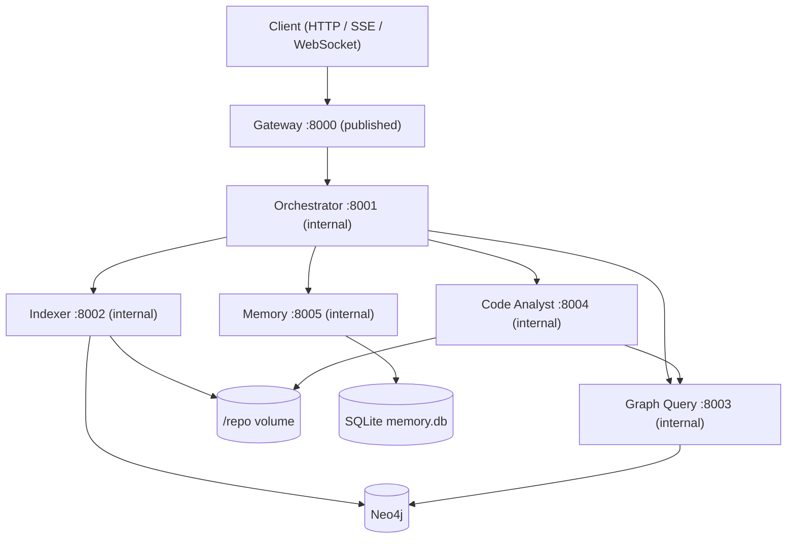
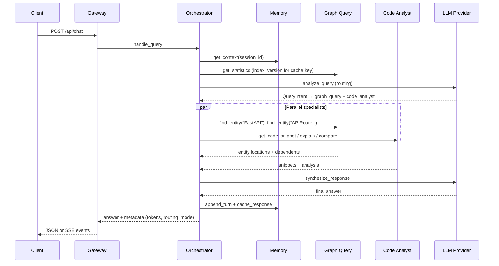

# FastAPI Repository Chat Agent

Five MCP servers (orchestrator, indexer, graph_query, code_analyst, memory) operate over a Neo4j knowledge graph of the [FastAPI](https://github.com/fastapi/fastapi) repository, fronted by a FastAPI gateway, all running in Docker Compose. The orchestrator routes natural-language questions to specialist agents, synthesizes a single answer, and persists conversation plus response cache in SQLite via the Memory agent.

## Overview

The system indexes a cloned Python repository into a typed Neo4j graph (modules, classes, functions, parameters, decorators, imports, docstrings, and their relationships). Users chat through the gateway; the orchestrator decides which agents to invoke, runs them in parallel where possible, and synthesizes a final answer. Context is queried on demand from the graph and Memory agent rather than baked into static prompt files.

### Architecture



### Complex query sequence

Example: *"Compare FastAPI and APIRouter implementations, then show who depends on them"*



---

## Setup

### Quick start

```bash
cp .env.example .env
# Export secrets in your shell (never commit them):
# export OPENROUTER_API_KEY=...
# export NEO4J_PASSWORD=...          # required; compose will not invent a default
# export NEO4J_AUTH=neo4j/$NEO4J_PASSWORD
# export GATEWAY_API_KEY=...         # compose defaults to dev-gateway-key

docker compose up --build -d
curl http://localhost:8000/health
make index          # clone + index FastAPI into Neo4j (~minutes first run)
make smoke          # MCP smoke via compose network: find_entity → get_dependents → explain_implementation
```

Index the graph before asking code questions. The indexer clones `REPO_URL` into the shared `/repo` Docker volume and upserts nodes/relationships into Neo4j.

### `.env.example` walkthrough

| Section | Key variables | Purpose |
| --- | --- | --- |
| Global | `APP_ENV`, `LOG_LEVEL`, `REPO_ROOT`, `REPO_URL` | Runtime profile (`development` / `testing` / `production`), repo clone target. `APP_ENV` loads `.env.{APP_ENV}` over `.env` |
| Neo4j | `NEO4J_URI`, `NEO4J_USER` | Bolt connection. `NEO4J_PASSWORD` / `NEO4J_AUTH` are required at compose time and are never committed |
| Gateway | `GATEWAY_PORT`, `GATEWAY_*_URL`, `GATEWAY_CACHE_TTL_SECONDS`, `GATEWAY_API_KEY`, `GATEWAY_RATE_LIMIT_REQUESTS`, `GATEWAY_RATE_LIMIT_WINDOW_S`, `GATEWAY_MAX_MESSAGE_CHARS`, `GATEWAY_CHAT_TIMEOUT_S` | HTTP bind, MCP upstream URLs, response cache TTL, chat/index API key (compose default `dev-gateway-key`), sliding-window rate limit (HTTP and WebSocket), max chat message size, orchestrator `handle_query` timeout (default 90s; keep above `ORCH_REQUEST_DEADLINE_S`) |
| Orchestrator | `ORCH_PORT`, `ORCH_ROUTING_STRATEGY`, `ORCH_RULES_MAX_QUERY_TOKENS`, `ORCH_SYNTHESIS_TIMEOUT_S`, `ORCH_SYNTHESIS_PROMPT_TOKEN_BUDGET`, `ORCH_SYNTHESIS_RESERVE_S`, `ORCH_PLAN_DEADLINE_S`, `ORCH_REQUEST_DEADLINE_S`, `ORCH_REQUEST_TOKEN_BUDGET`, `ORCH_REQUEST_COST_USD_MAX`, `ORCH_BREAKER_*` | Routing mode (`rules_first` default), ambiguity token threshold, synthesis LLM **cap**, time reserved for synthesis so the plan phase cannot starve it, heuristic refinement cutoff, outer request wall-clock, outer token and USD ceilings, per-agent circuit-breaker overrides |
| Indexer | `INDEXER_SKIP_TESTS`, `INDEXER_SKIP_DOCS`, `INDEXER_CLONE_ALLOWED_HOSTS`, `INDEXER_CLONE_ALLOWED_SCHEMES` | Fast profile only: skip `tests/` and `docs/` (default is a full index). Clone URL allowlist (default `https` + `github.com`) |
| Graph Query | `GQ_EMBEDDINGS_ENABLED` | Enable the hash-based lexical fallback (256-dim bag-of-words hash, not a semantic embedding model). Default off; the flag is authoritative even if a provider is injected |
| Code Analyst | `CA_GRAPH_QUERY_URL`, `CA_REPO_ROOT` | Graph lookup MCP URL, read-only source root |
| Memory | `MEM_DB_PATH`, `MEM_RECENT_TURNS`, `MEM_CACHE_TTL_SECONDS` | SQLite path on `memory_data` volume, rolling turn window |
| LLM | `OPENROUTER_MODEL`, `ORCH_MODEL_ROUTING`, `ORCH_MODEL_SYNTHESIS`, `CA_MODEL_ANALYSIS`, `OPENROUTER_BASE_URL`, `LLM_PROMPT_USD_PER_MILLION`, `LLM_COMPLETION_USD_PER_MILLION`, `LLM_CACHED_PROMPT_USD_PER_MILLION`, `LLM_MODEL_PRICES_JSON`, `LLM_PROMPT_CACHE` | Global model (default `anthropic/claude-sonnet-4.5`) for routing/analysis; synthesis defaults to `openai/gpt-4.1-mini`. Per-1M rates for the token ledger; Anthropic prompt caching on static system prompts |
| Observability | `OTEL_EXPORTER_OTLP_ENDPOINT` | OTLP HTTP traces when set; blank disables export |

**Secret precedence:** real environment variables → `.env.{APP_ENV}` overlay (`.env.development` / `.env.production` in the repo contain no secrets) → `.env` → code defaults. Repo env files intentionally exclude `OPENROUTER_API_KEY`, `NEO4J_PASSWORD`, `GATEWAY_API_KEY`, `MCP_SHARED_SECRET`, and `ANTHROPIC_API_KEY`. Compose sets `GATEWAY_API_KEY` (and the MCP shared secret) to `dev-gateway-key` when unset, and **requires** `NEO4J_PASSWORD` / `NEO4J_AUTH`. Agent MCP ports are internal-only; `make smoke` runs inside the compose network.

### Make targets

| Target | Description |
| --- | --- |
| `make up` | `docker compose up --build -d` (copies `.env.example` → `.env` if missing) |
| `make down` | Stop and remove containers |
| `make test` | Offline unit suite only (`pytest -m "not integration and not live"`, ≥79% coverage gate) |
| `make test-all` | Full pytest including integration/live markers |
| `make index` | Trigger `index_repository` inside the indexer container |
| `make smoke` | Day-2 MCP smoke via `docker compose exec` into the gateway (`python -m core.mcp.smoke`) |
| `make smoke-day3` | End-to-end gateway SSE smoke (cache hit + degraded path) via `scripts/smoke_day3.py` |
| `make eval` | Executed-plan routing checks, QA scorecard (offline stub; routing/retrieval only), trap tests |
| `make eval-live` | All 50 `evals/qa.jsonl` cases with a live LLM (`EVAL_PROVIDER=live`); writes the README eval block |
| `make eval-models` | Purpose-aware model bake-off on `evals/qa.jsonl` (routing + synthesis, `--repeats 3`) |
| `make prove-incremental` | Live-stack proof that unchanged files are skipped on re-index |
| `make lint` | `ruff check .` + `mypy` |
| `make tokens-report` | Token usage table for the nine sample queries (StubProvider harness) |

---

## Agents

All agents expose FastMCP tools over streamable HTTP. Business logic lives in `core/`; agent packages are thin adapters.

### Orchestrator (`:8001`)

**Responsibility:** Route queries, execute a specialist set concurrently, synthesize one answer, manage response cache keys (`index_version + session_id + normalized query + resolved-entity fingerprint`), and return degraded answers instead of failing the query when specialists or synthesis fail. After a round with insufficient evidence, a heuristic refinement expands keywords/entities and missing agents (not an LLM replan).

**Tools**

| Tool | Signature | Returns |
| --- | --- | --- |
| `health()` | — | `HealthStatus` |
| `get_conversation_context(session_id, token_budget=3000)` | session + budget | `ConversationContext` |
| `analyze_query(query, context)` | NL query + context | `QueryIntent` (always LLM when called directly) |
| `route_to_agents(intent)` | `QueryIntent` | `ExecutionPlan` |
| `synthesize_response(query, agent_outputs, context)` | query + outputs | `str` |
| `handle_query(query, session_id)` | gateway entrypoint | `{answer, metadata}` |

**Design points:** Rules-first routing with LLM escalation on ambiguity (`ORCH_ROUTING_STRATEGY`, `ORCH_RULES_MAX_QUERY_TOKENS`). Cache lookup before routing. In-process token ledger per correlation ID. MCP client of the other four agents. `ExecutionPlan.agents` is a flat specialist set; the executor waits internally when `code_analyst` needs graph coordinates it does not already have. Comparison-shaped queries (`compare` in the text, including mixed “compare then who depends”) call `find_entity`, `compare_implementations`, and only the relationship tools the question names — not the full explanation/analyze/snippet set. Independent graph neighbor lookups still overlap the comparison call. Synthesis prompts are capped by `ORCH_SYNTHESIS_PROMPT_TOKEN_BUDGET` (order chosen from eval quality under budget pressure: snippet bodies, then long lists). If the synthesis LLM times out or errors after tokens have already been streamed, those tokens are returned as a partial answer (`metadata.partial=true`) instead of discarded. With no emitted tokens, `handle_query` returns an evidence-only markdown answer (`metadata.degraded=true`, `evidence_only=true`, `degraded_reason` = exception class) and the gateway responds HTTP 200 rather than discarding retrieved hits. Module citations omit line ranges (class and function ranges are kept). Coreference on follow-up turns is heuristic (pronoun regex + entity carry from recent user turns and the folded summary). The orchestrator FastMCP server uses streamable HTTP SSE (`json_response=False`) so synthesis tokens can leave the process as MCP progress notifications (`ctx.report_progress`). Specialist agents keep `json_response=True` because they do not stream. The gateway `handle_query` client forwards `progress_callback` through the session pool onto the existing SSE/WebSocket `answer` events. Clients that do not negotiate progress still get post-hoc chunks of the finished answer.

**Request budget and latency hierarchy**

These layers share one wall-clock; they are not independent timeouts stacked to 55s+.

1. **Outer request budget** (`RequestBudget` in `core/orchestration/budget.py`) spans routing + every specialist call + synthesis. Ceilings: `ORCH_REQUEST_DEADLINE_S` (default 55s), `ORCH_REQUEST_TOKEN_BUDGET`, `ORCH_REQUEST_COST_USD_MAX`. Spend is read from the token ledger's `cost_usd` (priced per purpose-resolved model via `core.llm.pricing`), including code_analyst LLM calls recorded under `metadata.tokens.by_purpose.analysis`. When a ceiling trips mid-plan, no new calls are issued and synthesis uses evidence already gathered (`metadata.budget_exhausted` = `deadline` \| `tokens` \| `cost`).
2. **Plan deadline** (`ORCH_PLAN_DEADLINE_S`, default 35s) bounds heuristic refinement rounds. Specialist calls also stop once remaining request time drops to the effective synthesis reserve. `ORCH_SYNTHESIS_RESERVE_S` (default 20s) is the floor for a typical prompt; at runtime the reserve scales with the actual synthesis prompt token count from `core/orchestration/prompt_budget.py` so a bulky mixed (non-comparison) fan-out claims more wall-clock than the constant. Settings validation still requires `plan_deadline_s + synthesis_reserve_s <= request_deadline_s` on the configured constants only, not the scaled runtime reserve: a ~12k-token prompt raises that reserve to roughly 36s, `plan_remaining_s` clamps to zero, and heuristic refinement stops early so retrieval is starved in favour of synthesizing evidence already gathered. The same validation still requires `synthesis_reserve_s − synthesis_safety_margin_s >=` the bake-off synthesis p95 of the resolved `ORCH_MODEL_SYNTHESIS` model. After a full plan the derived synthesis timeout is 18s for a typical prompt (`55 - 35 - 2`), which covers `openai/gpt-4.1-mini` p95 (11.7s) with live-prompt margin; `anthropic/claude-sonnet-4.5` p95 (19.9s) still does not fit, which is why it is not the default synthesizer. Each request logs `orchestrator.synthesis_window` with the derived `synthesis_timeout_s` and `plan_duration_s` (Prometheus: `repochat_synthesis_timeout_seconds`, `repochat_plan_duration_seconds`).
3. **Per-agent MCP timeouts** (`ORCH_GRAPH_QUERY_TIMEOUT_S`, `ORCH_CODE_ANALYST_TIMEOUT_S`, …) are clipped to remaining request time minus the (possibly scaled) synthesis reserve.
4. **Synthesis timeout** is derived: `remaining(request_deadline) − ORCH_SYNTHESIS_SAFETY_MARGIN_S`. `ORCH_SYNTHESIS_TIMEOUT_S` is the typical-prompt cap; large prompts raise that cap so leftover request time is not left unused. Because the plan phase cannot spend the reserve, this derived timeout stays above zero even when planning uses its full deadline.
5. **Per-prompt synthesis token budget** (`ORCH_SYNTHESIS_PROMPT_TOKEN_BUDGET`) is unchanged and only truncates the synthesis prompt.

Synthesis tokens stream from the LLM provider through orchestrator MCP progress notifications (streamable HTTP SSE; `json_response=False` on the orchestrator only) into the existing SSE/WebSocket `answer` events, so time-to-first-token stays under 2s of synthesis start. Clients that do not pass a progress callback, and the non-streaming JSON chat path, still wait for the full answer and then post-hoc chunk it. A timeout or mid-stream error keeps tokens already emitted and marks the answer `partial` rather than replacing it with the evidence-only renderer.

Prometheus: `repochat_synthesis_duration_seconds`, `repochat_time_to_first_token_seconds`, `repochat_synthesis_timeout_seconds`, `repochat_plan_duration_seconds`, `repochat_budget_exhausted_total{ceiling}`, `repochat_evidence_only_total`.

**Diagnostic long-budget profile (env only).** Defaults stay at 55 / 35 / 20 / 90. For live two-round queries that need more synthesis headroom, set these in the environment (not as committed defaults): `ORCH_REQUEST_DEADLINE_S=110`, `ORCH_PLAN_DEADLINE_S=45`, `ORCH_SYNTHESIS_RESERVE_S=60`, `GATEWAY_CHAT_TIMEOUT_S=130`. Settings still require `plan_deadline_s + synthesis_reserve_s <= request_deadline_s` (45 + 60 = 105 ≤ 110) and `synthesis_reserve_s − synthesis_safety_margin_s` ≥ the bake-off synthesis p95 of `ORCH_MODEL_SYNTHESIS`. Raise the gateway timeout too: `GatewaySettings.chat_timeout_s` (default 90s) is the timeout on the orchestrator `handle_query` call in `gateway/src/gateway/mcp_client.py`, so raising only the orchestrator deadline moves the failure to the gateway.

### Indexer (`:8002`)

**Responsibility:** Clone the target repo, parse Python AST, extract entities/relationships, and batch-upsert into Neo4j. Only agent that writes the graph.

**Tools**

| Tool | Signature | Returns |
| --- | --- | --- |
| `health()` | — | `HealthStatus` |
| `index_repository(repo_url=None, mode="incremental")` | optional URL override; `full` re-parses every file, `incremental` skips unchanged hashes | `IndexReport` |
| `index_file(path)` | repo-relative path | `IndexReport` |
| `parse_python_ast(path_or_code)` | file path or source | `ParsedFile` |
| `extract_entities(path_or_code)` | file path or source | `ExtractedGraph` |
| `get_index_status()` | — | `IndexStatus` (last report + live counts) |

**Design points:** Content-hash incremental indexing at file granularity (`mode="incremental"`, the default). `POST /api/index` `mode="full"` re-parses every file even when hashes match. Stale `:File` nodes whose paths disappeared from the walk are `DETACH DELETE`d. `UNWIND` batched writes. Shared `:Decorator` nodes survive file-subtree deletes. Async lock prevents concurrent full indexes. Default crawl includes `tests/` and `docs/`; set `INDEX_SKIP_TESTS=1` and `INDEX_SKIP_DOCS=1` for a fast profile.

### Graph Query (`:8003`)

**Responsibility:** Read-only Cypher over the knowledge graph. Template queries for common traversals plus guarded ad-hoc Cypher.

**Tools**

| Tool | Signature | Returns |
| --- | --- | --- |
| `health()` | — | `HealthStatus` |
| `find_entity(name, entity_type=None)` | name, phrase, or conceptual query | `EntityQueryResult` (ranked hits tagged `exact` / `fulltext` / `lexical`, each carrying `docstring_text` / `docstring_summary` when the entity is documented) |
| `get_docstring(qualified_name)` | qualified name or short entity name | `DocstringResult` (indexed `Docstring` text for `Module` / `Class` / `Function` / `Method`) |
| `get_dependencies(name)` | qualified name | `NeighborQueryResult` |
| `get_dependents(name)` | qualified name | `NeighborQueryResult` |
| `trace_imports(module, depth=5)` | module + depth cap | `ImportTraceResult` |
| `find_related(name, relationship_type)` | name + rel type | `RelatedQueryResult` |
| `execute_query(cypher, params=None)` | read-only Cypher | `QueryResult` (includes `cypher_executed`, `params`) |
| `get_statistics()` | — | `GraphStatistics` (`index_version`, label/rel counts) |

**Design points:** Write clauses rejected; default `LIMIT` injected. Trusted `CALL db.index.fulltext.queryNodes` is allowed for the `code_search` index over names, qualified names, and docstring text. `find_entity` runs a cascade: exact name, then identifier re-export resolution via `(:Module)-[:IMPORTS]->(:Import)`, then full-text (package source before tests/docs), then optional hash-based lexical fallback when `GQ_EMBEDDINGS_ENABLED=1`.

The re-export tier resolves once per query rather than per import edge: if any import edge joins to a real `Class` / `Function` / `Method` node, only those real nodes are returned (`fastapi.FastAPI` → `fastapi.applications.FastAPI`, one hit, not one per importer). Only when *no* edge resolves — the symbol is defined outside the indexed tree, as `WebSocket`, `JSONResponse`, `CORSMiddleware`, and `Request` are in starlette — does it fall back to the importing `Module` nodes, preferring FastAPI-local ones, so `fastapi/websockets.py` is still attributed. Fallback hits are real `Module` nodes scored 0.6; no coordinate is synthesized.

Hits are ordered by retrieval tier, package vs tests/docs, `fastapi/` locality, and filename affinity to the symbol. Conceptual questions are mapped onto concrete identifiers by `_CONCEPT_ENTITIES` for three families: dependency injection/resolution (`Depends`, `get_dependant`, `solve_dependencies`), request lifecycle (`APIRoute.get_request_handler`, `run_endpoint_function`, `serialize_response`), and request validation (`request_params_to_args`, `request_body_to_args`, `RequestValidationError`). The lexical tier is a 256-dim bag-of-words hash (`HashingEmbeddingProvider`), not a semantic embedding model. `:Meta` singleton stores `index_version` for cache invalidation.

### Code Analyst (`:8004`)

**Responsibility:** Read source from `/repo` using graph coordinates, run structured LLM analysis (explain, compare, pattern find).

**Tools**

| Tool | Signature | Returns |
| --- | --- | --- |
| `health()` | — | `HealthStatus` |
| `analyze_function(qualified_name)` | e.g. `fastapi.routing.APIRouter` | `FunctionAnalysis` |
| `analyze_class(qualified_name)` | class FQN | `ClassAnalysis` |
| `find_patterns(pattern, path_prefix=None)` | `decorator` \| `dependency_injection` \| `factory`, optionally scoped to a path fragment such as `fastapi/routing.py` | `PatternAnalysis` |
| `get_code_snippet(qualified_name=None, file_path=None, line_start=None, line_end=None)` | name or path range | `SnippetResult` |
| `explain_implementation(qualified_name)` | FQN | `ImplementationExplanation` |
| `compare_implementations(name_a, name_b)` | two FQNs | `ImplementationComparison` |

**Design points:** No direct Neo4j — graph lookup via Graph Query MCP. Path traversal guarded. `find_patterns` supports exactly three fixed Cypher templates, optionally scoped by `path_prefix`; the orchestrator derives that prefix from phrasing such as "in the routing module" (`core/querying/patterns.py`). `compare_implementations` clips each snippet to 120 lines before the LLM call so large class pairs (FastAPI / APIRouter) stay inside the specialist timeout. LLM-backed tools attach `usage` (prompt/completion/total/model) on the MCP payload so the orchestrator can record it in the request token ledger.

### Memory (`:8005`)

**Responsibility:** SQLite-backed session memory (rolling summary + recent turns) and opaque response cache keyed by orchestrator.

**Tools**

| Tool | Signature | Returns |
| --- | --- | --- |
| `health()` | — | `HealthStatus` |
| `append_turn(session_id, role, content)` | user/assistant turn | `{status: ok}` |
| `get_context(session_id, token_budget=3000)` | session + budget | `ConversationContext` |
| `summarize_session(session_id)` | fold older turns | `{summary}` |
| `cache_response(cache_key, response_json)` | caller-computed key | `{status: ok}` |
| `get_cached_response(cache_key)` | key | `CachedResponse \| null` |

**Design points:** Idempotent `folded_at` migration prevents double-summarization. Cache TTL configurable per agent. Data persisted on `memory_data` Docker volume. Multi-turn coreference is heuristic: regex pronoun detection plus entity carry from recent user turns and the folded session summary. It is not model-based resolution.

---

## Gateway API

Base URL: `http://localhost:8000`. Compose sets `GATEWAY_API_KEY` to `dev-gateway-key` by default. Pass `X-API-Key: <key>` on all routes except `GET /health`, `GET /api/agents/health`, and the OpenAPI docs. `GET /metrics` requires the API key when one is configured. Agent MCP servers share the same secret (`MCP_SHARED_SECRET`) — including their `/metrics` routes — and are not published to the host.

| Method | Path | Description |
| --- | --- | --- |
| `POST` | `/api/chat` | Chat (JSON body; `stream=true` for SSE) |
| `WS` | `/ws/chat` | WebSocket chat (same event protocol) |
| `POST` | `/api/index` | Start background index job (`mode`: `incremental` hash-skip or `full` re-parse) |
| `GET` | `/api/index/status/{job_id}` | Poll index job status |
| `GET` | `/api/agents/health` | Per-agent health aggregation |
| `GET` | `/api/graph/statistics` | Graph counts + `index_version` |
| `GET` | `/health` | Alias for agents health |
| `GET` | `/metrics` | Prometheus metrics (request count, latency, errors, cache, LLM tokens/cost) |

Chat messages are capped at 8,000 characters (`GATEWAY_MAX_MESSAGE_CHARS`; `422` when exceeded). The gateway applies a sliding-window rate limit (`GATEWAY_RATE_LIMIT_REQUESTS` / `GATEWAY_RATE_LIMIT_WINDOW_S`, default 60 requests per 60s) to HTTP routes **and** to `/ws/chat` (handshake and each message) and returns `429` / WebSocket close `1008` when exceeded. Each agent and the gateway expose `GET /metrics` behind the API key. OpenTelemetry spans share the request `correlation_id` across MCP calls so one chat query is a single trace (`OTEL_EXPORTER_OTLP_ENDPOINT` to export). Interactive OpenAPI is at `/docs`.

### Examples

**Chat (JSON)**

```bash
curl -s http://localhost:8000/api/chat \
  -H 'Content-Type: application/json' \
  -H 'X-API-Key: dev-gateway-key' \
  -d '{"message":"What is the FastAPI class?","session_id":"demo-1"}' | jq .
```

**Chat (SSE)**

```bash
curl -N http://localhost:8000/api/chat \
  -H 'Content-Type: application/json' \
  -H 'X-API-Key: dev-gateway-key' \
  -d '{"message":"What is the FastAPI class?","stream":true}'
```

**WebSocket** — connect to `ws://localhost:8000/ws/chat` with `X-API-Key: dev-gateway-key`. Auth and the rate limiter run on the handshake; each subsequent JSON message is also rate-limited. Send JSON shaped like `ChatRequest`:

```json
{"message": "What is the FastAPI class?", "session_id": "demo-1"}
```

**Start index job**

```bash
curl -s http://localhost:8000/api/index \
  -H 'Content-Type: application/json' \
  -H 'X-API-Key: dev-gateway-key' \
  -d '{"mode":"incremental"}' | jq .
```

**Index job status**

```bash
curl -s http://localhost:8000/api/index/status/<job_id> \
  -H 'X-API-Key: dev-gateway-key' | jq .
```

**Agents health**

```bash
curl -s http://localhost:8000/api/agents/health | jq .
```

**Graph statistics**

```bash
curl -s http://localhost:8000/api/graph/statistics \
  -H 'X-API-Key: dev-gateway-key' | jq .
```

### SSE / WebSocket event protocol

Both transports emit the same four event types in order:

| Event | Payload highlights |
| --- | --- |
| `routing` | `routing_mode`, `agents`, `cached`, `degraded` |
| `agent_result` | `agent`, `ok`, `cached`, `degraded` |
| `answer` | `chunk` (live synthesis token when the orchestrator MCP session negotiates progress; otherwise the gateway splits the finished answer at `GATEWAY_ANSWER_CHUNK_CHARS`) |
| `done` | `latency_ms`, `cached`, `degraded`, `routing_mode`, `tokens` (`total`, `prompt`, `completion`, `cached_prompt`, `uncached_prompt`, `llm_calls`, `cost_usd`, `by_purpose`, `by_model`); when synthesis fell back, also `evidence_only`, `degraded_reason`, and optionally `prompt_truncated`; when tokens already streamed were kept, also `partial` |

**SSE format:** `event: <type>\ndata: {"type":"<type>","correlation_id":"...","..."}\n\n`

**WebSocket format:** `{"type":"<type>","correlation_id":"...","data":{...}}`

Every response includes an `x-correlation-id` header for log correlation.

### Security

- **Auth.** `X-API-Key` is required on chat, index, graph, metrics, and WebSocket when `GATEWAY_API_KEY` is set. `GET /health` and `GET /api/agents/health` stay unauthenticated for probes. Agent MCP `/metrics` uses the same shared secret.
- **Rate limits.** The sliding-window limiter applies to HTTP middleware, the `/ws/chat` handshake, and each WebSocket message.
- **Clone SSRF.** Indexer `repo_url` must be `https` to a host in `INDEXER_CLONE_ALLOWED_HOSTS` (default `github.com`). `file://`, `http://`, SSH, and `git@` remotes are rejected in `core` before git runs.
- **Secrets.** No Neo4j password default in code or Compose. Committed `.env.example`, `.env.development`, and `.env.production` omit secret values.

---

## Design decisions and trade-offs

**Framework-free core with thin MCP adapters.** Parsing, Cypher, routing, LLM logic, and the Code Analyst's Graph Query client live in `core/`; agent packages only wire FastMCP transport. The analyst lookup uses the same pooled, circuit-breaker-protected MCP session as the orchestrator. Rejected embedding that logic inside agent packages, which would couple business rules to MCP and hinder unit testing.

**Streamable HTTP per agent container.** Each agent is an independent Docker service on an internal port. Rejected a single-process stdio MCP multiplex that would prevent independent scaling and health checks. Host publish is gateway `:8000` only.

**MCP health probes instead of TCP sockets.** Docker healthchecks call each agent's MCP `health` tool: Neo4j for `graph_query`, SQLite for `memory`, `/repo` plus graph_query reachability for `code_analyst`, downstream aggregation for `orchestrator`. Rejected bare TCP port opens that report healthy while dependencies are down.

**Shared-secret MCP mesh.** Compose sets `GATEWAY_API_KEY` (default `dev-gateway-key`) and reuses it as `MCP_SHARED_SECRET` so agents are not callable without the key even on the Docker network.

**Restricted Neo4j access.** Only indexer (writes) and graph_query (reads) open Neo4j sessions. Rejected letting every agent connect directly, which would blur write/read boundaries.

**Batched Neo4j writes with `UNWIND`.** Bulk upserts amortize round-trips during indexing. Rejected per-row individual Cypher transactions.

**File-granularity incremental indexing.** Content hashes skip unchanged files on re-index (`mode=incremental`). `mode=full` on `POST /api/index` (and the indexer tool) re-parses every file. Rejected treating the public `mode` parameter as documentation-only.

**Single specialist set, not multi-phase plans.** `ExecutionPlan.agents` is a flat list. The executor already sequences `code_analyst` behind `graph_query` when the analyst lacks coordinates. A second plan phase would duplicate that wait, and the router never emitted more than one phase, so nested `phases` was decoration.

**Heuristic evidence-driven refinement, not LLM replanning.** After a round, keyword/entity expansion and missing-agent suggestions produce a follow-up plan. No second routing LLM call.

**Plan starvation under a scaled synthesis reserve.** Settings validation only checks `plan_deadline_s + synthesis_reserve_s <= request_deadline_s` on the configured constants. At runtime a ~12k-token prompt scales the reserve to roughly 36s, so `plan_remaining_s` clamps to zero and heuristic refinement stops early. Retrieval is deliberately starved in favour of synthesizing evidence already gathered.

**Hash-based lexical fallback, not embedding retrieval.** The third `find_entity` tier uses `HashingEmbeddingProvider` (256-dim bag-of-words hash) behind `GQ_EMBEDDINGS_ENABLED` (default off; the flag is authoritative). A real embedding model is future work; the `EmbeddingProvider` protocol stays as the seam.

**Re-exported names resolve to the importing module, but only as a fallback.** `find_entity` joins import edges to the real `Class`/`Function`/`Method` node rather than synthesizing a coordinate, so `fastapi.FastAPI` resolves to `fastapi.applications.FastAPI` instead of a node that does not exist. Names re-exported from starlette (`WebSocket`, `JSONResponse`, `CORSMiddleware`, `Request`) have no node at all, because starlette is outside the indexed tree; a strict join drops them entirely and loses `fastapi/websockets.py`. The lookup therefore decides once per query rather than per row: if any import edge resolved to a real node, only real nodes are returned; otherwise it falls back to the importing `Module` nodes, preferring FastAPI-local ones. Rejected a per-row `coalesce(target, module)`, which would reinstate one hit per importer — `FastAPI` is imported by 569 modules and only one edge resolves. The fallback returns real `Module` nodes with real paths, so no fabricated coordinate re-enters the graph.

**Module citations use the header span.** Module nodes store the docstring or leading-import range, not `1–<file length>`. Citations omit line ranges for Module hits. Class and function line numbers are unchanged.

**Citations are normalized to repo paths before scoring.** Synthesis models sometimes render a coordinate from the qualified name (`fastapi.param_functions.py:2283`) instead of the `file_path` the evidence carried. The line numbers are correct; only the separator is wrong, and citation validation resolves the path against evidence, so the turn fails. `_normalize_dotted_paths` rewrites a dotted coordinate to its slash form **only when that path appears in the agent evidence**, so the step can never invent a citation it did not retrieve. Rejected relaxing the citation gate below 1.00, which would have hidden a real formatting defect.

**Heuristic multi-turn coreference.** Pronoun detection plus entity carry from prior user turns and the folded session summary. Not model-based coreference.

**First-class graph nodes for parameters, decorators, imports, docstrings.** Queries traverse typed nodes and relationships. Rejected storing these only as scalar properties on code nodes.

**Shared decorator nodes.** `:Decorator` nodes are excluded from file-subtree deletes so reused decorators survive reindex. Rejected deleting decorators with the owning file subtree.

**Guarded read-only Cypher.** User-facing `execute_query` rejects writes and injects `LIMIT`. Rejected raw user Cypher with no guard or cap.

**Best-effort `CALLS` resolution by name.** Call sites are linked without full type inference. Rejected waiting for perfect resolution before emitting any `CALLS` edges.

**LLMProvider protocol + StubProvider.** All LLM calls go through one interface; tests use deterministic stubs. Rejected real API calls in unit tests.

**Auditable guarded queries.** `execute_query` returns `cypher_executed` and `params` so callers can verify LIMIT injection. Rejected logging-only audit trails.

**Offline-green test contract.** `make test` excludes `integration` and `live` markers and runs without Docker, Neo4j, or API keys. Rejected relying solely on runtime skipif checks without marker-based exclusion.

**On-demand context, not static prompt files.** Repository knowledge lives in the Neo4j graph; conversational state lives in the Memory agent. Both are queried per request rather than loaded into every prompt upfront, so context is paid for only when needed.

**Response cache scoped to the session, not the whole deployment.** The key is `orchestrator:v1:{index_version}:{session_id}:{normalized_query}:{entity_fingerprint}` (`_cache_key` in `core/orchestration/service.py`). Re-indexing bumps `index_version` and invalidates stale entries automatically; the `session_id` component means an identical question asked in a different session is answered fresh rather than served another session's answer, and the resolved-entity fingerprint keeps a follow-up turn that resolved a pronoun to a different antecedent from colliding with the earlier turn. Rejected a deployment-wide `query + index_version` key, which is cheaper but leaks one session's synthesized answer into another's transcript.

**Degradation policy (HTTP status is exact).** Specialist timeouts and errors during retrieval still produce an answer: HTTP 200 with `degraded: true` and an incomplete-retrieval prefix when graph_query or code_analyst failed. Synthesis LLM timeout or error also returns HTTP 200: the orchestrator renders retrieved entity hits, dependents, and snippets as markdown (`evidence_only: true`, `degraded_reason` is the exception class name such as `TimeoutError`). Successful retrieval is never discarded because synthesis failed. `AgentUnavailableError` and `CircuitBreakerOpenError` (orchestrator MCP unreachable or a specialist breaker open) are HTTP 503. `GraphLookupError` is HTTP 503. `RoutingError` and `SchemaValidationError` are HTTP 422. Unhandled errors in the gateway itself are HTTP 500. A leaked `SynthesisError` that escapes `handle_query` is still mapped to HTTP 503; the synthesizer path itself no longer raises that error. These error bodies are declared on `/api/chat` in OpenAPI as `GatewayErrorBody`.

**Idempotent session folding.** A nullable `folded_at` column on SQLite turns prevents re-summarizing already folded history. Rejected deleting old turns immediately after summarization.

**Singleton `:Meta` for index metadata.** `index_version` and `last_indexed_at` are stored on one node keyed by `key`. Rejected deriving version ad hoc from file nodes on every statistics read.

**Secret filtering from repo env files.** Overlay config files (`.env.development`, `.env.production`) remain ergonomic while API keys and passwords must be exported. Rejected loading secrets from committed `.env*` files.

**Clone URL allowlist.** `clone_repo` rejects anything that is not `https` to an allowlisted host (default `github.com`) before spawning git. `file://`, link-local `http://`, and `git@` / SSH remotes are errors (`UnsafeCloneUrlError`). SSH is not enabled: it can target internal SSH endpoints and is a common metacharacter-injection vehicle; HTTPS to GitHub is enough for the default FastAPI clone.

**No default Neo4j password.** `GraphSettings` requires `NEO4J_PASSWORD`. Compose interpolates `NEO4J_AUTH` / `NEO4J_PASSWORD` with no fallback value.

**Entity extraction in fallback routing.** When LLM routing fails, rule-based fallback still extracts likely entities for specialist lookups. Rejected silent no-op specialists on routing failure.

**Deterministic rule-based routing for golden evals.** Simple lookups route to `graph_query` only; multi-part analysis escalates to LLM routing with multiple agents. Rejected defaulting most queries to mixed multi-agent plans.

**Synthesis short-circuit for absent entities.** When graph and snippet lookups find nothing, synthesis returns an honest out-of-repo message without calling the LLM. Rejected always prompting the LLM with empty results (hallucination risk on trap queries).

**Unified eval entrypoint.** `make eval` runs executed-plan routing checks, the QA scorecard, and trap pytest in one pass. Rejected separate manual eval commands.

**CI eval with host-cloned FastAPI.** The eval job clones FastAPI on the runner and indexes via Docker Compose so trap tests see both host-readable paths and the live graph. Rejected container-only repo volumes for integration evals.

**Rules-first routing with LLM escalation.** Cheap deterministic routing handles simple queries; ambiguous or long queries call the LLM router. Rejected always routing through the LLM first.

**In-process token ledger.** Per-request token totals are accumulated and emitted in gateway `done` events, including the resolved model, cached vs uncached prompt tokens, and per-model cost. Code analyst LLM calls (`explain_implementation`, `analyze_function`, and the other analysis tools) return usage on the MCP payload and are recorded under `by_purpose.analysis`, so `ORCH_REQUEST_TOKEN_BUDGET` / `ORCH_REQUEST_COST_USD_MAX` can see the largest consumer. Rejected provider-only logs with no request-level aggregation.

**Purpose-aware model selection.** `complete(purpose=...)` selects `ORCH_MODEL_ROUTING`, `ORCH_MODEL_SYNTHESIS`, or `CA_MODEL_ANALYSIS`. Routing and analysis fall back to `OPENROUTER_MODEL` (`anthropic/claude-sonnet-4.5`); synthesis defaults to `openai/gpt-4.1-mini`. Routing stays on sonnet-4.5 because it passes 61% of routing traps versus 33% for gpt-4.1-mini. Synthesis uses gpt-4.1-mini because the bake-off measured 89% quality at 11,714 ms p95 and $1.18/1k versus sonnet-4.5's 82% at 19,943 ms and $14.43/1k, with the same 83% trap pass rate.

**Unmeasured synthesis-reserve slope.** `REFERENCE_SYNTHESIS_PROMPT_TOKENS` (4000) and `SYNTHESIS_EXTRA_SECONDS_PER_TOKEN` (0.002) are unmeasured engineering defaults. The bake-off recorded p95 per model, not a latency-versus-prompt-size slope; a fitted slope from per-case bake-off latency and prompt tokens would validate them.

**Prompt caching on static system prompts.** Anthropic models send `cache_control: ephemeral` on the first system message. Cached vs uncached input tokens are recorded separately in the ledger.

---

## Testing and evaluation

### Fresh-clone guarantee

`make test` is guaranteed to pass from a fresh clone without a `.env` file or running Docker Compose containers: StubProvider everywhere, no Neo4j required, coverage gate ≥79% on `core`, `orchestrator`, `indexer`, `graph_query`, `code_analyst`, `memory`, and `gateway`.

### Marker taxonomy

| Marker | Requires | Included in |
| --- | --- | --- |
| *(none)* | nothing | `make test`, `make test-all` |
| `integration` | `NEO4J_URI`, indexed graph, often `REPO_ROOT` | `make test-all`, trap evals via `make eval` |
| `live` | full Docker Compose stack | `make test-all` |

### Coverage

Offline suite (`make test`, 2026-08-20). Combined coverage is measured on `core`, `orchestrator`, `indexer`, `graph_query`, `code_analyst`, `memory`, and `gateway`:

```
TOTAL    8951 statements    87.25% coverage (gate: 79%)
496 passed, 14 deselected
```

`make test-all` additionally runs the 14 `integration`/`live` tests against the Compose stack; all 14 pass.

Split from the same `.coverage` data (branch-aware):

| Scope | Statements | Coverage |
| --- | ---: | ---: |
| `core/src/core` | 8201 | 86.77% |
| Five agent `__main__.py` adapters | 374 | 95.38% |
| Agent packages + gateway (`orchestrator`, `indexer`, `graph_query`, `code_analyst`, `memory`, `gateway`) | 750 | 93.55% |
| `gateway/src/gateway/mcp_client.py` | 120 | 98.57% |

Adapter `__main__.py` packages individually: `code_analyst` 97%, `graph_query` 98%, `indexer` 98%, `memory` 97%, `orchestrator` 89% (`orchestrator.service` is a 2-statement re-export at 100%). Gateway `app.py` is 89%. Orchestrator `handle_query` lives in `core.orchestration.service`.

### Request budget eval

`scripts/eval_qa.py` runs the QA scorer twice over `evals/qa.jsonl` (outer request budgets enabled vs disabled) and fails if any tier's citation-precision or groundedness drops. Truncation order under a tight prompt budget is scored with `repo_root` (and the graph when available) so Sources `file:line` citations actually resolve — a 0% figure next to a 1.00 was a scorer bug, not a measurement. Latency p50/p95 on the enabled run use `core.eval.model_bakeoff.percentile`. `make eval` is **provider: offline (stub answers — routing/retrieval only)**; `make eval-live` regenerates the scorecard below with a live LLM over all 50 labelled cases in `evals/qa.jsonl` (including trap and multi-turn).

### Model selection

`OPENROUTER_MODEL` remains `anthropic/claude-sonnet-4.5` for routing. `ORCH_MODEL_SYNTHESIS` defaults to `openai/gpt-4.1-mini` (89% synthesis quality, 11.7s p95, 12× cheaper than sonnet-4.5, and it fits the 18s reserved synthesis window where sonnet's 19.9s p95 does not). Routing stays on sonnet-4.5 because its routing trap pass rate is 61% versus 33% for gpt-4.1-mini. Blank `ORCH_MODEL_ROUTING` / `CA_MODEL_ANALYSIS` fall back to the global model. `make eval-models` re-runs `scripts/eval_models.py --repeats 3` at temperature 0 and refreshes the tables. Export `OPENROUTER_API_KEY` in the shell (repo `.env` files do not load that secret). Frozen synthesis payloads are in `tests/fixtures/synthesis_payloads.jsonl`.

<!-- BEGIN_MODEL_BAKEOFF -->
Generated by `python scripts/eval_models.py` on 2026-08-19 against commit `8876e31`. Routing stays on `anthropic/claude-sonnet-4.5` because it passes 61% of routing traps versus 33% for `openai/gpt-4.1-mini`. Synthesis uses `openai/gpt-4.1-mini`: 89% quality vs sonnet-4.5's 82%, 11,714 ms p95 vs 19,943 ms, $1.18 vs $14.43 per 1k queries, and the same 83% trap pass rate.

Per-purpose overrides: `ORCH_MODEL_ROUTING`, `ORCH_MODEL_SYNTHESIS`, `CA_MODEL_ANALYSIS` (routing and analysis fall back to `OPENROUTER_MODEL`; synthesis defaults to `openai/gpt-4.1-mini`).

### Routing

Repeats=3 at temperature 0 over 58 queries. Values are mean ± half-range across repeats. Prices as of 2026-08-18.

- Router bake-off calls the routing prompt directly; Neo4j is not used.
- Production routing is rules-first; this table scores the LLM router in isolation.
- Quality is exact-match on expected_agents (set equality).
- Schema-failure rate is 1 − first-attempt schema-validity.

| Model | Quality score | Trap pass rate | Schema-failure rate | p95 latency | Cost / 1000 queries | Price used |
| --- | ---: | ---: | ---: | ---: | ---: | --- |
| `anthropic/claude-sonnet-4.5` | 52% | 61% ± 8% | 0% | 5284 ± 273 ms | $5.5197 ± $0.0089 | anthropic/claude-sonnet-4.5: $3.00 in / $15.00 out / $0.300 cached per 1M (as of 2026-08-18) |
| `anthropic/claude-haiku-4.5` | 63% | 50% | 0% | 2915 ± 150 ms | $0.9123 ± $0.0001 | anthropic/claude-haiku-4.5: $0.50 in / $2.50 out / $0.050 cached per 1M (as of 2026-08-18) |
| `openai/gpt-4.1-mini` | 68% ± 1% | 33% | 0% | 2489 ± 272 ms | $0.2424 ± $0.0005 | openai/gpt-4.1-mini: $0.40 in / $1.60 out / $0.100 cached per 1M (as of 2026-08-18) |

### Synthesis

Repeats=3 at temperature 0 over 58 queries. Values are mean ± half-range across repeats. Prices as of 2026-08-18.
Retrieval payloads captured 2026-08-18.

- Synthesis bake-off replays frozen agent_outputs; retrieval is not re-run.
- Quality is the mean of citation precision and groundedness on non-trap turns.
- Trap pass rate is refusal correctness. Synthesis is free-text (schema-failure 0).
- Citations must resolve in the graph when a graph client is provided.

| Model | Quality score | Trap pass rate | Schema-failure rate | p95 latency | Cost / 1000 queries | Price used |
| --- | ---: | ---: | ---: | ---: | ---: | --- |
| `anthropic/claude-sonnet-4.5` | 82% ± 1% | 83% | 0% | 19943 ± 50 ms | $14.4324 ± $0.0587 | anthropic/claude-sonnet-4.5: $3.00 in / $15.00 out / $0.300 cached per 1M (as of 2026-08-18) |
| `anthropic/claude-haiku-4.5` | 84% | 83% | 0% | 9068 ± 462 ms | $2.7190 ± $0.0007 | anthropic/claude-haiku-4.5: $0.50 in / $2.50 out / $0.050 cached per 1M (as of 2026-08-18) |
| `openai/gpt-4.1-mini` | 89% ± 1% | 83% | 0% | 11714 ± 808 ms | $1.1775 ± $0.3431 | openai/gpt-4.1-mini: $0.40 in / $1.60 out / $0.100 cached per 1M (as of 2026-08-18) |

<!-- END_MODEL_BAKEOFF -->

<!-- BEGIN_EVAL_REPORT -->
Generated by `make eval-live` on 2026-08-20 from `handle_query` metadata (`tools_invoked`, tokens, latency), not from the router’s intent.

### Live quality measurement

**provider: live**

LLM-backed synthesis over every labelled case in `evals/qa.jsonl` (simple, medium, complex, trap, and multi-turn). Citation precision and groundedness exclude turns with no citations / no checkable claims rather than scoring empty output as 1.00. Groundedness is a token-level fraction; the pass gate is 0.70, one decimal below the 2026-08-19 live claim-level mean of 0.74.

| Tier | n | Pass rate | Executed agents | Retrieval | Citation precision | Groundedness | Entity recall | Degraded fails |
| --- | ---: | ---: | ---: | ---: | ---: | ---: | ---: | ---: |
| simple | 12 | 100% | 100% | 100% | 100% (1 excl.) | 94% | 100% | 0 |
| medium | 12 | 92% | 100% | 100% | 100% | 90% | 100% | 0 |
| complex | 12 | 92% | 100% | 100% | 100% | 95% | 96% | 0 |
| trap | 6 | 100% (refusal 100%) | 100% | 100% | — (6 excl.) | 39% | 100% | 0 |
| multi-turn | 16 | 88% | 100% | 97% | 100% (1 excl.) | 92% | 100% | 0 |

| Metric | Score | n | Status | Detail |
| --- | ---: | ---: | --- | --- |
| `hard_executed_agents` | 1.00 | 58 | PASS | 58/58 turns matched expected_agents via tools_invoked |
| `hard_non_trap_not_degraded` | 1.00 | 52 | PASS | 52/52 non-trap turns not evidence-only/degraded |
| `refusal_accuracy` | 1.00 | 6 | PASS | 6/6 traps refused |
| `citation_precision` | 1.00 | 50 | PASS | 50/50 scored non-trap turns (2 excluded: no citations) |
| `groundedness` | 0.93 | 52 | PASS | mean 0.93 vs gate 0.70; 50/52 turns ≥ gate (0 excluded: no checkable claims) |
| `entity_recall` | 0.99 | 52 | FAIL | 51/52 non-trap turns |
| `retrieval_correctness` | 0.99 | 52 | FAIL | 51/52 non-trap turns |

### Per-turn layer verdicts (live)

Retrieval FAIL means the executed agents missed the label or the specialist payloads did not contain the labelled files (entity recall can still be 1.00 when a test fixture mentions the same symbol). Synthesis FAIL means the LLM timed out, errored, or returned an evidence-only dump; grounding FAIL means citation precision or token-level groundedness missed the calibrated gate even when retrieval and synthesis succeeded.

Agents are taken from `metadata.tools_invoked` after the plan ran.

| Case | Query | Expected agents | Agents invoked | Mode | Latency ms | Tokens | Cost | Retrieval | Synthesis | Grounding |
| --- | --- | --- | --- | --- | ---: | ---: | ---: | --- | --- | --- |
| `s01` | What is the FastAPI class? | `graph_query` | `graph_query` | `rules` | 3761 | 3103 | $0.0006 | PASS | PASS | PASS |
| `s02` | What classes inherit from APIRouter? | `graph_query` | `graph_query` | `rules` | 2576 | 6727 | $0.0009 | PASS | PASS | PASS |
| `s03` | What is APIRouter? | `graph_query` | `graph_query` | `rules` | 6438 | 1535 | $0.0006 | PASS | PASS | PASS |
| `s04` | Where is get_openapi? | `graph_query` | `graph_query` | `rules` | 1494 | 730 | $0.0004 | PASS | PASS | PASS |
| `s05` | What is HTTPException? | `graph_query` | `graph_query` | `rules` | 3533 | 1437 | $0.0005 | PASS | PASS | PASS |
| `s06` | Find BackgroundTasks | `graph_query` | `graph_query` | `rules` | 4289 | 1547 | $0.0006 | PASS | PASS | PASS |
| `s07` | What is UploadFile? | `graph_query` | `graph_query` | `rules` | 4110 | 1580 | $0.0006 | PASS | PASS | PASS |
| `s08` | What is APIRoute? | `graph_query` | `graph_query` | `rules` | 2713 | 826 | $0.0005 | PASS | PASS | PASS |
| `s09` | Who depends on FastAPI? | `graph_query` | `graph_query` | `rules` | 9275 | 9045 | $0.0018 | PASS | PASS | PASS |
| `s10` | What is WebSocket? | `graph_query` | `graph_query` | `rules` | 5418 | 3187 | $0.0017 | PASS | PASS | PASS |
| `s11` | List Query | `graph_query` | `graph_query` | `rules` | 4446 | 1450 | $0.0005 | PASS | PASS | PASS |
| `s12` | What is Depends? | `graph_query` | `graph_query` | `rules` | 4123 | 1838 | $0.0007 | PASS | PASS | PASS |
| `m01` | How does dependency injection work and show me examples from the codebase | `graph_query`, `code_analyst` | `graph_query`, `code_analyst` | `llm` | 32728 | 15906 | $0.0295 | PASS | PASS | PASS |
| `m02` | Explain how get_openapi is implemented in the codebase | `graph_query`, `code_analyst` | `graph_query`, `code_analyst` | `llm` | 25704 | 7685 | $0.0233 | PASS | PASS | PASS |
| `m03` | How does FastAPI handle middleware and show me the implementation | `graph_query`, `code_analyst` | `graph_query`, `code_analyst` | `llm` | 30966 | 76031 | $0.2266 | PASS | PASS | PASS |
| `m04` | Explain CORSMiddleware implementation in the codebase | `graph_query`, `code_analyst` | `graph_query`, `code_analyst` | `llm` | 7746 | 2406 | $0.0064 | PASS | PASS | FAIL |
| `m05` | How does lifespan work in FastAPI source | `graph_query`, `code_analyst` | `graph_query`, `code_analyst` | `llm` | 28956 | 73945 | $0.2222 | PASS | PASS | PASS |
| `m06` | Explain how APIRouter includes routes and show me the implementation in the codebase | `graph_query`, `code_analyst` | `graph_query`, `code_analyst` | `llm` | 28959 | 65011 | $0.1833 | PASS | PASS | PASS |
| `m07` | Explain HTTPException implementation in the codebase | `graph_query`, `code_analyst` | `graph_query`, `code_analyst` | `llm` | 25262 | 9315 | $0.0330 | PASS | PASS | PASS |
| `m08` | How does dependency resolution work in the codebase | `graph_query`, `code_analyst` | `graph_query`, `code_analyst` | `llm` | 30679 | 17057 | $0.0295 | PASS | PASS | PASS |
| `m09` | Explain TestClient implementation with examples from the source | `graph_query`, `code_analyst` | `graph_query`, `code_analyst` | `llm` | 10335 | 2592 | $0.0063 | PASS | PASS | PASS |
| `m10` | How does WebSocket routing work in the codebase | `graph_query`, `code_analyst` | `graph_query`, `code_analyst` | `llm` | 17852 | 11939 | $0.0109 | PASS | PASS | PASS |
| `m11` | Explain OAuth2PasswordBearer implementation in the codebase | `graph_query`, `code_analyst` | `graph_query`, `code_analyst` | `llm` | 26638 | 7335 | $0.0195 | PASS | PASS | PASS |
| `m12` | How does APIRoute serialize responses and show me the source | `graph_query`, `code_analyst` | `graph_query`, `code_analyst` | `llm` | 27176 | 21428 | $0.0649 | PASS | PASS | PASS |
| `c01` | Compare FastAPI and APIRouter implementations in the codebase | `graph_query`, `code_analyst` | `graph_query`, `code_analyst` | `llm` | 25348 | 10600 | $0.0277 | PASS | PASS | PASS |
| `c02` | Explain how get_openapi is implemented and who calls it | `graph_query`, `code_analyst` | `graph_query`, `code_analyst` | `llm` | 27353 | 15066 | $0.0456 | PASS | PASS | PASS |
| `c03` | Reindex the repository and explain dependency injection examples in the codebase | `indexer`, `graph_query`, `code_analyst` | `indexer`, `graph_query`, `code_analyst` | `llm` | 32858 | 20392 | $0.0486 | PASS | PASS | PASS |
| `c04` | Reindex the repository and trace how APIRouter imports connect to FastAPI | `indexer`, `graph_query`, `code_analyst` | `indexer`, `graph_query`, `code_analyst` | `llm` | 34655 | 128037 | $0.3744 | PASS | PASS | PASS |
| `c05` | Compare FastAPI and APIRouter implementations, then show who depends on them | `graph_query`, `code_analyst` | `graph_query`, `code_analyst` | `llm` | 33081 | 14263 | $0.0284 | PASS | PASS | PASS |
| `c06` | Explain how dependency injection, APIRouter, and get_openapi connect across the codebase | `graph_query`, `code_analyst` | `graph_query`, `code_analyst` | `llm` | 32910 | 16431 | $0.0290 | PASS | PASS | PASS |
| `c07` | Compare Depends and Security implementations in the codebase | `graph_query`, `code_analyst` | `graph_query`, `code_analyst` | `llm` | 23312 | 10911 | $0.0303 | PASS | PASS | PASS |
| `c08` | Trace how APIRouter imports connect to FastAPI, then show who depends on them in the codebase | `graph_query`, `code_analyst` | `graph_query`, `code_analyst` | `llm` | 38799 | 128326 | $0.3711 | PASS | PASS | PASS |
| `c09` | Explain how routing, OpenAPI, and dependencies connect across the codebase | `graph_query`, `code_analyst` | `graph_query`, `code_analyst` | `llm` | 30454 | 12728 | $0.0177 | PASS | PASS | PASS |
| `c10` | Compare JSONResponse and HTMLResponse implementations then who depends on them | `graph_query`, `code_analyst` | `graph_query`, `code_analyst` | `llm` | 11267 | 5731 | $0.0079 | PASS | PASS | PASS |
| `c11` | Reindex the repository and compare FastAPI and APIRouter implementations | `indexer`, `graph_query`, `code_analyst` | `indexer`, `graph_query`, `code_analyst` | `llm` | 27870 | 10821 | $0.0282 | PASS | PASS | PASS |
| `c12` | Explain how WebSocket and APIRoute connect across the codebase and who calls them | `graph_query`, `code_analyst` | `graph_query`, `code_analyst` | `llm` | 13414 | 11628 | $0.0105 | PASS | PASS | PASS |
| `t01` | How does Django's ORM lazy-load querysets? | `graph_query`, `code_analyst` | `graph_query`, `code_analyst` | `rules` | 101 | 0 | $0.0000 | PASS | PASS | PASS |
| `t02` | Explain React's useEffect cleanup | `graph_query`, `code_analyst` | `graph_query`, `code_analyst` | `rules` | 61 | 0 | $0.0000 | PASS | PASS | PASS |
| `t03` | How does Rails ActiveRecord implement callbacks? | `graph_query`, `code_analyst` | `graph_query`, `code_analyst` | `rules` | 95 | 0 | $0.0000 | PASS | PASS | PASS |
| `t04` | Explain Kubernetes pod scheduling | `graph_query`, `code_analyst` | `graph_query`, `code_analyst` | `rules` | 45 | 0 | $0.0000 | PASS | PASS | PASS |
| `t05` | How does PostgreSQL write-ahead logging work? | `graph_query`, `code_analyst` | `graph_query`, `code_analyst` | `rules` | 45 | 0 | $0.0000 | PASS | PASS | PASS |
| `t06` | Explain TensorFlow GradientTape internals | `graph_query`, `code_analyst` | `graph_query`, `code_analyst` | `rules` | 71 | 0 | $0.0000 | PASS | PASS | PASS |
| `mt01` | What is the FastAPI class? | `graph_query` | `graph_query` | `rules` | 3167 | 3120 | $0.0006 | PASS | PASS | PASS |
| `mt01` | What about its parameters? | `graph_query` | `graph_query` | `rules` | 7254 | 8945 | $0.0041 | PASS | PASS | FAIL |
| `mt02` | What is APIRouter? | `graph_query` | `graph_query` | `rules` | 4075 | 1496 | $0.0006 | PASS | PASS | PASS |
| `mt02` | Who depends on it? | `graph_query` | `graph_query` | `rules` | 6586 | 10431 | $0.0047 | PASS | PASS | PASS |
| `mt03` | Where is get_openapi? | `graph_query` | `graph_query` | `rules` | 1388 | 731 | $0.0004 | PASS | PASS | PASS |
| `mt03` | Explain how that is implemented in the codebase | `graph_query`, `code_analyst` | `graph_query`, `code_analyst` | `llm` | 31128 | 26247 | $0.0825 | PASS | PASS | PASS |
| `mt04` | What is Depends? | `graph_query` | `graph_query` | `rules` | 4583 | 1818 | $0.0007 | PASS | PASS | PASS |
| `mt04` | Show me examples of that from the codebase | `graph_query`, `code_analyst` | `graph_query`, `code_analyst` | `rules` | 22755 | 17606 | $0.0406 | FAIL | PASS | PASS |
| `mt05` | What is HTTPException? | `graph_query` | `graph_query` | `rules` | 2877 | 1464 | $0.0005 | PASS | PASS | PASS |
| `mt05` | How does it work in the source? | `graph_query`, `code_analyst` | `graph_query`, `code_analyst` | `llm` | 23427 | 9289 | $0.0317 | PASS | PASS | PASS |
| `mt06` | What is WebSocket? | `graph_query` | `graph_query` | `rules` | 6736 | 3193 | $0.0009 | PASS | PASS | PASS |
| `mt06` | Compare that and APIRoute implementations in the codebase | `graph_query`, `code_analyst` | `graph_query`, `code_analyst` | `llm` | 10760 | 5432 | $0.0078 | PASS | PASS | PASS |
| `mt07` | Find BackgroundTasks | `graph_query` | `graph_query` | `rules` | 3769 | 1552 | $0.0006 | PASS | PASS | PASS |
| `mt07` | What classes inherit from it? | `graph_query` | `graph_query` | `rules` | 3372 | 7892 | $0.0034 | PASS | PASS | PASS |
| `mt08` | What is UploadFile? | `graph_query` | `graph_query` | `rules` | 3768 | 1556 | $0.0006 | PASS | PASS | PASS |
| `mt08` | Explain how that and File connect across the codebase | `graph_query`, `code_analyst` | `graph_query`, `code_analyst` | `llm` | 32157 | 26779 | $0.0806 | PASS | PASS | PASS |

### Sample query transcripts

provider: live. Nine routing golden-set queries shown as samples; the scorecard above scores every case in `evals/qa.jsonl`. Each row is one `handle_query` turn with real synthesis and `file:line` citations resolved against the graph and indexed tree.

### 1. What is the FastAPI class?

- **Result:** retrieval PASS · synthesis PASS · grounding PASS
- **Agents actually invoked:** `graph_query`
- **Expected agents:** `graph_query`
- **Routing mode:** `rules`
- **Latency:** 3167 ms
- **Tokens:** 3120 (prompt 2965, completion 155, llm_calls 1)
- **Cost:** $0.0006
- **Tools:** `graph_query.find_entity`
- **Citations:** `fastapi/applications.py:42`
- **Missing files:** (none)
- **Answer:** The `FastAPI` class is the main application class in the FastAPI framework, serving as the primary entry point to create a FastAPI app. It encapsulates the web application and provides the interface for defining routes, handling requests, and configuring the application. An example usage to create a FastAPI app is: ```python from fastapi import FastAPI app = FastAPI() ``` This class appears in the file `fastapi/applications.py` starting at line 42. For more information, the official FastAPI documentation's "First Steps" tutorial is referenced for learning how to use the `FastAPI` class. ### Sources: - `fastapi/applications.py`, lines 42-4774 (contains the `FastAPI` class)

### 2. What classes inherit from APIRouter?

- **Result:** retrieval PASS · synthesis PASS · grounding PASS
- **Agents actually invoked:** `graph_query`
- **Expected agents:** `graph_query`
- **Routing mode:** `rules`
- **Latency:** 2576 ms
- **Tokens:** 6727 (prompt 6601, completion 126, llm_calls 1)
- **Cost:** $0.0009
- **Tools:** `graph_query.find_entity`, `graph_query.get_dependencies`, `graph_query.get_dependents`, `graph_query.trace_imports`, `graph_query.find_related`
- **Citations:** `fastapi/routing.py:2255`
- **Missing files:** (none)
- **Answer:** The retrieved information indicates the class `APIRouter` is defined in the module `fastapi.routing`, specifically in the file `fastapi/routing.py` from line 2255 to 6447. The query to find classes that inherit from `APIRouter` returned no results, meaning there are no subclasses of `APIRouter` indexed in the available data. Thus, based on the available repository evidence, there are no classes that inherit from `APIRouter`. ### Sources - `fastapi/routing.py`, lines 2255-6447 (definition of `APIRouter` class)

### 3. How does dependency injection work and show me examples from the codebase

- **Result:** retrieval PASS · synthesis PASS · grounding PASS
- **Agents actually invoked:** `graph_query`, `code_analyst`
- **Expected agents:** `graph_query`, `code_analyst`
- **Routing mode:** `llm`
- **Latency:** 32728 ms
- **Tokens:** 15906 (prompt 14103, completion 1803, llm_calls 4)
- **Cost:** $0.0295
- **Tools:** `graph_query.find_entity`, `graph_query.get_dependencies`, `graph_query.get_dependents`, `graph_query.trace_imports`, `code_analyst.explain_implementation`, `code_analyst.analyze_class`, `code_analyst.analyze_function`, `code_analyst.get_code_snippet`
- **Citations:** `fastapi/params.py:745`, `fastapi/param_functions.py:2283`, `fastapi/dependencies/utils.py:271`, `fastapi/dependencies/utils.py:586`, `fastapi/security/oauth2.py:547`, `fastapi/security/http.py:222`, `fastapi/security/api_key.py:235`, `fastapi/security/api_key.py:55`, `fastapi/security/api_key.py:147`, `fastapi/security/http.py:16`, `fastapi/security/http.py:105`, `fastapi/security/oauth2.py:433`, `fastapi/openapi/docs.py:9`, `fastapi/exceptions.py:167`
- **Missing files:** (none)
- **Answer:** Dependency injection in this codebase, specifically in FastAPI, is implemented using a mechanism centered around the `Depends` class and function. This system allows you to define dependencies that FastAPI will automatically resolve and inject into path operation functions or other dependencies at runtime. ### How Dependency Injection Works - **`Depends` class (fastapi.params.Depends)**: This is a frozen dataclass used to configure a dependency injection parameter. It includes: - `dependency`: An optional callable that represents the dependency to be injected. - `use_cache`: A boolean flag (default `True`) to cache the dependency result within the same request. - `scope`: Optional, indicating the lifecycle of the dependency — either `'function'` or `'request'`. Essentially, creating an instance of `Depends` wraps a callable so that FastAPI knows how to treat it as a dependency. - **`Depends` function (fastapi.param_functions.Depends)**: This function serves as the public interface to declare dependencies in FastAPI route handlers or other dependencies. You pass a callable (the "dependable") to `Depends`, and FastAPI uses this to resolve and inject dependencies automatically without you having to call them manually. - **Dependency resolution (`get_dependant` in fastapi.dependencies.utils)**: The `get_dependant` function analyzes a callable (your dependency), extracting parameters, sub-dependencies, and OAuth scopes recursively. It validates compatibility of scopes and organizes parameters (e.g., body params, path params) for the dependency tree. This is core to building FastAPI's dependency graph and handling complex nested dependencies. ### Example Usage from Codebase Docstring This example illustrates typical usage with the `Depends` function and a dependency callable: ```python from typing import Annotated from fastapi import Depends, FastAPI app = FastAPI() async def common_parameters(q: str | None = None, skip: int = 0, limit: int = 100): return {"q": q, "skip": skip, "limit": limit} @app.get("/items/") async def read_items(commons: Annotated[dict, Depends(common_parameters)]): return commons ``` - Here, `common_parameters` is a dependency callable that declares parameters possibly shared across endpoints. - `Depends(common_parameters)` signals that FastAPI should inject the return value of `common_parameters` into the `read_items` endpoint parameter `commons`. - FastAPI resolves and calls `common_parameters` automatically when processing the reques...

### 4. Compare FastAPI and APIRouter implementations in the codebase

- **Result:** retrieval PASS · synthesis PASS · grounding PASS
- **Agents actually invoked:** `graph_query`, `code_analyst`
- **Expected agents:** `graph_query`, `code_analyst`
- **Routing mode:** `llm`
- **Latency:** 25348 ms
- **Tokens:** 10600 (prompt 9093, completion 1507, llm_calls 3)
- **Cost:** $0.0277
- **Tools:** `graph_query.find_entity`, `code_analyst.compare_implementations`
- **Citations:** `fastapi/applications.py:42`, `fastapi/routing.py:2255`, `fastapi/_compat/shared.py:113`, `fastapi/_compat/shared.py:134`, `fastapi/_compat/shared.py:47`, `fastapi/_compat/shared.py:156`, `fastapi/_compat/shared.py:145`
- **Missing files:** (none)
- **Answer:** FastAPI and APIRouter are both core classes within the FastAPI codebase that provide routing capabilities, but they serve different roles and have distinct implementations and features: ### Summary - **FastAPI** is the main application class and top-level ASGI app, extending from Starlette. It serves as the primary entry point for building and running FastAPI applications. - **APIRouter** is a modular router class used to group and organize path operations, enabling better code structure and modularization. Routers can be included in the FastAPI app or even nested inside other routers. ### Similarities - Both inherit from Starlette base classes (`FastAPI` extends Starlette, while `APIRouter` extends Starlette's routing.Router). - Both accept a `routes` parameter (deprecated) to maintain compatibility with Starlette. - Both support OpenAPI-related parameters such as `tags` for categorizing path operations. - Both accept a `dependencies` parameter to apply dependencies globally across path operations. - Both allow customization of response types through `default_response_class`. - Both support additional OpenAPI response documentation via `responses` parameter. - Both support OpenAPI `callbacks`. - Both provide path operation decorators such as `get`, `post`, `put`, `delete`, etc. - Both contribute to the generation of OpenAPI documentation. - Both support middleware and exception handler registration. ### Differences - **Role and Usage** - FastAPI is the main application class that you instantiate to create the app. - APIRouter is meant to be a sub-component used to group and organize routes, then included using `include_router()` into the FastAPI app. - **Inheritance** - FastAPI inherits directly from a Starlette class. - APIRouter inherits from Starlette's routing.Router class. - **OpenAPI and Documentation Metadata** - FastAPI accepts extensive metadata parameters like `title`, `summary`, `description`, `version`, `openapi_url`, `openapi_tags`, `servers`, terms of service, contact, license info, and related documentation UI URLs (`docs_url`, `redoc_url`, `swagger_ui_oauth2_redirect_url`). - APIRouter does not include these top-level API metadata and documentation UI parameters. - **Debugging and Lifecycle** - FastAPI supports a `debug` parameter for improved error tracebacks. - FastAPI supports lifespan context managers and startup/shutdown events directly. - APIRouter lacks these capabilities directly and relies on the app for lifecycle management. -...

### 5. Explain how get_openapi is implemented and who calls it

- **Result:** retrieval PASS · synthesis PASS · grounding PASS
- **Agents actually invoked:** `graph_query`, `code_analyst`
- **Expected agents:** `graph_query`, `code_analyst`
- **Routing mode:** `llm`
- **Latency:** 27353 ms
- **Tokens:** 15066 (prompt 12733, completion 2333, llm_calls 5)
- **Cost:** $0.0456
- **Tools:** `graph_query.find_entity`, `graph_query.get_dependencies`, `graph_query.get_dependents`, `graph_query.trace_imports`, `graph_query.find_related`, `code_analyst.explain_implementation`, `code_analyst.analyze_function`, `code_analyst.get_code_snippet`
- **Citations:** `fastapi/openapi/utils.py:585`, `tests/test_dump_json_fast_path.py:30`
- **Missing files:** (none)
- **Answer:** The function `get_openapi` in FastAPI is the main entry point for generating the OpenAPI schema documentation for a FastAPI application. It synthesizes application metadata, routes, webhooks, and other optional information into a complete OpenAPI 3.1.0 specification dictionary. ### How `get_openapi` is implemented: - It accepts many parameters including `title`, `version`, `openapi_version` (default "3.1.0"), optional descriptions, routes, webhooks, tags, servers, terms of service, contact info, license info, a flag for separating input/output schemas, and external documentation. - The function builds the `info` dictionary containing the app's title, version, and optionally summary, description, terms of service, contact, and license information. - It initializes the OpenAPI `output` dictionary with the version and info, adding servers if provided. - It collects all fields from the provided routes and webhooks using `get_fields_from_routes`. - It generates flattened models from these fields and a model name mapping using helper functions from the compatibility module (`fastapi._compat.v2`). - It gets JSON schema definitions for all fields. - Using an iteration over the routes (and webhooks), it obtains API route representations and generates path definitions via `get_openapi_path`, collecting security schemes and path-specific definitions. - The function similarly handles webhook routes separately. - When definitions are available, they are added in a sorted manner to the components under the "schemas" key. - Components including security schemes are added to the output if present. - The paths and webhooks data are incorporated, along with tags and external docs if specified. - Finally, the full OpenAPI schema dictionary is serialized to JSON-compatible form by encoding it with `jsonable_encoder` and returning the result. ### Who calls `get_openapi`: - The `FastAPI.openapi` method calls `get_openapi` to generate the OpenAPI schema for the app. - It is also called by custom OpenAPI generation functions, e.g., `custom_openapi` in user tutorials extending OpenAPI. - Tests such as `test_get_openapi_accepts_filtered_route_contexts_with_effective_paths` and `test_get_openapi_accepts_webhook_route_contexts` invoke `get_openapi`. ### Summary `get_openapi` centralizes the process of transforming FastAPI routes and metadata into the OpenAPI schema format. It coordinates data extraction from routes and schemas, path generation, component assembly, and serializatio...

### 6. Reindex the repository and explain dependency injection examples in the codebase

- **Result:** retrieval PASS · synthesis PASS · grounding PASS
- **Agents actually invoked:** `indexer`, `graph_query`, `code_analyst`
- **Expected agents:** `indexer`, `graph_query`, `code_analyst`
- **Routing mode:** `llm`
- **Latency:** 32858 ms
- **Tokens:** 20392 (prompt 18018, completion 2374, llm_calls 5)
- **Cost:** $0.0486
- **Tools:** `indexer.index_repository`, `graph_query.find_entity`, `graph_query.get_dependencies`, `graph_query.get_dependents`, `graph_query.trace_imports`, `code_analyst.explain_implementation`, `code_analyst.analyze_class`, `code_analyst.analyze_function`, `code_analyst.get_code_snippet`
- **Citations:** `fastapi/params.py:745`, `fastapi/param_functions.py:2283`, `fastapi/dependencies/utils.py:271`, `fastapi/dependencies/utils.py:586`, `fastapi/security/oauth2.py:547`, `fastapi/security/http.py:222`, `fastapi/security/api_key.py:235`, `fastapi/security/api_key.py:55`, `fastapi/security/api_key.py:147`, `fastapi/security/http.py:16`, `fastapi/security/http.py:105`, `fastapi/security/oauth2.py:433`, `fastapi/openapi/docs.py:9`, `fastapi/exceptions.py:167`
- **Missing files:** (none)
- **Answer:** The repository was not reindexed in this session because "eval harness does not reindex," so the latest available index was used for analysis. ### Dependency Injection in this Codebase: FastAPI's `Depends` In this repository (FastAPI), dependency injection is implemented primarily via the `Depends` mechanism. This is a key architectural element widely used throughout the framework to manage and inject dependencies into route handlers and other callables. #### Core Concept: `Depends` - **`fastapi.param_functions.Depends`** is a function that declares a FastAPI dependency. - It accepts as input a callable (e.g., a function) that defines how the dependency is resolved. - You do **not call `Depends` directly**; FastAPI calls it internally during request handling. - The `Depends` function returns an instance of `params.Depends`, which is a frozen dataclass acting as a marker for dependency injection. #### `fastapi.params.Depends` Class - This class is a frozen dataclass that encapsulates the dependency callable, caching behavior (`use_cache`), and an optional lifecycle `scope` (`"function"`, `"request"`, or `None`). - The `use_cache` flag controls whether the dependency result should be cached during a request to avoid redundant execution. - The `scope` parameter controls the lifecycle of generator-based (yield) dependencies, defining when cleanup happens. #### Example Usage (from `fastapi.param_functions.Depends` docstring) ```python from typing import Annotated from fastapi import Depends, FastAPI app = FastAPI() async def common_parameters(q: str | None = None, skip: int = 0, limit: int = 100): return {"q": q, "skip": skip, "limit": limit} @app.get("/items/") async def read_items(commons: Annotated[dict, Depends(common_parameters)]): return commons ``` In this example: - `common_parameters` is a dependency function. - `Depends(common_parameters)` declares that `read_items` depends on `common_parameters`. - FastAPI automatically calls `common_parameters` and passes its return value to `read_items`. #### Dependency Resolution Internals - The function `fastapi.dependencies.utils.get_dependant` analyzes a callable to build a `Dependant` object representing its dependencies. - It recursively analyzes parameters, including nested dependencies. - It handles OAuth scopes and validates scope compatibility for generator-based dependencies. - This internal function is used by FastAPI's routing and dependency resolution system to orchestrate injection. #### Use Cases...

### 7. Reindex the repository and trace how APIRouter imports connect to FastAPI

- **Result:** retrieval PASS · synthesis PASS · grounding PASS
- **Agents actually invoked:** `indexer`, `graph_query`, `code_analyst`
- **Expected agents:** `indexer`, `graph_query`, `code_analyst`
- **Routing mode:** `llm`
- **Latency:** 34655 ms
- **Tokens:** 128037 (prompt 125615, completion 2422, llm_calls 5)
- **Cost:** $0.3744
- **Tools:** `indexer.index_repository`, `graph_query.find_entity`, `graph_query.get_dependencies`, `graph_query.get_dependents`, `graph_query.trace_imports`, `graph_query.find_related`, `code_analyst.explain_implementation`, `code_analyst.analyze_class`, `code_analyst.analyze_function`, `code_analyst.get_code_snippet`
- **Citations:** `fastapi/routing.py:2255`, `fastapi/applications.py:42`, `fastapi/routing.py:5981`
- **Missing files:** (none)
- **Answer:** ### Reindexing Repository Reindexing was skipped because evaluation harness does not perform reindexing ([indexer output](#)). --- ### Tracing How `APIRouter` Imports Connect to `FastAPI` **`APIRouter`** and **`FastAPI`** are two main classes in the FastAPI framework linked together in usage and implementation as follows: --- #### APIRouter (`fastapi.routing.APIRouter`) - Defined in `fastapi/routing.py`, lines **2255–6447**. - It is a specialized router class used to group path operations for modular app structure. - The class inherits from Starlette's `Router`. - It provides FastAPI-specific features for HTTP methods, WebSocket routes, static file serving, dependency injection, response model validation, and OpenAPI integration. - Supports decorating path operation handlers for various HTTP methods (GET, POST, PUT, DELETE, PATCH, OPTIONS, HEAD, TRACE). - `APIRouter` instances are typically included into a `FastAPI` app via `app.include_router(router)`. Example from the docstring: ```python from fastapi import APIRouter, FastAPI app = FastAPI() router = APIRouter() @router.get("/users/", tags=["users"]) async def read_users(): return [{"username": "Rick"}, {"username": "Morty"}] app.include_router(router) ``` - Its imports (dependencies) include many FastAPI internal modules such as concurrency, datastructures, encoders, exceptions, and dependencies models, indicating it leverages shared FastAPI functionality ([graph_query](#)). --- #### FastAPI (`fastapi.applications.FastAPI`) - Defined in `fastapi/applications.py`, lines **42–4774**. - Core application class, main entrypoint to use FastAPI. - Inherits from Starlette's `Starlette`. - Provides rich features for route definitions, middleware, exception handling, lifecycle events, OpenAPI docs generation, and static frontend integration. - Offers route decorator methods for all HTTP methods, including `include_router` that integrates routes from `APIRouter`. - Depends on multiple internal FastAPI modules such as datastructures, security, docs, exception handlers, and logger. --- #### Connection / Import Trace - `APIRouter` is defined in `fastapi.routing`. - `FastAPI` in `fastapi.applications` depends on (imports) `fastapi.routing.APIRouter` when using the `include_router` method. - The standard usage pattern is for `FastAPI` to create an `APIRouter` instance or to receive one, and integrate it via `include_router`. - In the codebase, `APIRouter`'s decorators create routes, which `FastAPI` manages internal...

### 8. Compare FastAPI and APIRouter implementations, then show who depends on them

- **Result:** retrieval PASS · synthesis PASS · grounding PASS
- **Agents actually invoked:** `graph_query`, `code_analyst`
- **Expected agents:** `graph_query`, `code_analyst`
- **Routing mode:** `llm`
- **Latency:** 33081 ms
- **Tokens:** 14263 (prompt 12435, completion 1828, llm_calls 3)
- **Cost:** $0.0284
- **Tools:** `graph_query.find_entity`, `graph_query.get_dependents`, `code_analyst.compare_implementations`
- **Citations:** `fastapi/applications.py:42`, `fastapi/routing.py:2255`, `fastapi/routing.py:2630`, `fastapi/_compat/shared.py:113`, `fastapi/_compat/shared.py:134`, `fastapi/_compat/shared.py:47`, `fastapi/_compat/shared.py:156`, `fastapi/_compat/shared.py:145`, `fastapi/__init__.py:1`
- **Missing files:** (none)
- **Answer:** FastAPI and APIRouter are both core components of the FastAPI framework used for building web applications and APIs, but they serve distinct roles and have implementation differences. ### Comparison of Implementations **FastAPI (fastapi.applications.FastAPI):** - It is the main application class and serves as the primary entry point for a FastAPI web application. - Inherits from Starlette ASGI application, thus it is a full ASGI app. - Provides extensive OpenAPI metadata configuration options such as title, summary, description, version, openapi_url, docs_url, redoc_url, swagger_ui_parameters, servers, license_info, and contact. - Supports middleware, exception handlers, lifespan event management. - Instantiated once per application (`app = FastAPI()`). - Generates the complete OpenAPI schema for the app. - Applies parameters like deprecated, include_in_schema per operation. - Supports organizing path operations via decorators (.get(), .post(), etc.). - Can include multiple APIRouter instances. - Accepts 'dependencies', 'default_response_class', 'responses', 'callbacks', 'tags' that apply broadly. - Has parameters like redirect_slashes for route management. **APIRouter (fastapi.routing.APIRouter):** - Used to group path operations (endpoints) and modularize the routing layer. - Inherits from Starlette's routing.Router. - Contains minimal metadata support compared to FastAPI. - Has a 'prefix' parameter to apply a common path prefix to all routes it manages. - Is typically instantiated multiple times to organize routes in a modular fashion. - Does not manage the full ASGI app lifecycle (middleware, lifespan). - Contributes routes and metadata to FastAPI's overall OpenAPI schema when included. - Has parameters like 'deprecated' and 'include_in_schema' that apply to all routes it contains. - Supports the same decorator-based route definitions as FastAPI. - Includes a feature `frontend` method to serve static frontend builds as low-priority routes. - Heavily used to structure larger applications into multiple files/modules. ### Similarities - Both organize path operations with decorators like `.get()`, `.post()`, etc. - Both inherit from Starlette base classes. - Both accept 'routes' and 'dependencies' parameters (although 'routes' parameter is deprecated). - Both support customization of response classes and additional OpenAPI response definitions. - Both generate OpenAPI documentation elements. - Both are part of FastAPI’s routing system and help create th...

### 9. Explain how dependency injection, APIRouter, and get_openapi connect across the codebase

- **Result:** retrieval PASS · synthesis PASS · grounding PASS
- **Agents actually invoked:** `graph_query`, `code_analyst`
- **Expected agents:** `graph_query`, `code_analyst`
- **Routing mode:** `llm`
- **Latency:** 32910 ms
- **Tokens:** 16431 (prompt 14721, completion 1710, llm_calls 4)
- **Cost:** $0.0290
- **Tools:** `graph_query.find_entity`, `graph_query.get_dependencies`, `graph_query.get_dependents`, `graph_query.trace_imports`, `code_analyst.explain_implementation`, `code_analyst.analyze_class`, `code_analyst.analyze_function`, `code_analyst.get_code_snippet`
- **Citations:** `fastapi/params.py:745`, `fastapi/param_functions.py:2283`, `fastapi/dependencies/utils.py:271`, `fastapi/dependencies/utils.py:586`, `fastapi/security/oauth2.py:547`, `fastapi/security/http.py:222`, `fastapi/security/api_key.py:235`, `fastapi/security/api_key.py:55`, `fastapi/security/api_key.py:147`, `fastapi/security/http.py:16`, `fastapi/security/http.py:105`, `fastapi/security/oauth2.py:433`, `fastapi/openapi/docs.py:9`, `fastapi/exceptions.py:167`, `fastapi/routing.py:2255`, `fastapi/openapi/utils.py:585`
- **Missing files:** (none)
- **Answer:** The connection between dependency injection, `APIRouter`, and `get_openapi` in the FastAPI codebase can be explained as follows: ### Dependency Injection (`Depends` and related functions) - **`Depends`** (found as a class in `fastapi.params` and a function in `fastapi.param_functions`) is the core mechanism for declaring dependencies in FastAPI. It marks function parameters as dependencies to be resolved and injected automatically by the framework when calling path operation functions. - The `Depends` class is a frozen dataclass that holds a callable dependency, a caching flag (`use_cache`), and optionally a scope (`function` or `request`). It is used to signal that FastAPI should resolve the value from another callable or dependency provider. - The `Depends` function (in `fastapi/param_functions.py`) is a helper that declares dependencies and is intended not to be called directly but used as an annotation marker. - Dependency resolution and construction of the full dependency graph happen mostly through utility functions like `get_dependant` and `solve_dependencies` in `fastapi.dependencies.utils`. - `get_dependant` inspects the callable's signature, extracts path parameters, analyzes details about each parameter (dependencies, bodies, security scopes), recursively processes nested dependencies, and ensures scope compatibility. - This process builds a `Dependant` object representing the complete dependency tree for a given callable. ### `APIRouter` - The `APIRouter` class (in `fastapi/routing.py`) provides a grouping mechanism for path operations so that an application can be divided into multiple modular routers. Each router can declare path operations, middleware, and dependencies. - Dependencies declared in route handlers via `Depends` are resolved when routing requests through an `APIRouter`. - Routers can be included in a `FastAPI` app, composing the whole app and allowing injection of dependencies scoped to routes. ### `get_openapi` - The `get_openapi` function (in `fastapi/openapi/utils.py`) is responsible for generating the OpenAPI schema describing the API. - This schema integrates information from path operations registered through `APIRouter` and `FastAPI` app instances. - `get_openapi` utilizes the dependency declarations (via `Depends`) and other metadata associated with routes to construct the OpenAPI specification, including security schemes and parameters derived from dependencies. - It depends on modules including `fastapi.params.Depen...

### Offline routing/retrieval (not a quality measurement)

**provider: offline (stub answers — routing/retrieval only)**

Same queries through `OfflineProvider` (all labelled cases in `evals/qa.jsonl`). Citation precision and groundedness exclude turns with no citations / no checkable claims; a stub answer is never reported as 1.00 quality.

| Tier | n | Pass rate | Executed agents | Retrieval | Citation precision | Groundedness | Entity recall | Degraded fails |
| --- | ---: | ---: | ---: | ---: | ---: | ---: | ---: | ---: |
| simple | 12 | 100% | 100% | 100% | — (12 excl.) | — (12 excl.) | 100% | 0 |
| medium | 12 | 100% | 100% | 100% | 100% | 100% | 100% | 0 |
| complex | 12 | 92% | 100% | 96% | 100% (2 excl.) | 100% (1 excl.) | 92% | 0 |
| trap | 6 | 100% (refusal 100%) | 100% | 100% | — (6 excl.) | 39% | 100% | 0 |
| multi-turn | 16 | 94% | 100% | 97% | 100% (11 excl.) | 100% (11 excl.) | 100% | 0 |

| Metric | Score | n | Status | Detail |
| --- | ---: | ---: | --- | --- |
| `hard_executed_agents` | 1.00 | 58 | PASS | 58/58 turns matched expected_agents via tools_invoked |
| `hard_non_trap_not_degraded` | 1.00 | 52 | PASS | 52/52 non-trap turns not evidence-only/degraded |
| `refusal_accuracy` | 1.00 | 6 | PASS | 6/6 traps refused |
| `citation_precision` | 1.00 | 27 | PASS | 27/27 scored non-trap turns (25 excluded: no citations) |
| `groundedness` | 1.00 | 28 | PASS | mean 1.00 vs gate 0.70; 28/28 turns ≥ gate (24 excluded: no checkable claims) |
| `entity_recall` | 0.98 | 52 | FAIL | 51/52 non-trap turns |
| `retrieval_correctness` | 0.98 | 52 | FAIL | 50/52 non-trap turns |

### Request budgets (quality comparison)

Outer request budget (`ORCH_REQUEST_DEADLINE_S`, `ORCH_REQUEST_TOKEN_BUDGET`, `ORCH_REQUEST_COST_USD_MAX`) is distinct from the per-prompt synthesis cap. Latency percentiles use `core.eval.model_bakeoff.percentile`. This comparison is run with the offline stub provider (routing/retrieval); it is not a live LLM quality score.

- Budgets enabled vs disabled: citation-precision and groundedness did not drop per tier.
- Enabled-run latency p50/p95: 163 / 589 ms.
- Truncation order under budget pressure (measured against the indexed tree via `repo_root`/`graph_client`, not assumed): `snippets_then_lists`. Citation precision is `—` when no backend was available to resolve `file:line` coordinates.

| Setting | simple cite | simple ground | medium cite | medium ground | complex cite | complex ground |
| --- | ---: | ---: | ---: | ---: | ---: | ---: |
| enabled | — | — | 100% | 100% | 100% | 100% |
| disabled | — | — | 100% | 100% | 100% | 100% |

| Truncation order | Citation precision | Groundedness |
| --- | ---: | ---: |
| `snippets_then_lists` (chosen) | 100% | 100% |
| `lists_then_snippets` | 100% | 100% |

<!-- END_EVAL_REPORT -->

---

## Known limitations and future improvements

| Limitation | Detail |
| --- | --- |
| Best-effort `CALLS` | Edges resolved by callee name only; no cross-module type inference |
| `find_patterns` | Three fixed patterns: `decorator`, `dependency_injection`, `factory` |
| Incremental indexing | File-granularity only; a single-line change reindexes the whole file. `mode=full` is the escape hatch |
| Index job registry | In-process dict in the gateway; jobs lost on restart, no cross-replica coordination |
| Shared API key | Compose default `GATEWAY_API_KEY=dev-gateway-key`; same value is the MCP shared secret. Not per-user auth |
| Lexical fallback | HashingEmbeddingProvider is token overlap, not semantics. Off unless `GQ_EMBEDDINGS_ENABLED=1` |
| Evidence refinement | Follow-up rounds expand keywords/entities and missing agents; they do not call an LLM to replan |
| Coreference | Regex pronouns + entity carry from recent user turns and the folded summary. No model-based resolution |
| Module citations | Module nodes cite the docstring/header span (or path only), never the whole file |
| Third-party symbols | Names defined in starlette have no graph node. `find_entity` falls back to the FastAPI module that re-exports them, so answers cite `fastapi/websockets.py` rather than starlette's definition site |
| Concept-to-entity mapping | `_CONCEPT_ENTITIES` covers dependency injection, request lifecycle, and request validation. Queries phrased purely conceptually outside that table (`c09`, "routing, OpenAPI, and dependencies") still miss labelled entities. Entries are deliberately not added per failing eval case |

**Future work**

- Replace `HashingEmbeddingProvider` with a real embedding model (keep the `EmbeddingProvider` protocol)
- Persist those model vectors in the existing Neo4j vector indexes
- Real job queue (Redis/SQS) replacing the in-process index registry
- Model-based coreference once folded summaries are richer than identifier lists
- Bake-off is three models (sonnet-4.5, haiku-4.5, gpt-4.1-mini) because live routing/synthesis evals are the dominant LLM cost. make eval-models is the seam for adding more; the synthesis-reserve slope is still unmeasured for the same reason.

---

## Graph schema (reference)

**Node labels:** `Module`, `Class`, `Function`, `Method`, `Parameter`, `Decorator`, `Import`, `Docstring`, `File`, `Meta`

**Relationships:** `CONTAINS`, `IMPORTS`, `INHERITS_FROM`, `CALLS`, `DECORATED_BY`, `HAS_PARAMETER`, `DOCUMENTED_BY`, `DEPENDS_ON`

After indexing FastAPI (2026-08-18, `GET /api/graph/statistics`): 1136 files, 16372 nodes, 21550 relationships, `index_version` `aea924f3e4eb27dfba54c0bd76f871a139f10f2bd709388f7aa2c817a5205e5f`.
