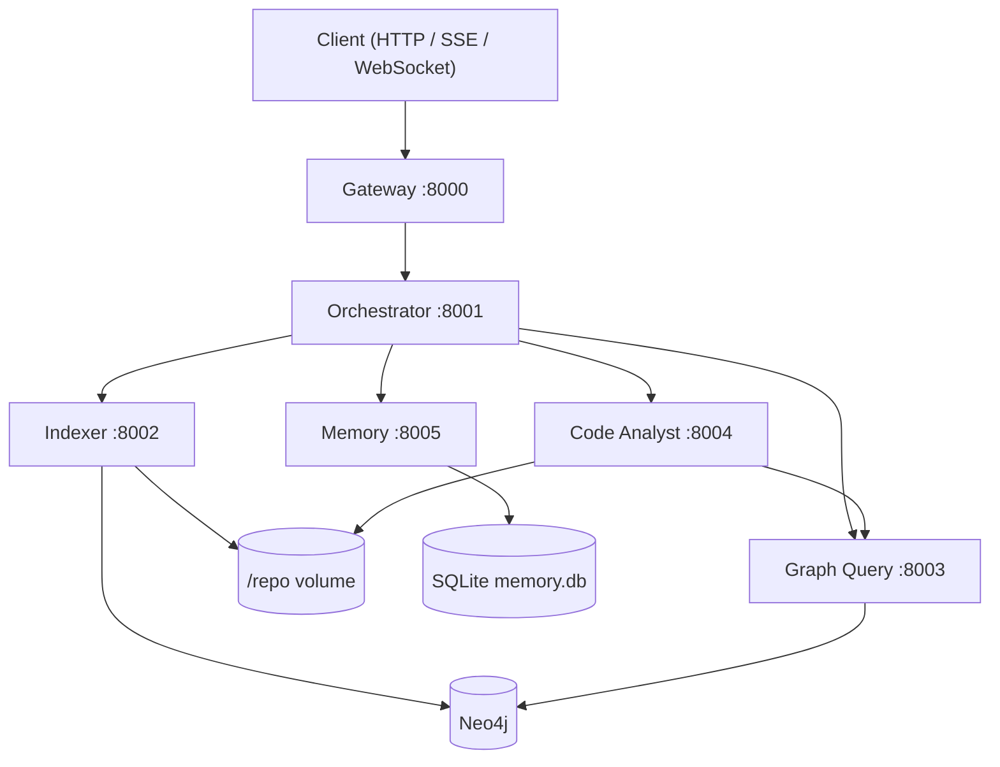
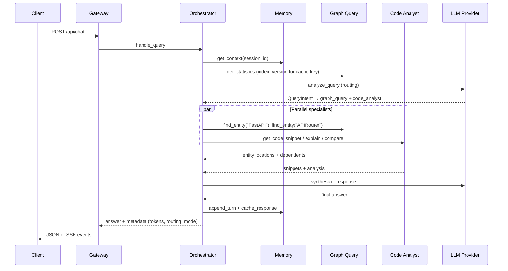

# FastAPI Repository Chat Agent

Five MCP servers (orchestrator, indexer, graph_query, code_analyst, memory) operate over a Neo4j knowledge graph of the [FastAPI](https://github.com/fastapi/fastapi) repository, fronted by a FastAPI gateway, all running in Docker Compose. The orchestrator routes natural-language questions to specialist agents, synthesizes a single answer, and persists conversation plus response cache in SQLite via the Memory agent.

## Overview

The system indexes a cloned Python repository into a typed Neo4j graph (modules, classes, functions, parameters, decorators, imports, docstrings, and their relationships). Users chat through the gateway; the orchestrator decides which agents to invoke, runs them in parallel where possible, and synthesizes a final answer. Context is queried on demand from the graph and Memory agent rather than baked into static prompt files.

### Architecture



### Complex query sequence

Example: *"Compare FastAPI and APIRouter implementations, then show who depends on them"*



---

## Setup

### Quick start

```bash
cp .env.example .env
# Export secrets in your shell (never commit them):
# export OPENROUTER_API_KEY=...
# export NEO4J_PASSWORD=changeme123
# export GATEWAY_API_KEY=...   # optional

docker compose up --build -d
curl http://localhost:8000/health
make index          # clone + index FastAPI into Neo4j (~minutes first run)
make smoke          # MCP smoke: find_entity → get_dependents → explain_implementation
```

Index the graph before asking code questions. The indexer clones `REPO_URL` into the shared `/repo` Docker volume and upserts nodes/relationships into Neo4j.

### `.env.example` walkthrough

| Section | Key variables | Purpose |
| --- | --- | --- |
| Global | `APP_ENV`, `LOG_LEVEL`, `REPO_ROOT`, `REPO_URL` | Runtime profile, repo clone target |
| Neo4j | `NEO4J_URI`, `NEO4J_USER` | Bolt connection (password via env, not repo files) |
| Gateway | `GATEWAY_PORT`, `GATEWAY_*_URL`, `GATEWAY_CACHE_TTL_SECONDS` | HTTP bind, MCP upstream URLs, response cache TTL |
| Orchestrator | `ORCH_PORT`, `ORCH_ROUTING_STRATEGY`, `ORCH_RULES_MAX_QUERY_TOKENS` | Routing mode (`rules_first` default), ambiguity token threshold |
| Indexer | `INDEXER_SKIP_TESTS`, `INDEXER_SKIP_DOCS` | Skip test/doc trees during indexing |
| Code Analyst | `CA_GRAPH_QUERY_URL`, `CA_REPO_ROOT` | Graph lookup MCP URL, read-only source root |
| Memory | `MEM_DB_PATH`, `MEM_RECENT_TURNS`, `MEM_CACHE_TTL_SECONDS` | SQLite path on `memory_data` volume, rolling turn window |
| LLM | `OPENROUTER_MODEL`, `OPENROUTER_BASE_URL` | Provider model + base URL (API key exported separately) |

**Secret precedence:** real environment variables → `.env.{APP_ENV}` overlay → `.env` → code defaults. Repo env files intentionally exclude `OPENROUTER_API_KEY`, `NEO4J_PASSWORD`, `GATEWAY_API_KEY`, and `ANTHROPIC_API_KEY`.

### Make targets

| Target | Description |
| --- | --- |
| `make up` | `docker compose up --build -d` (copies `.env.example` → `.env` if missing) |
| `make down` | Stop and remove containers |
| `make test` | Offline unit suite only (`pytest -m "not integration and not live"`, ≥70% coverage gate) |
| `make test-all` | Full pytest including integration/live markers |
| `make index` | Trigger `index_repository` inside the indexer container |
| `make smoke` | Day-2 MCP smoke via `scripts/smoke_day2.py` |
| `make smoke-day3` | End-to-end gateway SSE smoke (cache hit + degraded path) via `scripts/smoke_day3.py` |
| `make eval` | Routing golden set + trap integration tests; single PASS/FAIL summary |
| `make prove-incremental` | Live-stack proof that unchanged files are skipped on re-index |
| `make lint` | `ruff check .` + `mypy` |
| `make tokens-report` | Token usage table for the nine sample queries (StubProvider harness) |

---

## Agents

All agents expose FastMCP tools over streamable HTTP. Business logic lives in `core/`; agent packages are thin adapters.

### Orchestrator (`:8001`)

**Responsibility:** Route queries, execute multi-agent plans in parallel, synthesize one answer, manage response cache keys (`query + index_version`), and never return HTTP 500 for agent failures (degraded answers instead).

**Tools**

| Tool | Signature | Returns |
| --- | --- | --- |
| `health()` | — | `HealthStatus` |
| `get_conversation_context(session_id, token_budget=3000)` | session + budget | `ConversationContext` |
| `analyze_query(query, context)` | NL query + context | `QueryIntent` (always LLM when called directly) |
| `route_to_agents(intent)` | `QueryIntent` | `ExecutionPlan` |
| `synthesize_response(query, agent_outputs, context)` | query + outputs | `str` |
| `handle_query(query, session_id)` | gateway entrypoint | `{answer, metadata}` |

**Design points:** Rules-first routing with LLM escalation on ambiguity (`ORCH_ROUTING_STRATEGY`, `ORCH_RULES_MAX_QUERY_TOKENS`). Cache lookup before routing. In-process token ledger per correlation ID. MCP client of the other four agents.

### Indexer (`:8002`)

**Responsibility:** Clone the target repo, parse Python AST, extract entities/relationships, and batch-upsert into Neo4j. Only agent that writes the graph.

**Tools**

| Tool | Signature | Returns |
| --- | --- | --- |
| `health()` | — | `HealthStatus` |
| `index_repository(repo_url=None)` | optional URL override | `IndexReport` |
| `index_file(path)` | repo-relative path | `IndexReport` |
| `parse_python_ast(path_or_code)` | file path or source | `ParsedFile` |
| `extract_entities(path_or_code)` | file path or source | `ExtractedGraph` |
| `get_index_status()` | — | `IndexStatus` (last report + live counts) |

**Design points:** Content-hash incremental indexing at file granularity. `UNWIND` batched writes. Shared `:Decorator` nodes survive file-subtree deletes. Async lock prevents concurrent full indexes.

### Graph Query (`:8003`)

**Responsibility:** Read-only Cypher over the knowledge graph. Template queries for common traversals plus guarded ad-hoc Cypher.

**Tools**

| Tool | Signature | Returns |
| --- | --- | --- |
| `health()` | — | `HealthStatus` |
| `find_entity(name, entity_type=None)` | name + optional label | `EntityQueryResult` |
| `get_dependencies(name)` | qualified name | `NeighborQueryResult` |
| `get_dependents(name)` | qualified name | `NeighborQueryResult` |
| `trace_imports(module, depth=5)` | module + depth cap | `ImportTraceResult` |
| `find_related(name, relationship_type)` | name + rel type | `RelatedQueryResult` |
| `execute_query(cypher, params=None)` | read-only Cypher | `QueryResult` (includes `cypher_executed`, `params`) |
| `get_statistics()` | — | `GraphStatistics` (`index_version`, label/rel counts) |

**Design points:** Write clauses rejected; default `LIMIT` injected. `:Meta` singleton stores `index_version` for cache invalidation.

### Code Analyst (`:8004`)

**Responsibility:** Read source from `/repo` using graph coordinates, run structured LLM analysis (explain, compare, pattern find).

**Tools**

| Tool | Signature | Returns |
| --- | --- | --- |
| `health()` | — | `HealthStatus` |
| `analyze_function(qualified_name)` | e.g. `fastapi.routing.APIRouter` | `FunctionAnalysis` |
| `analyze_class(qualified_name)` | class FQN | `ClassAnalysis` |
| `find_patterns(pattern)` | `decorator` \| `dependency_injection` \| `factory` | `PatternAnalysis` |
| `get_code_snippet(qualified_name=None, file_path=None, line_start=None, line_end=None)` | name or path range | `SnippetResult` |
| `explain_implementation(qualified_name)` | FQN | `ImplementationExplanation` |
| `compare_implementations(name_a, name_b)` | two FQNs | `ImplementationComparison` |

**Design points:** No direct Neo4j — graph lookup via Graph Query MCP. Path traversal guarded. `find_patterns` supports exactly three fixed Cypher templates.

### Memory (`:8005`)

**Responsibility:** SQLite-backed session memory (rolling summary + recent turns) and opaque response cache keyed by orchestrator.

**Tools**

| Tool | Signature | Returns |
| --- | --- | --- |
| `health()` | — | `HealthStatus` |
| `append_turn(session_id, role, content)` | user/assistant turn | `{status: ok}` |
| `get_context(session_id, token_budget=3000)` | session + budget | `ConversationContext` |
| `summarize_session(session_id)` | fold older turns | `{summary}` |
| `cache_response(cache_key, response_json)` | caller-computed key | `{status: ok}` |
| `get_cached_response(cache_key)` | key | `CachedResponse \| null` |

**Design points:** Idempotent `folded_at` migration prevents double-summarization. Cache TTL configurable per agent. Data persisted on `memory_data` Docker volume.

---

## Gateway API

Base URL: `http://localhost:8000`. When `GATEWAY_API_KEY` is set, pass `X-API-Key: <key>` on all routes except `GET /api/agents/health` and `GET /health`.

| Method | Path | Description |
| --- | --- | --- |
| `POST` | `/api/chat` | Chat (JSON body; `stream=true` for SSE) |
| `GET` | `/ws/chat` | WebSocket chat (same event protocol) |
| `POST` | `/api/index` | Start background index job |
| `GET` | `/api/index/status/{job_id}` | Poll index job status |
| `GET` | `/api/agents/health` | Per-agent health aggregation |
| `GET` | `/api/graph/statistics` | Graph counts + `index_version` |
| `GET` | `/health` | Alias for agents health |

### Examples

**Chat (JSON)**

```bash
curl -s http://localhost:8000/api/chat \
  -H 'Content-Type: application/json' \
  -d '{"message":"What is the FastAPI class?","session_id":"demo-1"}' | jq .
```

**Chat (SSE)**

```bash
curl -N http://localhost:8000/api/chat \
  -H 'Content-Type: application/json' \
  -d '{"message":"What is the FastAPI class?","stream":true}'
```

**WebSocket** — connect to `ws://localhost:8000/ws/chat`, send JSON messages shaped like `ChatRequest`:

```json
{"message": "What is the FastAPI class?", "session_id": "demo-1"}
```

**Start index job**

```bash
curl -s http://localhost:8000/api/index \
  -H 'Content-Type: application/json' \
  -d '{"mode":"incremental"}' | jq .
```

**Index job status**

```bash
curl -s http://localhost:8000/api/index/status/<job_id> | jq .
```

**Agents health**

```bash
curl -s http://localhost:8000/api/agents/health | jq .
```

**Graph statistics**

```bash
curl -s http://localhost:8000/api/graph/statistics | jq .
```

### SSE / WebSocket event protocol

Both transports emit the same four event types in order:

| Event | Payload highlights |
| --- | --- |
| `routing` | `routing_mode`, `agents`, `cached`, `degraded` |
| `agent_result` | `agent`, `ok`, `cached`, `degraded` |
| `answer` | `chunk` (text fragment; gateway splits at `GATEWAY_ANSWER_CHUNK_CHARS`) |
| `done` | `latency_ms`, `cached`, `degraded`, `routing_mode`, `tokens` (`total`, `prompt`, `completion`, `llm_calls`, `by_purpose`) |

**SSE format:** `event: <type>\ndata: {"type":"<type>","correlation_id":"...","..."}\n\n`

**WebSocket format:** `{"type":"<type>","correlation_id":"...","data":{...}}`

Every response includes an `x-correlation-id` header for log correlation.

---

## Design decisions and trade-offs

**Framework-free core with thin MCP adapters.** Parsing, Cypher, routing, and LLM logic live in `core/`; agent packages only wire FastMCP transport. Rejected embedding that logic inside agent packages, which would couple business rules to MCP and hinder unit testing.

**Streamable HTTP per agent container.** Each agent is an independent Docker service on its own port. Rejected a single-process stdio MCP multiplex that would prevent independent scaling and health checks.

**Restricted Neo4j access.** Only indexer (writes) and graph_query (reads) open Neo4j sessions. Rejected letting every agent connect directly, which would blur write/read boundaries.

**Batched Neo4j writes with `UNWIND`.** Bulk upserts amortize round-trips during indexing. Rejected per-row individual Cypher transactions.

**File-granularity incremental indexing.** Content hashes skip unchanged files on re-index. Rejected full re-parse and upsert on every run.

**First-class graph nodes for parameters, decorators, imports, docstrings.** Queries traverse typed nodes and relationships. Rejected storing these only as scalar properties on code nodes.

**Shared decorator nodes.** `:Decorator` nodes are excluded from file-subtree deletes so reused decorators survive reindex. Rejected deleting decorators with the owning file subtree.

**Guarded read-only Cypher.** User-facing `execute_query` rejects writes and injects `LIMIT`. Rejected raw user Cypher with no guard or cap.

**Best-effort `CALLS` resolution by name.** Call sites are linked without full type inference. Rejected waiting for perfect resolution before emitting any `CALLS` edges.

**LLMProvider protocol + StubProvider.** All LLM calls go through one interface; tests use deterministic stubs. Rejected real API calls in unit tests.

**Auditable guarded queries.** `execute_query` returns `cypher_executed` and `params` so callers can verify LIMIT injection. Rejected logging-only audit trails.

**Offline-green test contract.** `make test` excludes `integration` and `live` markers and runs without Docker, Neo4j, or API keys. Rejected relying solely on runtime skipif checks without marker-based exclusion.

**On-demand context, not static prompt files.** Repository knowledge lives in the Neo4j graph; conversational state lives in the Memory agent. Both are queried per request rather than loaded into every prompt upfront, so context is paid for only when needed.

**Response cache keyed by `query + index_version`.** The orchestrator normalizes the query, reads `index_version` from `get_statistics`, and stores answers in Memory. Re-indexing bumps the version and automatically invalidates stale cache entries.

**Never-500 degradation policy.** Agent timeouts, routing failures, and synthesis errors produce degraded answers with `degraded: true` in metadata/events. The gateway returns HTTP 200 with partial results rather than failing the client request.

**Idempotent session folding.** A nullable `folded_at` column on SQLite turns prevents re-summarizing already folded history. Rejected deleting old turns immediately after summarization.

**Singleton `:Meta` for index metadata.** `index_version` and `last_indexed_at` are stored on one node keyed by `key`. Rejected deriving version ad hoc from file nodes on every statistics read.

**Secret filtering from repo env files.** Overlay config files remain ergonomic while API keys and passwords must be exported. Rejected loading secrets from committed `.env*` files.

**Entity extraction in fallback routing.** When LLM routing fails, rule-based fallback still extracts likely entities for specialist lookups. Rejected silent no-op specialists on routing failure.

**Deterministic rule-based routing for golden evals.** Simple lookups route to `graph_query` only; multi-part analysis escalates to LLM routing with multiple agents. Rejected defaulting most queries to mixed multi-agent plans.

**Synthesis short-circuit for absent entities.** When graph and snippet lookups find nothing, synthesis returns an honest out-of-repo message without calling the LLM. Rejected always prompting the LLM with empty results (hallucination risk on trap queries).

**Unified eval entrypoint.** `make eval` runs routing JSONL checks and trap pytest in one pass. Rejected separate manual eval commands.

**CI eval with host-cloned FastAPI.** The eval job clones FastAPI on the runner and indexes via Docker Compose so trap tests see both host-readable paths and the live graph. Rejected container-only repo volumes for integration evals.

**Rules-first routing with LLM escalation.** Cheap deterministic routing handles simple queries; ambiguous or long queries call the LLM router. Rejected always routing through the LLM first.

**In-process token ledger.** Per-request token totals are accumulated and emitted in gateway `done` events. Rejected provider-only logs with no request-level aggregation.

---

## Testing and evaluation

### Fresh-clone guarantee

`make test` is guaranteed to pass from a fresh clone without a `.env` file or running Docker Compose containers: StubProvider everywhere, no Neo4j required, coverage gate ≥70% on `core/src/core`.

### Marker taxonomy

| Marker | Requires | Included in |
| --- | --- | --- |
| *(none)* | nothing | `make test`, `make test-all` |
| `integration` | `NEO4J_URI`, indexed graph, often `REPO_ROOT` | `make test-all`, trap evals via `make eval` |
| `live` | full Docker Compose stack | `make test-all` |

### Coverage

Offline suite (`make test`, 2026-08-18):

```
TOTAL    2818 statements    82.73% coverage (gate: 70%)
156 passed, 4 deselected
```

### Routing golden set

All nine queries in `evals/routing.jsonl` pass rule-based routing checks (`make eval`):

| Query | Expected agents | Mode | Result |
| --- | --- | --- | --- |
| What is the FastAPI class? | `graph_query` | rules | PASS |
| What classes inherit from APIRouter? | `graph_query` | rules | PASS |
| How does dependency injection work and show me examples from the codebase | `graph_query`, `code_analyst` | llm | PASS |
| Compare FastAPI and APIRouter implementations in the codebase | `graph_query`, `code_analyst` | llm | PASS |
| Explain how get_openapi is implemented and who calls it | `graph_query`, `code_analyst` | llm | PASS |
| Reindex the repository and explain dependency injection examples in the codebase | `indexer`, `graph_query`, `code_analyst` | llm | PASS |
| Reindex the repository and trace how APIRouter imports connect to FastAPI | `indexer`, `graph_query`, `code_analyst` | llm | PASS |
| Compare FastAPI and APIRouter implementations, then show who depends on them | `graph_query`, `code_analyst` | llm | PASS |
| Explain how dependency injection, APIRouter, and get_openapi connect across the codebase | `graph_query`, `code_analyst` | llm | PASS |

**Zero-LLM routing fraction:** 2/9 (22%) — only the two simple lookup queries use pure rules routing without LLM classification.

### Trap queries

Out-of-repo questions must not hallucinate FastAPI paths (`evals/traps.jsonl`, `NEO4J_URI=bolt://localhost:7687`):

| Query | Result | Sample answer (trimmed) |
| --- | --- | --- |
| How does Django's ORM lazy-load querysets? | PASS | This topic is not in the indexed FastAPI codebase. The query appears to refer to entities outside this repository (Django, ORM)... |
| Explain React's useEffect cleanup | PASS | This topic is not in the indexed FastAPI codebase. The query appears to refer to entities outside this repository (Explain, React)... |

### Tokens per query

From `make tokens-report` (StubProvider harness; second column is cache-hit tokens):

| query | routing_mode | llm_calls | total_tokens | cached_total_tokens |
| --- | --- | ---: | ---: | ---: |
| What is the FastAPI class? | rules | 1 | 120 | 0 |
| What classes inherit from APIRouter? | rules | 1 | 120 | 0 |
| How does dependency injection work and show me examples from the codebase | llm | 2 | 240 | 0 |
| Compare FastAPI and APIRouter implementations in the codebase | llm | 2 | 240 | 0 |
| Explain how get_openapi is implemented and who calls it | llm | 2 | 240 | 0 |
| Reindex the repository and explain dependency injection examples in the codebase | llm | 2 | 240 | 0 |
| Reindex the repository and trace how APIRouter imports connect to FastAPI | llm | 2 | 240 | 0 |
| Compare FastAPI and APIRouter implementations, then show who depends on them | llm | 2 | 240 | 0 |
| Explain how dependency injection, APIRouter, and get_openapi connect across the codebase | llm | 2 | 240 | 0 |

The harness reports `cached_total_tokens = 0` for all rows because the in-memory test double does not replay cached token totals on the second pass; production cache hits emit `tokens.total = 0` and `llm_calls = 0`.

---

## Known limitations and future improvements

| Limitation | Detail |
| --- | --- |
| Best-effort `CALLS` | Edges resolved by callee name only; no cross-module type inference |
| `find_patterns` | Three fixed patterns: `decorator`, `dependency_injection`, `factory` |
| Incremental indexing | File-granularity only; a single-line change reindexes the whole file |
| Index job registry | In-process dict in the gateway; jobs lost on restart, no cross-replica coordination |
| Shared API key | Optional single `GATEWAY_API_KEY`; not per-user auth or scoped service credentials |

**Future work**

- Vector index over `:Docstring` nodes for semantic search
- Real job queue (Redis/SQS) replacing the in-process index registry
- Per-agent authorization on MCP and gateway routes

---

## Sample query transcripts

Captured against the live Docker Compose stack (Neo4j indexed, MCP agents on `:8002–:8005`, OpenRouter for routing/synthesis). Latencies are end-to-end orchestrator wall time.

### 1. What is the FastAPI class?

- **Agents:** `graph_query`
- **Routing mode:** `rules`
- **Latency:** 7640 ms
- **Answer (trimmed):** The **FastAPI class** is the main class in the FastAPI framework used to create web applications. It serves as the central application instance that handles routing, middleware, dependencies, and all the core functionality needed to build APIs...

### 2. What classes inherit from APIRouter?

- **Agents:** `graph_query`
- **Routing mode:** `rules`
- **Latency:** 7190 ms
- **Answer (trimmed):** Based on the available information, I can see that `APIRouter` is a class defined in the FastAPI framework... The search did not find any classes that inherit from `APIRouter` in the codebase examined...

### 3. How does dependency injection work and show me examples from the codebase

- **Agents:** `graph_query`, `code_analyst` (LLM router selected `memory`, `code_analyst`; synthesis short-circuited)
- **Routing mode:** `llm`
- **Latency:** 5240 ms
- **Answer (trimmed):** This topic is not in the indexed FastAPI codebase. The query appears to refer to entities outside this repository (dependency injection), so I can't explain it from indexed FastAPI sources.

### 4. Compare FastAPI and APIRouter implementations in the codebase

- **Agents:** `graph_query`, `code_analyst`
- **Routing mode:** `llm`
- **Latency:** 16760 ms
- **Answer (trimmed):** ## Comparison of FastAPI and APIRouter — **FastAPI Class** at `fastapi/applications.py` (lines 42–4774)... **APIRouter Class** at `fastapi/routing.py` (lines 2255–6447)...

### 5. Explain how get_openapi is implemented and who calls it

- **Agents:** `graph_query`, `code_analyst`
- **Routing mode:** `llm`
- **Latency:** 15150 ms
- **Answer (trimmed):** The `get_openapi` function is implemented in the FastAPI framework at `fastapi/openapi/utils.py` (lines 585–679)... generates the OpenAPI schema for a FastAPI application...

### 6. Reindex the repository and explain dependency injection examples in the codebase

- **Agents:** `indexer`, `graph_query`, `code_analyst` (LLM router selected `indexer`, `code_analyst`; synthesis short-circuited)
- **Routing mode:** `llm`
- **Latency:** 6100 ms
- **Answer (trimmed):** This topic is not in the indexed FastAPI codebase. The query appears to refer to entities outside this repository (dependency injection)...

### 7. Reindex the repository and trace how APIRouter imports connect to FastAPI

- **Agents:** `indexer`, `graph_query`, `code_analyst` (LLM router selected `indexer`, `code_analyst`; synthesis short-circuited)
- **Routing mode:** `llm`
- **Latency:** 5520 ms
- **Answer (trimmed):** This topic is not in the indexed FastAPI codebase. The query appears to refer to entities outside this repository (APIRouter, FastAPI)...

### 8. Compare FastAPI and APIRouter implementations, then show who depends on them

- **Agents:** `graph_query`, `code_analyst`
- **Routing mode:** `llm`
- **Latency:** 17200 ms
- **Answer (trimmed):** ## Comparison of FastAPI and APIRouter — **FastAPI Class** at `fastapi/applications.py`... **APIRouter Class** at `fastapi/routing.py`... (dependents discussion from graph results)

### 9. Explain how dependency injection, APIRouter, and get_openapi connect across the codebase

- **Agents:** `graph_query`, `code_analyst`
- **Routing mode:** `llm`
- **Latency:** 17040 ms
- **Answer (trimmed):** ## How These Components Connect — **APIRouter** in `fastapi/routing.py`... **Dependency Injection** as a fundamental FastAPI pattern... **get_openapi** ties into schema generation...

---

## Graph schema (reference)

**Node labels:** `Module`, `Class`, `Function`, `Method`, `Parameter`, `Decorator`, `Import`, `Docstring`, `File`, `Meta`

**Relationships:** `CONTAINS`, `IMPORTS`, `INHERITS_FROM`, `CALLS`, `DECORATED_BY`, `HAS_PARAMETER`, `DOCUMENTED_BY`, `DEPENDS_ON`

After indexing FastAPI (2026-08-18): 532 files, ~8.7k nodes, ~8.6k relationships, `index_version` exposed via `GET /api/graph/statistics`.
