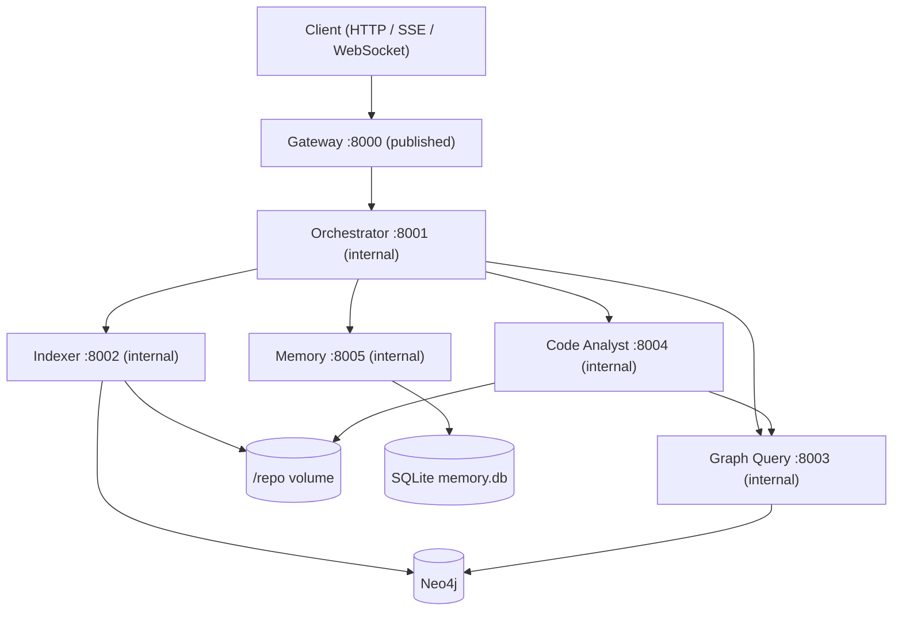

# Repository Agent

Five MCP servers (orchestrator, indexer, graph_query, code_analyst, memory) operate over a Neo4j knowledge graph of the [FastAPI](https://github.com/fastapi/fastapi) repository, fronted by a FastAPI gateway, all running in Docker Compose. The orchestrator routes natural-language questions to specialist agents, synthesizes one answer with `file:line` citations resolved against the graph, and persists conversation plus response cache in SQLite via the Memory agent.

## Results

<!-- BEGIN_EVAL_SUMMARY -->
Live LLM run over all 58 labelled turns in `evals/qa.jsonl` (2026-09-03). Full scorecard, per-turn verdicts, and the model bake-off: **[docs/evaluation.md](docs/evaluation.md)**.

| Tier | n | Pass rate | Citation precision | Groundedness | Entity recall |
| --- | ---: | ---: | ---: | ---: | ---: |
| simple | 12 | 100% | 100% (2 excl.) | 91% | 100% |
| medium | 12 | 100% | 100% | 95% | 100% |
| complex | 12 | 92% | 100% | 95% | 92% |
| trap | 6 | 100% (refusal 100%) | — (6 excl.) | 39% | 100% |
| multi-turn | 16 | 88% | 100% (1 excl.) | 93% | 100% |

| Gated metric | Score | n | Status |
| --- | ---: | ---: | --- |
| `hard_executed_agents` | 1.00 | 58 | PASS |
| `hard_non_trap_not_degraded` | 1.00 | 52 | PASS |
| `refusal_accuracy` | 1.00 | 6 | PASS |
| `citation_precision` | 1.00 | 49 | PASS |
| `groundedness` | 0.94 | 52 | PASS |
| `entity_recall` | 0.98 | 52 | FAIL |
| `retrieval_correctness` | 0.99 | 52 | FAIL |
<!-- END_EVAL_SUMMARY -->

**Suite totals** (same run): 55/58 turns passed, 795,635 tokens, $2.07, mean latency 15,524 ms. Routing is `anthropic/claude-sonnet-4.5`, synthesis `openai/gpt-4.1-mini` — chosen from a measured bake-off (89% synthesis quality at 11.7s p95 and $1.18/1k, versus sonnet-4.5's 82% at 19.9s and $14.43/1k). See [docs/regression-2026-08-20.md](docs/regression-2026-08-20.md) for the run-over-run comparison.

**Offline suite** (`make test`, no Docker, no API key, StubProvider): 496 passed, 8,951 statements, **87.25% coverage** against a 79% gate.

**Indexed graph** (FastAPI @ 2026-09-02): 1,138 files, 17,188 nodes, 22,359 relationships.

---

## Architecture



| Agent | Port | Responsibility |
| --- | --- | --- |
| **Orchestrator** | `:8001` | Rules-first routing with LLM escalation, concurrent specialist execution, response synthesis, cache keys, degraded answers |
| **Indexer** | `:8002` | Clone the repo, parse Python AST, batch-upsert Neo4j. **Only writer.** |
| **Graph Query** | `:8003` | Read-only guarded Cypher, entity resolution, dependency and import traversal. **Only reader.** |
| **Code Analyst** | `:8004` | Reads source from `/repo` at graph coordinates, runs LLM explain / compare / pattern analysis. No direct Neo4j. |
| **Memory** | `:8005` | SQLite session history, rolling summary, opaque response cache |

All business logic lives in `core/`; agent packages are thin FastMCP adapters, which is why the unit suite needs no Docker and no API key. Only the gateway is published to the host.

**Full detail:** [docs/architecture.md](docs/architecture.md) — per-agent tool signatures, request sequence diagram, graph schema.

---

## Quick start

```bash
cp .env.example .env
# Secrets are exported, never committed:
#   export OPENROUTER_API_KEY=...
#   export NEO4J_PASSWORD=...
#   export NEO4J_AUTH=neo4j/$NEO4J_PASSWORD
#   export GATEWAY_API_KEY=...        # compose defaults to dev-gateway-key

docker compose up --build -d
curl http://localhost:8000/health
make index          # clone + index FastAPI into Neo4j (~minutes first run)
make smoke          # MCP smoke: find_entity → get_dependents → explain_implementation
```

Index the graph before asking code questions. Compose **requires** `NEO4J_PASSWORD` / `NEO4J_AUTH` and will not invent a default.

```bash
curl -s http://localhost:8000/api/chat \
  -H 'Content-Type: application/json' -H 'X-API-Key: dev-gateway-key' \
  -d '{"message":"What is the FastAPI class?","session_id":"demo-1"}' | jq .
```

**Configuration reference** (every env var per agent, make targets, secret precedence): [docs/configuration.md](docs/configuration.md).

---

## Gateway API

| Method | Path | Description |
| --- | --- | --- |
| `POST` | `/api/chat` | Chat (JSON body; `stream=true` for SSE) |
| `WS` | `/ws/chat` | WebSocket chat (same event protocol) |
| `POST` | `/api/index` | Start background index job (`incremental` hash-skip or `full` re-parse) |
| `GET` | `/api/index/status/{job_id}` | Poll index job status |
| `GET` | `/api/agents/health` | Per-agent health aggregation |
| `GET` | `/api/graph/statistics` | Graph counts + `index_version` |
| `GET` | `/health` | Alias for agents health |
| `GET` | `/metrics` | Prometheus metrics |

`X-API-Key` is required on every route except `/health`, `/api/agents/health`, and the OpenAPI docs. Sliding-window rate limiting covers HTTP routes and each WebSocket message. Interactive OpenAPI at `/docs`.

**Full detail:** [docs/api.md](docs/api.md) — request/response examples, SSE and WebSocket event protocol, security model.

---

## Scope and cost

The limitations below are deliberate scope cuts rather than unknowns — each one is measured, reproducible, and reported by the eval suite instead of hidden.

A graceful-degradation defect — a *stopped* specialist container returning 503 after the gateway ceiling instead of a degraded 200 — was fixed on 2026-08-21. Root cause and measurements are in [WALKTHROUGH.md](WALKTHROUGH.md#failure-handling).

LLM spend is treated as a budget to engineer against. The offline suite (`make test`) and the routing/QA/trap evals (`make eval`) run entirely on `StubProvider` — no API key, no network — so CI and day-to-day iteration cost nothing, and live evaluation stays a deliberate, infrequent step ($2.07 for a full 58-turn run). That separation is what kept the regression in [docs/regression-2026-08-20.md](docs/regression-2026-08-20.md) cheap to diagnose: a live run surfaced it, but the offline suite localised it to one Cypher lookup and verified every candidate fix at zero API cost, so only the confirming run cost money. At runtime the orchestrator enforces per-request token and USD ceilings (`ORCH_REQUEST_TOKEN_BUDGET`, `ORCH_REQUEST_COST_USD_MAX`) and falls back to evidence already gathered when one trips.

---

## Known limitations

| Limitation | Detail |
| --- | --- |
| Best-effort `CALLS` | Edges resolved by callee name only; no cross-module type inference |
| `find_patterns` | Three fixed patterns: `decorator`, `dependency_injection`, `factory` |
| Incremental indexing | File-granularity only; a single-line change reindexes the whole file. `mode=full` is the escape hatch |
| Index job registry | In-process dict in the gateway; jobs lost on restart, no cross-replica coordination. Job status is polled from the indexer, so a job outlives the MCP request timeout, but not a gateway restart |
| Shared API key | Compose default `GATEWAY_API_KEY=dev-gateway-key`; same value is the MCP shared secret. Not per-user auth |
| Embedding backend | Defaults to `HashingEmbeddingProvider` (token overlap, not semantics) so indexing stays offline and free. `EMBEDDING_BACKEND=openrouter` swaps in a real model; switching either way needs `mode=full` since the two vector spaces are not comparable. A mismatch is detected from a fingerprint on the `:Meta` node and disables the tier rather than ranking nonsense. Retrieval tier is off unless `GQ_EMBEDDINGS_ENABLED=1` |
| Embedding dimension | Fixed at 256 to match the Neo4j vector indexes. Changing it requires dropping and recreating them — `CREATE ... IF NOT EXISTS` will not resize an existing index |
| Evidence refinement | Follow-up rounds expand keywords/entities and missing agents; they do not call an LLM to replan |
| Coreference | Regex pronouns + entity carry from recent user turns and the folded summary. No model-based resolution |
| Third-party symbols | Names defined in starlette have no graph node. `find_entity` falls back to the FastAPI module that re-exports them |
| Concept-to-entity mapping | `_CONCEPT_ENTITIES` covers dependency injection, request lifecycle, and request validation. Purely conceptual queries outside that table still miss labelled entities |

**Future work:** a Redis/SQS job queue replacing the in-process index registry, for durability across restarts and cross-replica coordination; gating the embedding retrieval tier so it only runs when the exact and full-text tiers come up short, rather than on every `find_entity`; retuning `DEFAULT_EMBEDDING_MIN_SCORE`, which was fitted to hash-vector cosines; model-based coreference; a fitted synthesis-reserve latency slope.

---

## Documentation

| Document | Contents |
| --- | --- |
| [WALKTHROUGH.md](WALKTHROUGH.md) | Written walkthrough: architecture, setup, indexing, sample queries, MCP/synthesis, observability |
| [docs/architecture.md](docs/architecture.md) | System and sequence diagrams, per-agent tools and design points, graph schema |
| [docs/design-decisions.md](docs/design-decisions.md) | Trade-off catalogue with rejected alternatives; request budget and latency hierarchy |
| [docs/configuration.md](docs/configuration.md) | Every environment variable per agent, make targets, secret precedence |
| [docs/api.md](docs/api.md) | Gateway examples, SSE/WebSocket event protocol, security model |
| [docs/evaluation.md](docs/evaluation.md) | Test contract, coverage split, model bake-off, full live and offline scorecards, sample transcripts |
| [docs/regression-2026-08-20.md](docs/regression-2026-08-20.md) | Run-over-run eval comparison and regression diagnosis |

## Repository layout

```
core/          business logic: parsing, graph, querying, orchestration, LLM, eval
agents/        five thin FastMCP adapters (orchestrator, indexer, graph_query, code_analyst, memory)
gateway/       FastAPI HTTP/SSE/WebSocket gateway
evals/         labelled QA, routing, and trap cases
scripts/       eval runners, bake-off, smoke, token report
tests/         cross-service tests; unit tests live in core/tests
```
