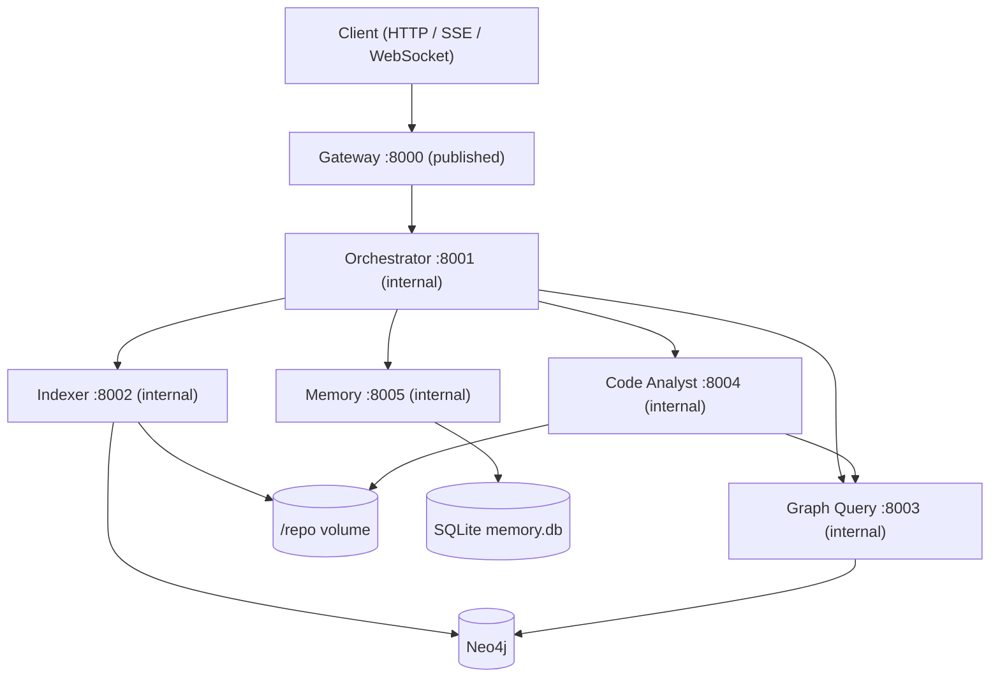
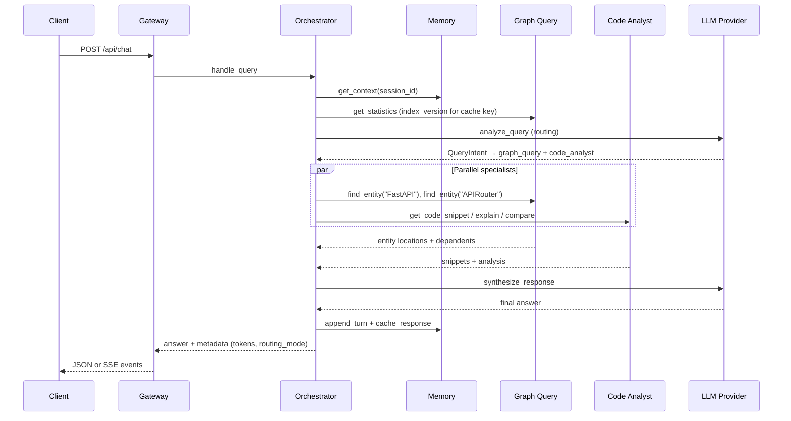

# FastAPI Repository Chat Agent

Five MCP servers (orchestrator, indexer, graph_query, code_analyst, memory) operate over a Neo4j knowledge graph of the [FastAPI](https://github.com/fastapi/fastapi) repository, fronted by a FastAPI gateway, all running in Docker Compose. The orchestrator routes natural-language questions to specialist agents, synthesizes a single answer, and persists conversation plus response cache in SQLite via the Memory agent.

## Overview

The system indexes a cloned Python repository into a typed Neo4j graph (modules, classes, functions, parameters, decorators, imports, docstrings, and their relationships). Users chat through the gateway; the orchestrator decides which agents to invoke, runs them in parallel where possible, and synthesizes a final answer. Context is queried on demand from the graph and Memory agent rather than baked into static prompt files.

### Architecture



### Complex query sequence

Example: *"Compare FastAPI and APIRouter implementations, then show who depends on them"*



---

## Setup

### Quick start

```bash
cp .env.example .env
# Export secrets in your shell (never commit them):
# export OPENROUTER_API_KEY=...
# export NEO4J_PASSWORD=...          # required; compose will not invent a default
# export NEO4J_AUTH=neo4j/$NEO4J_PASSWORD
# export GATEWAY_API_KEY=...         # compose defaults to dev-gateway-key

docker compose up --build -d
curl http://localhost:8000/health
make index          # clone + index FastAPI into Neo4j (~minutes first run)
make smoke          # MCP smoke via compose network: find_entity → get_dependents → explain_implementation
```

Index the graph before asking code questions. The indexer clones `REPO_URL` into the shared `/repo` Docker volume and upserts nodes/relationships into Neo4j.

### `.env.example` walkthrough

| Section | Key variables | Purpose |
| --- | --- | --- |
| Global | `APP_ENV`, `LOG_LEVEL`, `REPO_ROOT`, `REPO_URL` | Runtime profile (`development` / `testing` / `production`), repo clone target. `APP_ENV` loads `.env.{APP_ENV}` over `.env` |
| Neo4j | `NEO4J_URI`, `NEO4J_USER` | Bolt connection. `NEO4J_PASSWORD` / `NEO4J_AUTH` are required at compose time and are never committed |
| Gateway | `GATEWAY_PORT`, `GATEWAY_*_URL`, `GATEWAY_CACHE_TTL_SECONDS`, `GATEWAY_API_KEY`, `GATEWAY_RATE_LIMIT_REQUESTS`, `GATEWAY_RATE_LIMIT_WINDOW_S`, `GATEWAY_MAX_MESSAGE_CHARS` | HTTP bind, MCP upstream URLs, response cache TTL, chat/index API key (compose default `dev-gateway-key`), sliding-window rate limit (HTTP and WebSocket), max chat message size |
| Orchestrator | `ORCH_PORT`, `ORCH_ROUTING_STRATEGY`, `ORCH_RULES_MAX_QUERY_TOKENS`, `ORCH_SYNTHESIS_TIMEOUT_S`, `ORCH_SYNTHESIS_PROMPT_TOKEN_BUDGET`, `ORCH_SYNTHESIS_RESERVE_S`, `ORCH_PLAN_DEADLINE_S`, `ORCH_REQUEST_DEADLINE_S`, `ORCH_REQUEST_TOKEN_BUDGET`, `ORCH_REQUEST_COST_USD_MAX`, `ORCH_BREAKER_*` | Routing mode (`rules_first` default), ambiguity token threshold, synthesis LLM **cap**, time reserved for synthesis so the plan phase cannot starve it, heuristic refinement cutoff, outer request wall-clock, outer token and USD ceilings, per-agent circuit-breaker overrides |
| Indexer | `INDEXER_SKIP_TESTS`, `INDEXER_SKIP_DOCS`, `INDEXER_CLONE_ALLOWED_HOSTS`, `INDEXER_CLONE_ALLOWED_SCHEMES` | Fast profile only: skip `tests/` and `docs/` (default is a full index). Clone URL allowlist (default `https` + `github.com`) |
| Graph Query | `GQ_EMBEDDINGS_ENABLED` | Enable the hash-based lexical fallback (256-dim bag-of-words hash, not a semantic embedding model). Default off; the flag is authoritative even if a provider is injected |
| Code Analyst | `CA_GRAPH_QUERY_URL`, `CA_REPO_ROOT` | Graph lookup MCP URL, read-only source root |
| Memory | `MEM_DB_PATH`, `MEM_RECENT_TURNS`, `MEM_CACHE_TTL_SECONDS` | SQLite path on `memory_data` volume, rolling turn window |
| LLM | `OPENROUTER_MODEL`, `ORCH_MODEL_ROUTING`, `ORCH_MODEL_SYNTHESIS`, `CA_MODEL_ANALYSIS`, `OPENROUTER_BASE_URL`, `LLM_PROMPT_USD_PER_MILLION`, `LLM_COMPLETION_USD_PER_MILLION`, `LLM_CACHED_PROMPT_USD_PER_MILLION`, `LLM_MODEL_PRICES_JSON`, `LLM_PROMPT_CACHE` | Global model (default `anthropic/claude-sonnet-4.5`) for routing/analysis; synthesis defaults to `openai/gpt-4.1-mini`. Per-1M rates for the token ledger; Anthropic prompt caching on static system prompts |
| Observability | `OTEL_EXPORTER_OTLP_ENDPOINT` | OTLP HTTP traces when set; blank disables export |

**Secret precedence:** real environment variables → `.env.{APP_ENV}` overlay (`.env.development` / `.env.production` in the repo contain no secrets) → `.env` → code defaults. Repo env files intentionally exclude `OPENROUTER_API_KEY`, `NEO4J_PASSWORD`, `GATEWAY_API_KEY`, `MCP_SHARED_SECRET`, and `ANTHROPIC_API_KEY`. Compose sets `GATEWAY_API_KEY` (and the MCP shared secret) to `dev-gateway-key` when unset, and **requires** `NEO4J_PASSWORD` / `NEO4J_AUTH`. Agent MCP ports are internal-only; `make smoke` runs inside the compose network.

### Make targets

| Target | Description |
| --- | --- |
| `make up` | `docker compose up --build -d` (copies `.env.example` → `.env` if missing) |
| `make down` | Stop and remove containers |
| `make test` | Offline unit suite only (`pytest -m "not integration and not live"`, ≥79% coverage gate) |
| `make test-all` | Full pytest including integration/live markers |
| `make index` | Trigger `index_repository` inside the indexer container |
| `make smoke` | Day-2 MCP smoke via `docker compose exec` into the gateway (`python -m core.mcp.smoke`) |
| `make smoke-day3` | End-to-end gateway SSE smoke (cache hit + degraded path) via `scripts/smoke_day3.py` |
| `make eval` | Executed-plan routing checks, QA scorecard (offline stub; routing/retrieval only), trap tests |
| `make eval-live` | All 50 `evals/qa.jsonl` cases with a live LLM (`EVAL_PROVIDER=live`); writes the README eval block |
| `make eval-models` | Purpose-aware model bake-off on `evals/qa.jsonl` (routing + synthesis, `--repeats 3`) |
| `make prove-incremental` | Live-stack proof that unchanged files are skipped on re-index |
| `make lint` | `ruff check .` + `mypy` |
| `make tokens-report` | Token usage table for the nine sample queries (StubProvider harness) |

---

## Agents

All agents expose FastMCP tools over streamable HTTP. Business logic lives in `core/`; agent packages are thin adapters.

### Orchestrator (`:8001`)

**Responsibility:** Route queries, execute a specialist set concurrently, synthesize one answer, manage response cache keys (`query + index_version`), and return degraded answers instead of failing the query when specialists or synthesis fail. After a round with insufficient evidence, a heuristic refinement expands keywords/entities and missing agents (not an LLM replan).

**Tools**

| Tool | Signature | Returns |
| --- | --- | --- |
| `health()` | — | `HealthStatus` |
| `get_conversation_context(session_id, token_budget=3000)` | session + budget | `ConversationContext` |
| `analyze_query(query, context)` | NL query + context | `QueryIntent` (always LLM when called directly) |
| `route_to_agents(intent)` | `QueryIntent` | `ExecutionPlan` |
| `synthesize_response(query, agent_outputs, context)` | query + outputs | `str` |
| `handle_query(query, session_id)` | gateway entrypoint | `{answer, metadata}` |

**Design points:** Rules-first routing with LLM escalation on ambiguity (`ORCH_ROUTING_STRATEGY`, `ORCH_RULES_MAX_QUERY_TOKENS`). Cache lookup before routing. In-process token ledger per correlation ID. MCP client of the other four agents. `ExecutionPlan.agents` is a flat specialist set; the executor waits internally when `code_analyst` needs graph coordinates it does not already have. Synthesis prompts are capped by `ORCH_SYNTHESIS_PROMPT_TOKEN_BUDGET` (order chosen from eval quality under budget pressure: snippet bodies, then long lists). If the synthesis LLM times out or errors, `handle_query` returns an evidence-only markdown answer (`metadata.degraded=true`, `evidence_only=true`, `degraded_reason` = exception class) and the gateway responds HTTP 200 rather than discarding retrieved hits. Module citations omit line ranges (class and function ranges are kept). Coreference on follow-up turns is heuristic (pronoun regex + entity carry from recent user turns and the folded summary).

**Request budget and latency hierarchy**

These layers share one wall-clock; they are not independent timeouts stacked to 55s+.

1. **Outer request budget** (`RequestBudget` in `core/orchestration/budget.py`) spans routing + every specialist call + synthesis. Ceilings: `ORCH_REQUEST_DEADLINE_S` (default 55s), `ORCH_REQUEST_TOKEN_BUDGET`, `ORCH_REQUEST_COST_USD_MAX`. Spend is read from the token ledger's `cost_usd` (priced per purpose-resolved model via `core.llm.pricing`). When a ceiling trips mid-plan, no new calls are issued and synthesis uses evidence already gathered (`metadata.budget_exhausted` = `deadline` \| `tokens` \| `cost`).
2. **Plan deadline** (`ORCH_PLAN_DEADLINE_S`, default 35s) bounds heuristic refinement rounds. Specialist calls also stop once remaining request time drops to `ORCH_SYNTHESIS_RESERVE_S` (default 20s). Settings validation requires `plan_deadline_s + synthesis_reserve_s <= request_deadline_s` and `synthesis_reserve_s − synthesis_safety_margin_s >=` the bake-off synthesis p95 of the resolved `ORCH_MODEL_SYNTHESIS` model. After a full plan the derived synthesis timeout is 18s, which covers `openai/gpt-4.1-mini` p95 (11.7s) with live-prompt margin; `anthropic/claude-sonnet-4.5` p95 (19.9s) still does not fit, which is why it is not the default synthesizer.
3. **Per-agent MCP timeouts** (`ORCH_GRAPH_QUERY_TIMEOUT_S`, `ORCH_CODE_ANALYST_TIMEOUT_S`, …) are clipped to remaining request time minus the synthesis reserve.
4. **Synthesis timeout** is derived: `remaining(request_deadline) − ORCH_SYNTHESIS_SAFETY_MARGIN_S`, capped by `ORCH_SYNTHESIS_TIMEOUT_S`. Because the plan phase cannot spend the reserve, this derived timeout stays above zero even when planning uses its full deadline.
5. **Per-prompt synthesis token budget** (`ORCH_SYNTHESIS_PROMPT_TOKEN_BUDGET`) is unchanged and only truncates the synthesis prompt.

Synthesis tokens stream from the LLM provider into the existing SSE/WebSocket `answer` events so time-to-first-token stays under 2s of synthesis start. The non-streaming JSON path still waits for the full answer. A mid-stream error falls back to the evidence-only renderer.

Prometheus: `repochat_synthesis_duration_seconds`, `repochat_time_to_first_token_seconds`, `repochat_budget_exhausted_total{ceiling}`, `repochat_evidence_only_total`.

### Indexer (`:8002`)

**Responsibility:** Clone the target repo, parse Python AST, extract entities/relationships, and batch-upsert into Neo4j. Only agent that writes the graph.

**Tools**

| Tool | Signature | Returns |
| --- | --- | --- |
| `health()` | — | `HealthStatus` |
| `index_repository(repo_url=None, mode="incremental")` | optional URL override; `full` re-parses every file, `incremental` skips unchanged hashes | `IndexReport` |
| `index_file(path)` | repo-relative path | `IndexReport` |
| `parse_python_ast(path_or_code)` | file path or source | `ParsedFile` |
| `extract_entities(path_or_code)` | file path or source | `ExtractedGraph` |
| `get_index_status()` | — | `IndexStatus` (last report + live counts) |

**Design points:** Content-hash incremental indexing at file granularity (`mode="incremental"`, the default). `POST /api/index` `mode="full"` re-parses every file even when hashes match. Stale `:File` nodes whose paths disappeared from the walk are `DETACH DELETE`d. `UNWIND` batched writes. Shared `:Decorator` nodes survive file-subtree deletes. Async lock prevents concurrent full indexes. Default crawl includes `tests/` and `docs/`; set `INDEX_SKIP_TESTS=1` and `INDEX_SKIP_DOCS=1` for a fast profile.

### Graph Query (`:8003`)

**Responsibility:** Read-only Cypher over the knowledge graph. Template queries for common traversals plus guarded ad-hoc Cypher.

**Tools**

| Tool | Signature | Returns |
| --- | --- | --- |
| `health()` | — | `HealthStatus` |
| `find_entity(name, entity_type=None)` | name, phrase, or conceptual query | `EntityQueryResult` (ranked hits tagged `exact` / `fulltext` / `lexical`) |
| `get_dependencies(name)` | qualified name | `NeighborQueryResult` |
| `get_dependents(name)` | qualified name | `NeighborQueryResult` |
| `trace_imports(module, depth=5)` | module + depth cap | `ImportTraceResult` |
| `find_related(name, relationship_type)` | name + rel type | `RelatedQueryResult` |
| `execute_query(cypher, params=None)` | read-only Cypher | `QueryResult` (includes `cypher_executed`, `params`) |
| `get_statistics()` | — | `GraphStatistics` (`index_version`, label/rel counts) |

**Design points:** Write clauses rejected; default `LIMIT` injected. Trusted `CALL db.index.fulltext.queryNodes` is allowed for the `code_search` index over names, qualified names, and docstring text. `find_entity` runs a three-tier cascade (exact → full-text → optional hash-based lexical fallback when `GQ_EMBEDDINGS_ENABLED=1`). The lexical tier is a 256-dim bag-of-words hash (`HashingEmbeddingProvider`), not a semantic embedding model. `:Meta` singleton stores `index_version` for cache invalidation.

### Code Analyst (`:8004`)

**Responsibility:** Read source from `/repo` using graph coordinates, run structured LLM analysis (explain, compare, pattern find).

**Tools**

| Tool | Signature | Returns |
| --- | --- | --- |
| `health()` | — | `HealthStatus` |
| `analyze_function(qualified_name)` | e.g. `fastapi.routing.APIRouter` | `FunctionAnalysis` |
| `analyze_class(qualified_name)` | class FQN | `ClassAnalysis` |
| `find_patterns(pattern)` | `decorator` \| `dependency_injection` \| `factory` | `PatternAnalysis` |
| `get_code_snippet(qualified_name=None, file_path=None, line_start=None, line_end=None)` | name or path range | `SnippetResult` |
| `explain_implementation(qualified_name)` | FQN | `ImplementationExplanation` |
| `compare_implementations(name_a, name_b)` | two FQNs | `ImplementationComparison` |

**Design points:** No direct Neo4j — graph lookup via Graph Query MCP. Path traversal guarded. `find_patterns` supports exactly three fixed Cypher templates.

### Memory (`:8005`)

**Responsibility:** SQLite-backed session memory (rolling summary + recent turns) and opaque response cache keyed by orchestrator.

**Tools**

| Tool | Signature | Returns |
| --- | --- | --- |
| `health()` | — | `HealthStatus` |
| `append_turn(session_id, role, content)` | user/assistant turn | `{status: ok}` |
| `get_context(session_id, token_budget=3000)` | session + budget | `ConversationContext` |
| `summarize_session(session_id)` | fold older turns | `{summary}` |
| `cache_response(cache_key, response_json)` | caller-computed key | `{status: ok}` |
| `get_cached_response(cache_key)` | key | `CachedResponse \| null` |

**Design points:** Idempotent `folded_at` migration prevents double-summarization. Cache TTL configurable per agent. Data persisted on `memory_data` Docker volume. Multi-turn coreference is heuristic: regex pronoun detection plus entity carry from recent user turns and the folded session summary. It is not model-based resolution.

---

## Gateway API

Base URL: `http://localhost:8000`. Compose sets `GATEWAY_API_KEY` to `dev-gateway-key` by default. Pass `X-API-Key: <key>` on all routes except `GET /health`, `GET /api/agents/health`, and the OpenAPI docs. `GET /metrics` requires the API key when one is configured. Agent MCP servers share the same secret (`MCP_SHARED_SECRET`) — including their `/metrics` routes — and are not published to the host.

| Method | Path | Description |
| --- | --- | --- |
| `POST` | `/api/chat` | Chat (JSON body; `stream=true` for SSE) |
| `GET` | `/ws/chat` | WebSocket chat (same event protocol) |
| `POST` | `/api/index` | Start background index job (`mode`: `incremental` hash-skip or `full` re-parse) |
| `GET` | `/api/index/status/{job_id}` | Poll index job status |
| `GET` | `/api/agents/health` | Per-agent health aggregation |
| `GET` | `/api/graph/statistics` | Graph counts + `index_version` |
| `GET` | `/health` | Alias for agents health |
| `GET` | `/metrics` | Prometheus metrics (request count, latency, errors, cache, LLM tokens/cost) |

Chat messages are capped at 8,000 characters (`GATEWAY_MAX_MESSAGE_CHARS`; `422` when exceeded). The gateway applies a sliding-window rate limit (`GATEWAY_RATE_LIMIT_REQUESTS` / `GATEWAY_RATE_LIMIT_WINDOW_S`, default 60 requests per 60s) to HTTP routes **and** to `/ws/chat` (handshake and each message) and returns `429` / WebSocket close `1008` when exceeded. Each agent and the gateway expose `GET /metrics` behind the API key. OpenTelemetry spans share the request `correlation_id` across MCP calls so one chat query is a single trace (`OTEL_EXPORTER_OTLP_ENDPOINT` to export). Interactive OpenAPI is at `/docs`.

### Examples

**Chat (JSON)**

```bash
curl -s http://localhost:8000/api/chat \
  -H 'Content-Type: application/json' \
  -H 'X-API-Key: dev-gateway-key' \
  -d '{"message":"What is the FastAPI class?","session_id":"demo-1"}' | jq .
```

**Chat (SSE)**

```bash
curl -N http://localhost:8000/api/chat \
  -H 'Content-Type: application/json' \
  -H 'X-API-Key: dev-gateway-key' \
  -d '{"message":"What is the FastAPI class?","stream":true}'
```

**WebSocket** — connect to `ws://localhost:8000/ws/chat` with `X-API-Key: dev-gateway-key`. Auth and the rate limiter run on the handshake; each subsequent JSON message is also rate-limited. Send JSON shaped like `ChatRequest`:

```json
{"message": "What is the FastAPI class?", "session_id": "demo-1"}
```

**Start index job**

```bash
curl -s http://localhost:8000/api/index \
  -H 'Content-Type: application/json' \
  -H 'X-API-Key: dev-gateway-key' \
  -d '{"mode":"incremental"}' | jq .
```

**Index job status**

```bash
curl -s http://localhost:8000/api/index/status/<job_id> \
  -H 'X-API-Key: dev-gateway-key' | jq .
```

**Agents health**

```bash
curl -s http://localhost:8000/api/agents/health | jq .
```

**Graph statistics**

```bash
curl -s http://localhost:8000/api/graph/statistics \
  -H 'X-API-Key: dev-gateway-key' | jq .
```

### SSE / WebSocket event protocol

Both transports emit the same four event types in order:

| Event | Payload highlights |
| --- | --- |
| `routing` | `routing_mode`, `agents`, `cached`, `degraded` |
| `agent_result` | `agent`, `ok`, `cached`, `degraded` |
| `answer` | `chunk` (text fragment; gateway splits at `GATEWAY_ANSWER_CHUNK_CHARS`) |
| `done` | `latency_ms`, `cached`, `degraded`, `routing_mode`, `tokens` (`total`, `prompt`, `completion`, `cached_prompt`, `uncached_prompt`, `llm_calls`, `cost_usd`, `by_purpose`, `by_model`); when synthesis fell back, also `evidence_only`, `degraded_reason`, and optionally `prompt_truncated` |

**SSE format:** `event: <type>\ndata: {"type":"<type>","correlation_id":"...","..."}\n\n`

**WebSocket format:** `{"type":"<type>","correlation_id":"...","data":{...}}`

Every response includes an `x-correlation-id` header for log correlation.

### Security

- **Auth.** `X-API-Key` is required on chat, index, graph, metrics, and WebSocket when `GATEWAY_API_KEY` is set. `GET /health` and `GET /api/agents/health` stay unauthenticated for probes. Agent MCP `/metrics` uses the same shared secret.
- **Rate limits.** The sliding-window limiter applies to HTTP middleware, the `/ws/chat` handshake, and each WebSocket message.
- **Clone SSRF.** Indexer `repo_url` must be `https` to a host in `INDEXER_CLONE_ALLOWED_HOSTS` (default `github.com`). `file://`, `http://`, SSH, and `git@` remotes are rejected in `core` before git runs.
- **Secrets.** No Neo4j password default in code or Compose. Committed `.env.example`, `.env.development`, and `.env.production` omit secret values.

---

## Design decisions and trade-offs

**Framework-free core with thin MCP adapters.** Parsing, Cypher, routing, LLM logic, and the Code Analyst's Graph Query client live in `core/`; agent packages only wire FastMCP transport. The analyst lookup uses the same pooled, circuit-breaker-protected MCP session as the orchestrator. Rejected embedding that logic inside agent packages, which would couple business rules to MCP and hinder unit testing.

**Streamable HTTP per agent container.** Each agent is an independent Docker service on an internal port. Rejected a single-process stdio MCP multiplex that would prevent independent scaling and health checks. Host publish is gateway `:8000` only.

**MCP health probes instead of TCP sockets.** Docker healthchecks call each agent's MCP `health` tool: Neo4j for `graph_query`, SQLite for `memory`, `/repo` plus graph_query reachability for `code_analyst`, downstream aggregation for `orchestrator`. Rejected bare TCP port opens that report healthy while dependencies are down.

**Shared-secret MCP mesh.** Compose sets `GATEWAY_API_KEY` (default `dev-gateway-key`) and reuses it as `MCP_SHARED_SECRET` so agents are not callable without the key even on the Docker network.

**Restricted Neo4j access.** Only indexer (writes) and graph_query (reads) open Neo4j sessions. Rejected letting every agent connect directly, which would blur write/read boundaries.

**Batched Neo4j writes with `UNWIND`.** Bulk upserts amortize round-trips during indexing. Rejected per-row individual Cypher transactions.

**File-granularity incremental indexing.** Content hashes skip unchanged files on re-index (`mode=incremental`). `mode=full` on `POST /api/index` (and the indexer tool) re-parses every file. Rejected treating the public `mode` parameter as documentation-only.

**Single specialist set, not multi-phase plans.** `ExecutionPlan.agents` is a flat list. The executor already sequences `code_analyst` behind `graph_query` when the analyst lacks coordinates. A second plan phase would duplicate that wait, and the router never emitted more than one phase, so nested `phases` was decoration.

**Heuristic evidence-driven refinement, not LLM replanning.** After a round, keyword/entity expansion and missing-agent suggestions produce a follow-up plan. No second routing LLM call.

**Hash-based lexical fallback, not embedding retrieval.** The third `find_entity` tier uses `HashingEmbeddingProvider` (256-dim bag-of-words hash) behind `GQ_EMBEDDINGS_ENABLED` (default off; the flag is authoritative). A real embedding model is future work; the `EmbeddingProvider` protocol stays as the seam.

**Module citations use the header span.** Module nodes store the docstring or leading-import range, not `1–<file length>`. Citations omit line ranges for Module hits. Class and function line numbers are unchanged.

**Heuristic multi-turn coreference.** Pronoun detection plus entity carry from prior user turns and the folded session summary. Not model-based coreference.

**First-class graph nodes for parameters, decorators, imports, docstrings.** Queries traverse typed nodes and relationships. Rejected storing these only as scalar properties on code nodes.

**Shared decorator nodes.** `:Decorator` nodes are excluded from file-subtree deletes so reused decorators survive reindex. Rejected deleting decorators with the owning file subtree.

**Guarded read-only Cypher.** User-facing `execute_query` rejects writes and injects `LIMIT`. Rejected raw user Cypher with no guard or cap.

**Best-effort `CALLS` resolution by name.** Call sites are linked without full type inference. Rejected waiting for perfect resolution before emitting any `CALLS` edges.

**LLMProvider protocol + StubProvider.** All LLM calls go through one interface; tests use deterministic stubs. Rejected real API calls in unit tests.

**Auditable guarded queries.** `execute_query` returns `cypher_executed` and `params` so callers can verify LIMIT injection. Rejected logging-only audit trails.

**Offline-green test contract.** `make test` excludes `integration` and `live` markers and runs without Docker, Neo4j, or API keys. Rejected relying solely on runtime skipif checks without marker-based exclusion.

**On-demand context, not static prompt files.** Repository knowledge lives in the Neo4j graph; conversational state lives in the Memory agent. Both are queried per request rather than loaded into every prompt upfront, so context is paid for only when needed.

**Response cache keyed by `query + index_version`.** The orchestrator normalizes the query, reads `index_version` from `get_statistics`, and stores answers in Memory. Re-indexing bumps the version and automatically invalidates stale cache entries.

**Degradation policy (HTTP status is exact).** Specialist timeouts and errors during retrieval still produce an answer: HTTP 200 with `degraded: true` and an incomplete-retrieval prefix when graph_query or code_analyst failed. Synthesis LLM timeout or error also returns HTTP 200: the orchestrator renders retrieved entity hits, dependents, and snippets as markdown (`evidence_only: true`, `degraded_reason` is the exception class name such as `TimeoutError`). Successful retrieval is never discarded because synthesis failed. `AgentUnavailableError` and `CircuitBreakerOpenError` (orchestrator MCP unreachable or a specialist breaker open) are HTTP 503. `GraphLookupError` is HTTP 503. `RoutingError` and `SchemaValidationError` are HTTP 422. Unhandled errors in the gateway itself are HTTP 500. A leaked `SynthesisError` that escapes `handle_query` is still mapped to HTTP 503; the synthesizer path itself no longer raises that error. These error bodies are declared on `/api/chat` in OpenAPI as `GatewayErrorBody`.

**Idempotent session folding.** A nullable `folded_at` column on SQLite turns prevents re-summarizing already folded history. Rejected deleting old turns immediately after summarization.

**Singleton `:Meta` for index metadata.** `index_version` and `last_indexed_at` are stored on one node keyed by `key`. Rejected deriving version ad hoc from file nodes on every statistics read.

**Secret filtering from repo env files.** Overlay config files (`.env.development`, `.env.production`) remain ergonomic while API keys and passwords must be exported. Rejected loading secrets from committed `.env*` files.

**Clone URL allowlist.** `clone_repo` rejects anything that is not `https` to an allowlisted host (default `github.com`) before spawning git. `file://`, link-local `http://`, and `git@` / SSH remotes are errors (`UnsafeCloneUrlError`). SSH is not enabled: it can target internal SSH endpoints and is a common metacharacter-injection vehicle; HTTPS to GitHub is enough for the default FastAPI clone.

**No default Neo4j password.** `GraphSettings` requires `NEO4J_PASSWORD`. Compose interpolates `NEO4J_AUTH` / `NEO4J_PASSWORD` with no fallback value.

**Entity extraction in fallback routing.** When LLM routing fails, rule-based fallback still extracts likely entities for specialist lookups. Rejected silent no-op specialists on routing failure.

**Deterministic rule-based routing for golden evals.** Simple lookups route to `graph_query` only; multi-part analysis escalates to LLM routing with multiple agents. Rejected defaulting most queries to mixed multi-agent plans.

**Synthesis short-circuit for absent entities.** When graph and snippet lookups find nothing, synthesis returns an honest out-of-repo message without calling the LLM. Rejected always prompting the LLM with empty results (hallucination risk on trap queries).

**Unified eval entrypoint.** `make eval` runs executed-plan routing checks, the QA scorecard, and trap pytest in one pass. Rejected separate manual eval commands.

**CI eval with host-cloned FastAPI.** The eval job clones FastAPI on the runner and indexes via Docker Compose so trap tests see both host-readable paths and the live graph. Rejected container-only repo volumes for integration evals.

**Rules-first routing with LLM escalation.** Cheap deterministic routing handles simple queries; ambiguous or long queries call the LLM router. Rejected always routing through the LLM first.

**In-process token ledger.** Per-request token totals are accumulated and emitted in gateway `done` events, including the resolved model, cached vs uncached prompt tokens, and per-model cost. Rejected provider-only logs with no request-level aggregation.

**Purpose-aware model selection.** `complete(purpose=...)` selects `ORCH_MODEL_ROUTING`, `ORCH_MODEL_SYNTHESIS`, or `CA_MODEL_ANALYSIS`. Routing and analysis fall back to `OPENROUTER_MODEL` (`anthropic/claude-sonnet-4.5`); synthesis defaults to `openai/gpt-4.1-mini`. Routing stays on sonnet-4.5 because it passes 61% of routing traps versus 33% for gpt-4.1-mini. Synthesis uses gpt-4.1-mini because the bake-off measured 89% quality at 11,714 ms p95 and $1.18/1k versus sonnet-4.5's 82% at 19,943 ms and $14.43/1k, with the same 83% trap pass rate.

**Prompt caching on static system prompts.** Anthropic models send `cache_control: ephemeral` on the first system message. Cached vs uncached input tokens are recorded separately in the ledger.

---

## Testing and evaluation

### Fresh-clone guarantee

`make test` is guaranteed to pass from a fresh clone without a `.env` file or running Docker Compose containers: StubProvider everywhere, no Neo4j required, coverage gate ≥79% on `core`, `orchestrator`, `indexer`, `graph_query`, `code_analyst`, `memory`, and `gateway`.

### Marker taxonomy

| Marker | Requires | Included in |
| --- | --- | --- |
| *(none)* | nothing | `make test`, `make test-all` |
| `integration` | `NEO4J_URI`, indexed graph, often `REPO_ROOT` | `make test-all`, trap evals via `make eval` |
| `live` | full Docker Compose stack | `make test-all` |

### Coverage

Offline suite (`make test`, 2026-08-19). Combined coverage is measured on `core`, `orchestrator`, `indexer`, `graph_query`, `code_analyst`, `memory`, and `gateway`:

```
TOTAL    8192 statements    86.63% coverage (gate: 79%)
424 passed, 14 deselected
```

Split from the same `.coverage` data (branch-aware):

| Scope | Statements | Coverage |
| --- | ---: | ---: |
| `core/src/core` | 7459 | 86.07% |
| Five agent `__main__.py` adapters | 364 | 95.26% |
| Agent packages + gateway (`orchestrator`, `indexer`, `graph_query`, `code_analyst`, `memory`, `gateway`) | 733 | 93.38% |
| `gateway/src/gateway/mcp_client.py` | 114 | 98.46% |

Adapter `__main__.py` packages individually: `code_analyst` 97%, `graph_query` 97%, `indexer` 98%, `memory` 97%, `orchestrator` 89% (`orchestrator.service` is a 2-statement re-export at 100%). Gateway `app.py` is 89%. Orchestrator `handle_query` lives in `core.orchestration.service`.

### Request budget eval

`scripts/eval_qa.py` runs the QA scorer twice over `evals/qa.jsonl` (outer request budgets enabled vs disabled) and fails if any tier's citation-precision or groundedness drops. Truncation order under a tight prompt budget is scored with `repo_root` (and the graph when available) so Sources `file:line` citations actually resolve — a 0% figure next to a 1.00 was a scorer bug, not a measurement. Latency p50/p95 on the enabled run use `core.eval.model_bakeoff.percentile`. `make eval` is **provider: offline (stub answers — routing/retrieval only)**; `make eval-live` regenerates the scorecard below with a live LLM over all 50 labelled cases in `evals/qa.jsonl` (including trap and multi-turn).

### Model selection

`OPENROUTER_MODEL` remains `anthropic/claude-sonnet-4.5` for routing. `ORCH_MODEL_SYNTHESIS` defaults to `openai/gpt-4.1-mini` (89% synthesis quality, 11.7s p95, 12× cheaper than sonnet-4.5, and it fits the 14s reserved synthesis window where sonnet's 19.9s p95 does not). Routing stays on sonnet-4.5 because its routing trap pass rate is 61% versus 33% for gpt-4.1-mini. Blank `ORCH_MODEL_ROUTING` / `CA_MODEL_ANALYSIS` fall back to the global model. `make eval-models` re-runs `scripts/eval_models.py --repeats 3` at temperature 0 and refreshes the tables. Export `OPENROUTER_API_KEY` in the shell (repo `.env` files do not load that secret). Frozen synthesis payloads are in `tests/fixtures/synthesis_payloads.jsonl`.

<!-- BEGIN_MODEL_BAKEOFF -->
Generated by `python scripts/eval_models.py` on 2026-08-19. Routing stays on `anthropic/claude-sonnet-4.5` because it passes 61% of routing traps versus 33% for `openai/gpt-4.1-mini`. Synthesis uses `openai/gpt-4.1-mini`: 89% quality vs sonnet-4.5's 82%, 11,714 ms p95 vs 19,943 ms, $1.18 vs $14.43 per 1k queries, and the same 83% trap pass rate.

Per-purpose overrides: `ORCH_MODEL_ROUTING`, `ORCH_MODEL_SYNTHESIS`, `CA_MODEL_ANALYSIS` (routing and analysis fall back to `OPENROUTER_MODEL`; synthesis defaults to `openai/gpt-4.1-mini`).

### Routing

Repeats=3 at temperature 0 over 58 queries. Values are mean ± half-range across repeats. Prices as of 2026-08-18.

- Router bake-off calls the routing prompt directly; Neo4j is not used.
- Production routing is rules-first; this table scores the LLM router in isolation.
- Quality is exact-match on expected_agents (set equality).
- Schema-failure rate is 1 − first-attempt schema-validity.

| Model | Quality score | Trap pass rate | Schema-failure rate | p95 latency | Cost / 1000 queries | Price used |
| --- | ---: | ---: | ---: | ---: | ---: | --- |
| `anthropic/claude-sonnet-4.5` | 52% | 61% ± 8% | 0% | 5284 ± 273 ms | $5.5197 ± $0.0089 | anthropic/claude-sonnet-4.5: $3.00 in / $15.00 out / $0.300 cached per 1M (as of 2026-08-18) |
| `anthropic/claude-haiku-4.5` | 63% | 50% | 0% | 2915 ± 150 ms | $0.9123 ± $0.0001 | anthropic/claude-haiku-4.5: $0.50 in / $2.50 out / $0.050 cached per 1M (as of 2026-08-18) |
| `openai/gpt-4.1-mini` | 68% ± 1% | 33% | 0% | 2489 ± 272 ms | $0.2424 ± $0.0005 | openai/gpt-4.1-mini: $0.40 in / $1.60 out / $0.100 cached per 1M (as of 2026-08-18) |

### Synthesis

Repeats=3 at temperature 0 over 58 queries. Values are mean ± half-range across repeats. Prices as of 2026-08-18.
Retrieval payloads captured 2026-08-18.

- Synthesis bake-off replays frozen agent_outputs; retrieval is not re-run.
- Quality is the mean of citation precision and groundedness on non-trap turns.
- Trap pass rate is refusal correctness. Synthesis is free-text (schema-failure 0).
- Citations must resolve in the graph when a graph client is provided.

| Model | Quality score | Trap pass rate | Schema-failure rate | p95 latency | Cost / 1000 queries | Price used |
| --- | ---: | ---: | ---: | ---: | ---: | --- |
| `anthropic/claude-sonnet-4.5` | 82% ± 1% | 83% | 0% | 19943 ± 50 ms | $14.4324 ± $0.0587 | anthropic/claude-sonnet-4.5: $3.00 in / $15.00 out / $0.300 cached per 1M (as of 2026-08-18) |
| `anthropic/claude-haiku-4.5` | 84% | 83% | 0% | 9068 ± 462 ms | $2.7190 ± $0.0007 | anthropic/claude-haiku-4.5: $0.50 in / $2.50 out / $0.050 cached per 1M (as of 2026-08-18) |
| `openai/gpt-4.1-mini` | 89% ± 1% | 83% | 0% | 11714 ± 808 ms | $1.1775 ± $0.3431 | openai/gpt-4.1-mini: $0.40 in / $1.60 out / $0.100 cached per 1M (as of 2026-08-18) |

<!-- END_MODEL_BAKEOFF -->

<!-- BEGIN_EVAL_REPORT -->
Generated by `make eval-live` on 2026-08-19 from `handle_query` metadata (`tools_invoked`, tokens, latency), not from the router’s intent.

### Live quality measurement

**provider: live**

LLM-backed synthesis over every labelled case in `evals/qa.jsonl` (simple, medium, complex, trap, and multi-turn). Citation precision and groundedness exclude turns with no citations / no checkable claims rather than scoring empty output as 1.00. Groundedness is a token-level fraction; the pass gate is 0.70, one decimal below the 2026-08-19 live claim-level mean of 0.74.

| Tier | n | Pass rate | Executed agents | Retrieval | Citation precision | Groundedness | Entity recall | Degraded fails |
| --- | ---: | ---: | ---: | ---: | ---: | ---: | ---: | ---: |
| simple | 12 | 83% | 100% | 92% | 100% (2 excl.) | 87% | 100% | 0 |
| medium | 12 | 75% | 100% | 79% | 100% (1 excl.) | 90% | 100% | 0 |
| complex | 12 | 50% | 100% | 92% | 99% (1 excl.) | 91% | 96% | 3 |
| trap | 6 | 100% (refusal 100%) | 100% | 100% | — (6 excl.) | 39% | 100% | 0 |
| multi-turn | 16 | 69% | 100% | 81% | 99% | 83% | 100% | 0 |

| Metric | Score | n | Status | Detail |
| --- | ---: | ---: | --- | --- |
| `hard_executed_agents` | 1.00 | 58 | PASS | 58/58 turns matched expected_agents via tools_invoked |
| `hard_non_trap_not_degraded` | 0.94 | 52 | FAIL | 49/52 non-trap turns not evidence-only/degraded; degraded=c01,c05,c06 |
| `refusal_accuracy` | 1.00 | 6 | PASS | 6/6 traps refused |
| `citation_precision` | 0.99 | 48 | FAIL | 46/48 scored non-trap turns (4 excluded: no citations) |
| `groundedness` | 0.88 | 52 | PASS | mean 0.88 vs gate 0.70; 48/52 turns ≥ gate (0 excluded: no checkable claims) |
| `entity_recall` | 0.99 | 52 | FAIL | 51/52 non-trap turns |
| `retrieval_correctness` | 0.86 | 52 | FAIL | 43/52 non-trap turns |

### Per-turn layer verdicts (live)

Retrieval FAIL means the executed agents missed the label or the specialist payloads did not contain the labelled files (entity recall can still be 1.00 when a test fixture mentions the same symbol). Synthesis FAIL means the LLM timed out, errored, or returned an evidence-only dump; grounding FAIL means citation precision or token-level groundedness missed the calibrated gate even when retrieval and synthesis succeeded.

Agents are taken from `metadata.tools_invoked` after the plan ran.

| Case | Query | Expected agents | Agents invoked | Mode | Latency ms | Tokens | Cost | Retrieval | Synthesis | Grounding |
| --- | --- | --- | --- | --- | ---: | ---: | ---: | --- | --- | --- |
| `s01` | What is the FastAPI class? | `graph_query` | `graph_query` | `rules` | 4592 | 2487 | $0.0006 | PASS | PASS | PASS |
| `s02` | What classes inherit from APIRouter? | `graph_query` | `graph_query` | `rules` | 2595 | 6082 | $0.0009 | PASS | PASS | PASS |
| `s03` | What is APIRouter? | `graph_query` | `graph_query` | `rules` | 2909 | 739 | $0.0005 | PASS | PASS | PASS |
| `s04` | Where is get_openapi? | `graph_query` | `graph_query` | `rules` | 2349 | 727 | $0.0004 | PASS | PASS | PASS |
| `s05` | What is HTTPException? | `graph_query` | `graph_query` | `rules` | 2413 | 679 | $0.0004 | PASS | PASS | FAIL |
| `s06` | Find BackgroundTasks | `graph_query` | `graph_query` | `rules` | 2613 | 699 | $0.0004 | PASS | PASS | PASS |
| `s07` | What is UploadFile? | `graph_query` | `graph_query` | `rules` | 2706 | 706 | $0.0004 | PASS | PASS | PASS |
| `s08` | What is APIRoute? | `graph_query` | `graph_query` | `rules` | 2883 | 746 | $0.0005 | PASS | PASS | PASS |
| `s09` | Who depends on FastAPI? | `graph_query` | `graph_query` | `rules` | 7036 | 8265 | $0.0015 | PASS | PASS | PASS |
| `s10` | What is WebSocket? | `graph_query` | `graph_query` | `rules` | 4589 | 1404 | $0.0008 | FAIL | PASS | PASS |
| `s11` | List Query | `graph_query` | `graph_query` | `rules` | 5391 | 1338 | $0.0008 | PASS | PASS | PASS |
| `s12` | What is Depends? | `graph_query` | `graph_query` | `rules` | 6289 | 1220 | $0.0010 | PASS | PASS | PASS |
| `m01` | How does dependency injection work and show me examples from the codebase | `graph_query`, `code_analyst` | `graph_query`, `code_analyst` | `llm` | 30584 | 11918 | $0.0119 | PASS | PASS | PASS |
| `m02` | Explain how get_openapi is implemented in the codebase | `graph_query`, `code_analyst` | `graph_query`, `code_analyst` | `llm` | 27641 | 3994 | $0.0078 | PASS | PASS | PASS |
| `m03` | How does FastAPI handle middleware and show me the implementation | `graph_query`, `code_analyst` | `graph_query`, `code_analyst` | `llm` | 30883 | 10661 | $0.0093 | PASS | PASS | PASS |
| `m04` | Explain CORSMiddleware implementation in the codebase | `graph_query`, `code_analyst` | `graph_query`, `code_analyst` | `llm` | 4599 | 1266 | $0.0060 | FAIL | PASS | FAIL |
| `m05` | How does lifespan work in FastAPI source | `graph_query`, `code_analyst` | `graph_query`, `code_analyst` | `llm` | 28819 | 12146 | $0.0110 | PASS | PASS | PASS |
| `m06` | Explain how APIRouter includes routes and show me the implementation in the codebase | `graph_query`, `code_analyst` | `graph_query`, `code_analyst` | `llm` | 32179 | 10145 | $0.0090 | PASS | PASS | PASS |
| `m07` | Explain HTTPException implementation in the codebase | `graph_query`, `code_analyst` | `graph_query`, `code_analyst` | `llm` | 29643 | 3536 | $0.0080 | PASS | PASS | PASS |
| `m08` | How does dependency resolution work in the codebase | `graph_query`, `code_analyst` | `graph_query`, `code_analyst` | `llm` | 27886 | 9310 | $0.0101 | FAIL | PASS | PASS |
| `m09` | Explain TestClient implementation with examples from the source | `graph_query`, `code_analyst` | `graph_query`, `code_analyst` | `llm` | 10998 | 2583 | $0.0073 | PASS | PASS | PASS |
| `m10` | How does WebSocket routing work in the codebase | `graph_query`, `code_analyst` | `graph_query`, `code_analyst` | `llm` | 31316 | 11811 | $0.0116 | FAIL | PASS | PASS |
| `m11` | Explain OAuth2PasswordBearer implementation in the codebase | `graph_query`, `code_analyst` | `graph_query`, `code_analyst` | `llm` | 32361 | 4545 | $0.0085 | PASS | PASS | PASS |
| `m12` | How does APIRoute serialize responses and show me the source | `graph_query`, `code_analyst` | `graph_query`, `code_analyst` | `llm` | 26895 | 8355 | $0.0098 | PASS | PASS | PASS |
| `c01` | Compare FastAPI and APIRouter implementations in the codebase | `graph_query`, `code_analyst` | `graph_query`, `code_analyst` | `llm` | 46079 | 4669 | $0.0089 | PASS | FAIL | PASS |
| `c02` | Explain how get_openapi is implemented and who calls it | `graph_query`, `code_analyst` | `graph_query`, `code_analyst` | `llm` | 29071 | 7212 | $0.0083 | PASS | PASS | PASS |
| `c03` | Reindex the repository and explain dependency injection examples in the codebase | `indexer`, `graph_query`, `code_analyst` | `indexer`, `graph_query`, `code_analyst` | `llm` | 33853 | 12157 | $0.0101 | PASS | PASS | PASS |
| `c04` | Reindex the repository and trace how APIRouter imports connect to FastAPI | `indexer`, `graph_query`, `code_analyst` | `indexer`, `graph_query`, `code_analyst` | `llm` | 31317 | 12357 | $0.0100 | PASS | PASS | PASS |
| `c05` | Compare FastAPI and APIRouter implementations, then show who depends on them | `graph_query`, `code_analyst` | `graph_query`, `code_analyst` | `llm` | 40388 | 1323 | $0.0068 | PASS | FAIL | PASS |
| `c06` | Explain how dependency injection, APIRouter, and get_openapi connect across the codebase | `graph_query`, `code_analyst` | `graph_query`, `code_analyst` | `llm` | 39785 | 1290 | $0.0063 | PASS | FAIL | PASS |
| `c07` | Compare Depends and Security implementations in the codebase | `graph_query`, `code_analyst` | `graph_query`, `code_analyst` | `llm` | 21575 | 3864 | $0.0083 | PASS | PASS | PASS |
| `c08` | Trace how APIRouter imports connect to FastAPI, then show who depends on them in the codebase | `graph_query`, `code_analyst` | `graph_query`, `code_analyst` | `llm` | 35047 | 12619 | $0.0126 | PASS | PASS | FAIL |
| `c09` | Explain how routing, OpenAPI, and dependencies connect across the codebase | `graph_query`, `code_analyst` | `graph_query`, `code_analyst` | `llm` | 29510 | 10996 | $0.0091 | PASS | PASS | PASS |
| `c10` | Compare JSONResponse and HTMLResponse implementations then who depends on them | `graph_query`, `code_analyst` | `graph_query`, `code_analyst` | `llm` | 5459 | 1329 | $0.0069 | FAIL | PASS | FAIL |
| `c11` | Reindex the repository and compare FastAPI and APIRouter implementations | `indexer`, `graph_query`, `code_analyst` | `indexer`, `graph_query`, `code_analyst` | `llm` | 33116 | 11989 | $0.0102 | PASS | PASS | PASS |
| `c12` | Explain how WebSocket and APIRoute connect across the codebase and who calls them | `graph_query`, `code_analyst` | `graph_query`, `code_analyst` | `llm` | 32683 | 10849 | $0.0095 | PASS | PASS | PASS |
| `t01` | How does Django's ORM lazy-load querysets? | `graph_query`, `code_analyst` | `graph_query`, `code_analyst` | `rules` | 220 | 0 | $0.0000 | PASS | PASS | PASS |
| `t02` | Explain React's useEffect cleanup | `graph_query`, `code_analyst` | `graph_query`, `code_analyst` | `rules` | 205 | 0 | $0.0000 | PASS | PASS | PASS |
| `t03` | How does Rails ActiveRecord implement callbacks? | `graph_query`, `code_analyst` | `graph_query`, `code_analyst` | `rules` | 297 | 0 | $0.0000 | PASS | PASS | PASS |
| `t04` | Explain Kubernetes pod scheduling | `graph_query`, `code_analyst` | `graph_query`, `code_analyst` | `rules` | 206 | 0 | $0.0000 | PASS | PASS | PASS |
| `t05` | How does PostgreSQL write-ahead logging work? | `graph_query`, `code_analyst` | `graph_query`, `code_analyst` | `rules` | 121 | 0 | $0.0000 | PASS | PASS | PASS |
| `t06` | Explain TensorFlow GradientTape internals | `graph_query`, `code_analyst` | `graph_query`, `code_analyst` | `rules` | 320 | 0 | $0.0000 | PASS | PASS | PASS |
| `mt01` | What is the FastAPI class? | `graph_query` | `graph_query` | `rules` | 2914 | 2442 | $0.0006 | PASS | PASS | PASS |
| `mt01` | What about its parameters? | `graph_query` | `graph_query` | `rules` | 9265 | 5079 | $0.0026 | PASS | PASS | FAIL |
| `mt02` | What is APIRouter? | `graph_query` | `graph_query` | `rules` | 3332 | 807 | $0.0006 | PASS | PASS | PASS |
| `mt02` | Who depends on it? | `graph_query` | `graph_query` | `rules` | 6132 | 9437 | $0.0042 | PASS | PASS | PASS |
| `mt03` | Where is get_openapi? | `graph_query` | `graph_query` | `rules` | 2717 | 724 | $0.0004 | PASS | PASS | PASS |
| `mt03` | Explain how that is implemented in the codebase | `graph_query`, `code_analyst` | `graph_query`, `code_analyst` | `llm` | 28095 | 7195 | $0.0092 | FAIL | PASS | PASS |
| `mt04` | What is Depends? | `graph_query` | `graph_query` | `rules` | 3828 | 1030 | $0.0007 | PASS | PASS | PASS |
| `mt04` | Show me examples of that from the codebase | `graph_query`, `code_analyst` | `graph_query`, `code_analyst` | `rules` | 32835 | 7060 | $0.0041 | FAIL | PASS | PASS |
| `mt05` | What is HTTPException? | `graph_query` | `graph_query` | `rules` | 4582 | 728 | $0.0005 | PASS | PASS | PASS |
| `mt05` | How does it work in the source? | `graph_query`, `code_analyst` | `graph_query`, `code_analyst` | `llm` | 26353 | 3603 | $0.0075 | PASS | PASS | PASS |
| `mt06` | What is WebSocket? | `graph_query` | `graph_query` | `rules` | 7737 | 1531 | $0.0007 | FAIL | PASS | PASS |
| `mt06` | Compare that and APIRoute implementations in the codebase | `graph_query`, `code_analyst` | `graph_query`, `code_analyst` | `llm` | 28874 | 3898 | $0.0085 | FAIL | PASS | FAIL |
| `mt07` | Find BackgroundTasks | `graph_query` | `graph_query` | `rules` | 2475 | 678 | $0.0004 | PASS | PASS | PASS |
| `mt07` | What classes inherit from it? | `graph_query` | `graph_query` | `rules` | 2635 | 8623 | $0.0036 | PASS | PASS | PASS |
| `mt08` | What is UploadFile? | `graph_query` | `graph_query` | `rules` | 3235 | 741 | $0.0005 | PASS | PASS | PASS |
| `mt08` | Explain how that and File connect across the codebase | `graph_query`, `code_analyst` | `graph_query`, `code_analyst` | `llm` | 31602 | 11987 | $0.0114 | PASS | PASS | PASS |

### Sample query transcripts

provider: live. Nine routing golden-set queries shown as samples; the scorecard above scores every case in `evals/qa.jsonl`. Each row is one `handle_query` turn with real synthesis and `file:line` citations resolved against the graph and indexed tree.

### 1. What is the FastAPI class?

- **Result:** retrieval PASS · synthesis PASS · grounding PASS
- **Agents actually invoked:** `graph_query`
- **Expected agents:** `graph_query`
- **Routing mode:** `rules`
- **Latency:** 2914 ms
- **Tokens:** 2442 (prompt 2267, completion 175, llm_calls 1)
- **Cost:** $0.0006
- **Tools:** `graph_query.find_entity`
- **Citations:** `fastapi/applications.py:42`
- **Missing files:** (none)
- **Answer:** The FastAPI class is the primary application class provided by the FastAPI framework. It is defined in the `fastapi.applications` module and encapsulates the core functionality for building web APIs using FastAPI. The class implementation spans a large portion of code (lines 42 to 4774 in the `fastapi/applications.py` file), indicating that it provides a comprehensive set of features. Typically, this includes route handling, dependency injection, request and response processing, background tasks, middleware support, and integration with tools like OpenAPI and JSON Schema generation. In summary, the `FastAPI` class is the foundational class you instantiate to create a FastAPI app, add routes, configure settings, and run an asynchronous web server. ### Sources - `fastapi/applications.py` lines 42-4774 (definition of `FastAPI` class)

### 2. What classes inherit from APIRouter?

- **Result:** retrieval PASS · synthesis PASS · grounding PASS
- **Agents actually invoked:** `graph_query`
- **Expected agents:** `graph_query`
- **Routing mode:** `rules`
- **Latency:** 2595 ms
- **Tokens:** 6082 (prompt 5930, completion 152, llm_calls 1)
- **Cost:** $0.0009
- **Tools:** `graph_query.find_entity`, `graph_query.get_dependencies`, `graph_query.get_dependents`, `graph_query.trace_imports`, `graph_query.find_related`
- **Citations:** `fastapi/routing.py:2255`
- **Missing files:** (none)
- **Answer:** Based on the retrieved repository data, there is no explicit information or examples of classes inheriting from `APIRouter` in the indexed FastAPI codebase or related documentation. The query result shows `APIRouter` as a class defined in `fastapi/routing.py` (lines 2255-6447), but no direct subclasses (classes inheriting from `APIRouter`) were found or indexed. Hence, no subclasses of `APIRouter` are confirmed or documented in the retrieved results. ### Sources - `fastapi/routing.py`, lines 2255-6447 (definition of `APIRouter`) No other files or line ranges showing subclasses of `APIRouter` were found in the retrieved data.

### 3. How does dependency injection work and show me examples from the codebase

- **Result:** retrieval PASS · synthesis PASS · grounding PASS
- **Agents actually invoked:** `graph_query`, `code_analyst`
- **Expected agents:** `graph_query`, `code_analyst`
- **Routing mode:** `llm`
- **Latency:** 30584 ms
- **Tokens:** 11918 (prompt 10970, completion 948, llm_calls 2)
- **Cost:** $0.0119
- **Tools:** `graph_query.find_entity`, `graph_query.get_dependencies`, `graph_query.get_dependents`, `graph_query.trace_imports`, `code_analyst.explain_implementation`, `code_analyst.analyze_class`, `code_analyst.analyze_function`, `code_analyst.get_code_snippet`
- **Citations:** `fastapi/openapi/docs.py:9`, `fastapi/exceptions.py:167`, `fastapi/security/oauth2.py:547`, `tests/test_dependency_duplicates.py:19`, `tests/test_response_dependency.py:54`, `tests/test_response_dependency.py:125`, `tests/test_response_dependency.py:71`, `tests/test_ws_router.py:210`, `tests/test_response_dependency.py:97`, `tests/test_response_dependency.py:1`
- **Missing files:** (none)
- **Answer:** Dependency Injection (DI) in the examined codebase works by allowing components and path operations to declare their dependencies, which are then resolved and provided by FastAPI's dependency injection system at runtime. This system manages dependencies' lifecycles, scopes, and validations, enabling clean, testable, and modular code. ### How Dependency Injection Works: - Dependencies can be declared in path operation function parameters, and FastAPI resolves them automatically. - The system supports nested or chained dependencies. - Dependency scope is enforced to avoid misconfigurations. For example, if a dependency relies on another dependency with a narrower (more restrictive) scope than allowed, this triggers a `DependencyScopeError`. This error signals an invalid dependency injection setup. - Security schemes like OAuth2 are implemented as dependencies that extract and validate data (e.g., bearer tokens) from the incoming request, allowing seamless access control by dependency injection. ### Key Classes and Errors: - **DependencyScopeError (in `fastapi.exceptions`)**: This exception is raised when there is a misconfiguration regarding the scope of dependencies. It ensures that dependencies do not depend on other dependencies with narrower scopes, which would be invalid. - **OAuth2AuthorizationCodeBearer (in `fastapi.security.oauth2`)**: This class represents an OAuth2 "authorizationCode" flow dependency. It extracts the bearer token from the HTTP Authorization header and validates it. It's designed as a dependency that can be easily used in endpoints for authentication purposes. ### Examples from Codebase: Though the detailed implementations of the dependency injection system’s core are spread through the codebase, here are relevant snippets and tests related to dependencies: 1. **DependencyScopeError Class** (fastapi/exceptions.py lines 167-171): - A specialized exception raised to flag invalid scope relations in dependency injection. 2. **OAuth2AuthorizationCodeBearer Class** (fastapi/security/oauth2.py lines 547-650): - Implements OAuth2 authorization code flow as a dependency. - Has an async `__call__` method that reads and parses the Authorization header to return a bearer token or raise an error. 3. **Dependency Test Example** (from tests/test_dependency_duplicates.py lines 19-20): - A simple test dependency function named `dependency` is declared, showing how dependencies may be implemented as functions to be injected. 4. **Response Dependen...

### 4. Compare FastAPI and APIRouter implementations in the codebase

- **Result:** retrieval PASS · synthesis FAIL · grounding PASS
- **Agents actually invoked:** `graph_query`, `code_analyst`
- **Expected agents:** `graph_query`, `code_analyst`
- **Routing mode:** `llm`
- **Latency:** 46079 ms
- **Tokens:** 4669 (prompt 3812, completion 857, llm_calls 2)
- **Cost:** $0.0089
- **Tools:** `graph_query.find_entity`, `code_analyst.compare_implementations`
- **Citations:** `fastapi/applications.py:42`, `fastapi/routing.py:2255`, `fastapi/_compat/shared.py:113`, `fastapi/_compat/shared.py:134`, `fastapi/_compat/shared.py:47`, `fastapi/_compat/shared.py:156`, `fastapi/_compat/shared.py:145`
- **Missing files:** (none)
- **Answer:** Retrieval was incomplete because an agent errored, timed out, or was degraded. The answer below uses only the partial evidence that was retrieved. The FastAPI codebase contains two main implementation classes relevant to the query: 1. **FastAPI class** - Located in `fastapi/applications.py` from lines 42 to 4774. - This is the central application class that represents the entire FastAPI web application. It manages the main application lifecycle, request handling, routing, dependency injection, middleware, and various application-wide configurations. 2. **APIRouter class** - Located in `fastapi/routing.py` from lines 2255 to 6447. - This class provides modular routing functionality. APIRouter allows users to create independent sub-routers that can be mounted or included into a FastAPI app. The router handles path operations, dependencies, and route registration, acting as a componentized routing unit. ### Comparison of FastAPI and APIRouter implementations - **Scope and Purpose**: - The **FastAPI** class serves as the main application container integrating routes, middleware, events, and configurations. - The **APIRouter** class is a routing-focused class specifically designed for grouping route operations and managing paths in a modular way, which can then be included into a FastAPI app. - **Implementation Size**: - The FastAPI class implementation spans a large range (line 42 to 4774), indicating it encapsulates many responsibilities beyond just routing, such as app startup/shutdown events, state management, and request lifecycle. - APIRouter, while also sizable (lines 2255 to 6447), is dedicated more narrowly to routing-related concerns like defining routes, handling dependencies at the route group level, and route registration management. - **Usage Pattern**: - FastAPI is instantiated as the main app object that handles incoming requests. - APIRouter instances are used to logically separate and group routes, often per feature or versioning, and are included into the FastAPI app via mounting. - **Codebase Organization**: - FastAPI is implemented in the `applications.py` module. - APIRouter is implemented in the `routing.py` module, indicating a separation of general app logic vs routing logic. Since no source code snippets or more detailed implementation details were provided, the analysis relies on the file paths, line ranges, and the entity roles. ### Summary - **FastAPI**: Comprehensive application class managing the entire API lifecycle, configura...

### 5. Explain how get_openapi is implemented and who calls it

- **Result:** retrieval PASS · synthesis PASS · grounding PASS
- **Agents actually invoked:** `graph_query`, `code_analyst`
- **Expected agents:** `graph_query`, `code_analyst`
- **Routing mode:** `llm`
- **Latency:** 29071 ms
- **Tokens:** 7212 (prompt 6458, completion 754, llm_calls 2)
- **Cost:** $0.0083
- **Tools:** `graph_query.find_entity`, `graph_query.get_dependencies`, `graph_query.get_dependents`, `graph_query.trace_imports`, `graph_query.find_related`, `code_analyst.explain_implementation`, `code_analyst.analyze_function`, `code_analyst.get_code_snippet`
- **Citations:** `fastapi/openapi/utils.py:585`, `tests/test_dump_json_fast_path.py:30`
- **Missing files:** (none)
- **Answer:** The function `get_openapi` is implemented in the `fastapi.openapi.utils` module and its purpose is to generate an OpenAPI schema dictionary describing the API. It takes detailed parameters such as title, version, description, routes, webhooks, tags, and others to produce a complete OpenAPI-compliant schema. ### Implementation Details - The function builds the OpenAPI info object with metadata like title, version, summary, description, terms of service, contact, and license information. - It initializes dictionaries for components, paths, webhook paths, and a set to track operation IDs. - It aggregates all fields from both routes and webhooks using `get_fields_from_routes`. - It flattens the model fields and creates a model name map with the help of utility functions (`get_flat_models_from_fields`, `get_model_name_map`). - It generates OpenAPI schema definitions for these models using `get_definitions`. - For each route context (normal routes and webhooks), it: - Retrieves the API route with `_get_api_route_for_openapi`. - Extracts path schemas and security schemes via `get_openapi_path`. - Updates the paths and components dictionaries, along with model definitions. - After processing routes and webhooks, it assembles the final OpenAPI schema dictionary with components, paths, webhooks, tags, external docs, etc. - Finally, it serializes the schema using `jsonable_encoder` with the `OpenAPI` Pydantic model to produce the encoded dictionary. ### Who Calls `get_openapi`? - The method `FastAPI.openapi()` calls `get_openapi` internally to generate the API schema used by FastAPI applications. - User-defined functions, e.g., `custom_openapi` in documentation/tutorials, may call `get_openapi` to customize or override the default OpenAPI schema. - Unit tests such as `test_get_openapi_accepts_filtered_route_contexts_with_effective_paths` and `test_get_openapi_accepts_webhook_route_contexts` call `get_openapi` to verify correct handling of routes. This function is thus central to building the OpenAPI specification for FastAPI apps and is invoked both internally by the framework and externally by users for customization. --- ### Sources - `fastapi/openapi/utils.py` lines 585-679 — `get_openapi` function implementation - `fastapi/applications.py` (not shown in snippets, but known to have `FastAPI.openapi` calls `get_openapi`) - `docs_src/extending_openapi/tutorial001_py310.py` (example user call to `get_openapi` as `custom_openapi`) - `tests/test_router_include_conte...

### 6. Reindex the repository and explain dependency injection examples in the codebase

- **Result:** retrieval PASS · synthesis PASS · grounding PASS
- **Agents actually invoked:** `indexer`, `graph_query`, `code_analyst`
- **Expected agents:** `indexer`, `graph_query`, `code_analyst`
- **Routing mode:** `llm`
- **Latency:** 33853 ms
- **Tokens:** 12157 (prompt 11132, completion 1025, llm_calls 2)
- **Cost:** $0.0101
- **Tools:** `indexer.index_repository`, `graph_query.find_entity`, `graph_query.get_dependencies`, `graph_query.get_dependents`, `graph_query.trace_imports`, `code_analyst.explain_implementation`, `code_analyst.analyze_class`, `code_analyst.analyze_function`, `code_analyst.get_code_snippet`
- **Citations:** `fastapi/openapi/docs.py:9`, `fastapi/exceptions.py:167`, `fastapi/security/oauth2.py:547`, `tests/test_dependency_duplicates.py:19`, `tests/test_response_dependency.py:54`, `tests/test_response_dependency.py:125`, `tests/test_response_dependency.py:71`, `tests/test_ws_router.py:210`, `tests/test_response_dependency.py:97`, `tests/test_response_dependency.py:1`
- **Missing files:** (none)
- **Answer:** ### Reindexing the Repository Reindexing of the repository was skipped because the evaluation harness does not perform reindexing. Therefore, no fresh reindexing data is available. ### Dependency Injection Examples in the Codebase FastAPI heavily uses dependency injection as a core feature to build APIs in a flexible and composable way. Dependency injection here typically means declaring a dependency as a function parameter or class attribute, which FastAPI automatically resolves and injects at runtime. From the repository, there are several examples and test modules demonstrating the usage of dependency injection, especially in test files such as `tests/test_response_dependency.py` and `tests/test_dependency_duplicates.py`. Although full explicit code examples for dependency injection functions are minimal, analyzing the general design of some components helps explain FastAPI's dependency injection pattern. #### Important Concepts and Examples: - **Dependency as Function Parameter:** In test modules (e.g., `tests/test_dependency_duplicates.py` at lines 19–20), functions like `dependency` serve as example dependencies, which can be injected into route handlers or other dependencies to provide reusable logic or data. - **Security Dependencies via OAuth2:** The class `OAuth2AuthorizationCodeBearer` in `fastapi/security/oauth2.py` (lines 547–650) is an example of a reusable dependency implementing OAuth2 Authorization Code flow. It is designed to be used as a dependency in path operations to extract and validate bearer tokens from HTTP authorization headers. This class extends an OAuth2 base and overrides `__call__` for OAuth2 token extraction, which FastAPI injects automatically when declared in route handlers. - **Custom Dependency Exceptions:** The exception `DependencyScopeError` in `fastapi/exceptions.py` (lines 167–171) represents an internal safeguard in dependency injection when a dependency requests another dependency with an invalid scope (e.g., narrower than allowed). This highlights the framework’s strict approach to dependency lifetimes and scoping. - **Testing Dependency Chains and Behavior:** The `tests/test_response_dependency.py` module (lines 1–173) includes multiple tests like `test_response_dependency_chain` (lines 71–94) and `test_response_dependency_returns_different_response_instance` (lines 97–121) that validate how dependencies are chained and how responses may be influenced by injected dependencies. ### Summary of Dependency Injec...

### 7. Reindex the repository and trace how APIRouter imports connect to FastAPI

- **Result:** retrieval PASS · synthesis PASS · grounding PASS
- **Agents actually invoked:** `indexer`, `graph_query`, `code_analyst`
- **Expected agents:** `indexer`, `graph_query`, `code_analyst`
- **Routing mode:** `llm`
- **Latency:** 31317 ms
- **Tokens:** 12357 (prompt 11272, completion 1085, llm_calls 2)
- **Cost:** $0.0100
- **Tools:** `indexer.index_repository`, `graph_query.find_entity`, `graph_query.get_dependencies`, `graph_query.get_dependents`, `graph_query.trace_imports`, `graph_query.find_related`, `code_analyst.explain_implementation`, `code_analyst.analyze_class`, `code_analyst.analyze_function`, `code_analyst.get_code_snippet`
- **Citations:** `fastapi/routing.py:2255`, `fastapi/applications.py:42`
- **Missing files:** (none)
- **Answer:** The repository was not reindexed since the eval harness does not perform reindexing. ### Overview and Trace of APIRouter Import Connection to FastAPI - **APIRouter** is a core class extending Starlette's Router to add FastAPI-specific routing features. It is defined in [`fastapi/routing.py` lines 2255-6447]. - **FastAPI** is the main application class in the FastAPI framework, subclassing Starlette's `Starlette` class and internally using an instance of `APIRouter` for routing. It is located in [`fastapi/applications.py` lines 42-4774]. #### APIRouter (fastapi.routing.APIRouter) - Purpose: To group and organize path operations (routes) such as HTTP methods (GET, POST, etc.), WebSocket routes, static files, and route inclusion. - Has decorators corresponding to HTTP methods like `get`, `post`, and also `trace`. - Supports features such as dependency injection, response model handling, OpenAPI customization. - Manages internal route versioning and nested router inclusion (`include_router`). - Implements custom ASGI dispatching logic including low-priority routes for frontend handling. - Maintains backwards compatibility for startup/shutdown event handling. #### FastAPI (fastapi.applications.FastAPI) - Purpose: Main entry point for building applications using FastAPI. - Extends Starlette with FastAPI-specific features like automatic OpenAPI schema generation, interactive docs, rich decorator-based routing API. - Internally, it uses an instance of `APIRouter` as its router (`self.router`), delegating route registration and handling to it. - Provides decorators (`get`, `post`, `put`, etc.) that delegate to the internal `APIRouter` routes. - Supports dependency overrides, middleware, custom exception handlers, and lifespan management. - `__init__` sets up state and calls a `setup()` function to configure docs routes and others. #### How APIRouter Imports Connect to FastAPI - `FastAPI` internally creates and exposes an `APIRouter` instance to manage all routing. - `FastAPI`'s routing methods (`get`, `post`, `include_router`, etc.) are thin delegates that call the same-named methods on its `APIRouter` instance. - This design decouples the application's routing logic from the framework class, enabling modular and reusable routers. - Import traces show that `fastapi.routing.APIRouter` depends on core FastAPI modules and Starlette components, while `fastapi.applications.FastAPI` depends on `fastapi.routing` and other modules for implementing its features. - The `t...

### 8. Compare FastAPI and APIRouter implementations, then show who depends on them

- **Result:** retrieval PASS · synthesis FAIL · grounding PASS
- **Agents actually invoked:** `graph_query`, `code_analyst`
- **Expected agents:** `graph_query`, `code_analyst`
- **Routing mode:** `llm`
- **Latency:** 40388 ms
- **Tokens:** 1323 (prompt 1085, completion 238, llm_calls 1)
- **Cost:** $0.0068
- **Tools:** `graph_query.find_entity`, `graph_query.get_dependencies`, `graph_query.get_dependents`, `graph_query.trace_imports`, `graph_query.find_related`, `code_analyst.explain_implementation`, `code_analyst.analyze_class`, `code_analyst.analyze_function`, `code_analyst.get_code_snippet`
- **Citations:** `fastapi/applications.py:42`, `fastapi/routing.py:2255`, `fastapi/routing.py:2630`, `fastapi/_compat/shared.py:113`, `fastapi/_compat/shared.py:134`, `fastapi/_compat/shared.py:47`, `fastapi/_compat/shared.py:156`, `fastapi/_compat/shared.py:145`
- **Missing files:** (none)
- **Answer:** synthesis unavailable, showing retrieved evidence The synthesizer failed (TimeoutError). Retrieved specialist evidence is shown below. **Query:** Compare FastAPI and APIRouter implementations, then show who depends on them ### Entities - fastapi/applications.py:42-4774 (fastapi.applications.FastAPI) - fastapi/routing.py:2255-6447 (fastapi.routing.APIRouter) - fastapi/routing.py:2630-2717 (fastapi.routing.APIRouter.frontend) - fastapi/__init__.py - fastapi/__main__.py (fastapi.__main__) - fastapi/_compat/shared.py:113-131 (fastapi._compat.shared.field_annotation_is_scalar_sequence) - fastapi/_compat/shared.py:134-142 (fastapi._compat.shared.is_bytes_or_nonable_bytes_annotation) - fastapi/_compat/shared.py:47-55 (fastapi._compat.shared.lenient_issubclass) - fastapi/_compat/shared.py:156-168 (fastapi._compat.shared.is_bytes_sequence_annotation) - fastapi/_compat/shared.py:145-153 (fastapi._compat.shared.is_uploadfile_or_nonable_uploadfile_annotation) - fastapi/_compat/v2.py (fastapi._compat.v2) - fastapi/_compat/shared.py (fastapi._compat.shared) ### Dependents - fastapi/__init__.py (DEPENDS_ON) - fastapi/__init__.py (.applications) (DEPENDS_ON) - fastapi/applications.py (starlette.applications) (DEPENDS_ON) - fastapi/applications.py (fastapi.applications.FastAPI.__init__) (CALLS) - tests/benchmarks/utils.py (tests.benchmarks.utils.generate_openapi) (CALLS) - tests/test_nested_annotated_in_sequence.py (tests.test_nested_annotated_in_sequence.test_openapi) (CALLS) - tests/test_request_params/test_body/test_optional_str.py (tests.test_request_params.test_body.test_optional_str.test_optional_alias_and_validation_alias_schema) (CALLS) - tests/test_request_params/test_cookie/test_optional_str.py (tests.test_request_params.test_cookie.test_optional_str.test_optional_alias_and_validation_alias_schema) (CALLS) - tests/test_request_params/test_body/test_optional_list.py (tests.test_request_params.test_body.test_optional_list.test_optional_list_alias_and_validation_alias_schema) (CALLS) - tests/test_request_params/test_body/test_optional_list.py (tests.test_request_params.test_body.test_optional_list.test_optional_list_str_alias_schema) (CALLS) - tests/test_request_params/test_body/test_optional_list.py (tests.test_request_params.test_body.test_optional_list.test_optional_list_str_schema) (CALLS) - tests/test_request_params/test_body/test_optional_list.py (tests.test_request_params.test_body.test_optional_list.test_optional_list_validation_alias_schema) (CALLS) - te...

### 9. Explain how dependency injection, APIRouter, and get_openapi connect across the codebase

- **Result:** retrieval PASS · synthesis FAIL · grounding PASS
- **Agents actually invoked:** `graph_query`, `code_analyst`
- **Expected agents:** `graph_query`, `code_analyst`
- **Routing mode:** `llm`
- **Latency:** 39785 ms
- **Tokens:** 1290 (prompt 1089, completion 201, llm_calls 1)
- **Cost:** $0.0063
- **Tools:** `graph_query.find_entity`, `graph_query.get_dependencies`, `graph_query.get_dependents`, `graph_query.trace_imports`, `code_analyst.explain_implementation`, `code_analyst.analyze_class`, `code_analyst.analyze_function`, `code_analyst.get_code_snippet`
- **Citations:** `fastapi/routing.py:2255`, `fastapi/openapi/utils.py:585`, `fastapi/openapi/docs.py:9`, `fastapi/exceptions.py:167`, `fastapi/security/oauth2.py:547`, `tests/test_dependency_duplicates.py:19`, `tests/test_response_dependency.py:54`, `tests/test_response_dependency.py:125`, `tests/test_response_dependency.py:71`, `tests/test_ws_router.py:210`, `tests/test_response_dependency.py:97`
- **Missing files:** (none)
- **Answer:** synthesis unavailable, showing retrieved evidence The synthesizer failed (TimeoutError). Retrieved specialist evidence is shown below. **Query:** Explain how dependency injection, APIRouter, and get_openapi connect across the codebase ### Entities - fastapi/routing.py:2255-6447 (fastapi.routing.APIRouter) - fastapi/openapi/utils.py:585-679 (fastapi.openapi.utils.get_openapi) - fastapi/openapi/docs.py:9-19 (fastapi.openapi.docs._html_safe_json) - fastapi/exceptions.py:167-171 (fastapi.exceptions.DependencyScopeError) - fastapi/security/oauth2.py:547-650 (fastapi.security.oauth2.OAuth2AuthorizationCodeBearer) - tests/test_dependency_duplicates.py:19-20 (tests.test_dependency_duplicates.dependency) - tests/test_response_dependency.py (tests.test_response_dependency) - tests/test_response_dependency.py:54-68 (tests.test_response_dependency.test_response_without_depends) - tests/test_response_dependency.py:125-145 (tests.test_response_dependency.test_request_with_depends_annotated) - tests/test_response_dependency.py:71-94 (tests.test_response_dependency.test_response_dependency_chain) - tests/test_ws_router.py:210-233 (tests.test_ws_router.test_depend_validation) - tests/test_response_dependency.py:97-121 (tests.test_response_dependency.test_response_dependency_returns_different_response_instance) ### Dependents - fastapi/applications.py (fastapi.applications) (DEPENDS_ON) - fastapi/__init__.py (DEPENDS_ON) - docs_src/path_operation_advanced_configuration/tutorial002_py310.py (docs_src.path_operation_advanced_configuration.tutorial002_py310) (DEPENDS_ON) - docs_src/generate_clients/tutorial003_py310.py (docs_src.generate_clients.tutorial003_py310) (DEPENDS_ON) - fastapi/openapi/utils.py (fastapi.openapi.utils) (DEPENDS_ON) - fastapi/__init__.py (.routing) (DEPENDS_ON) - tests/test_tutorial/test_openapi_webhooks/test_tutorial001.py (fastapi.routing) (DEPENDS_ON) - tests/memory_benchmarks/test_route_dependency_graph.py (fastapi.routing) (DEPENDS_ON) - tests/memory_benchmarks/test_dependency_graph.py (fastapi.routing) (DEPENDS_ON) - tests/test_frontend.py (starlette.routing) (DEPENDS_ON) - tests/test_router_include_context.py (fastapi.routing) (DEPENDS_ON) - tests/test_route_scope.py (fastapi.routing) (DEPENDS_ON) - tests/test_router_include_context.py (starlette.routing) (DEPENDS_ON) - tests/test_generate_unique_id_function.py (fastapi.routing) (DEPENDS_ON) - tests/test_sse.py (fastapi.routing) (DEPENDS_ON) - tests/test_custom_route_class.py (fastapi.routing)...

### Offline routing/retrieval (not a quality measurement)

**provider: offline (stub answers — routing/retrieval only)**

Same queries through `OfflineProvider` (all labelled cases in `evals/qa.jsonl`). Citation precision and groundedness exclude turns with no citations / no checkable claims; a stub answer is never reported as 1.00 quality.

| Tier | n | Pass rate | Executed agents | Retrieval | Citation precision | Groundedness | Entity recall | Degraded fails |
| --- | ---: | ---: | ---: | ---: | ---: | ---: | ---: | ---: |
| simple | 12 | 92% | 100% | 92% | — (12 excl.) | — (12 excl.) | 100% | 0 |
| medium | 12 | 83% | 100% | 88% | 100% (1 excl.) | 97% | 100% | 0 |
| complex | 12 | 83% | 100% | 88% | 100% (2 excl.) | 96% (1 excl.) | 92% | 0 |
| trap | 6 | 100% (refusal 100%) | 100% | 100% | — (6 excl.) | 39% | 100% | 0 |
| multi-turn | 16 | 81% | 100% | 84% | 100% (11 excl.) | 100% (11 excl.) | 94% | 0 |

| Metric | Score | n | Status | Detail |
| --- | ---: | ---: | --- | --- |
| `hard_executed_agents` | 1.00 | 58 | PASS | 58/58 turns matched expected_agents via tools_invoked |
| `hard_non_trap_not_degraded` | 1.00 | 52 | PASS | 52/52 non-trap turns not evidence-only/degraded |
| `refusal_accuracy` | 1.00 | 6 | PASS | 6/6 traps refused |
| `citation_precision` | 1.00 | 26 | PASS | 26/26 scored non-trap turns (26 excluded: no citations) |
| `groundedness` | 0.97 | 28 | PASS | mean 0.97 vs gate 0.70; 26/28 turns ≥ gate (24 excluded: no checkable claims) |
| `entity_recall` | 0.96 | 52 | FAIL | 50/52 non-trap turns |
| `retrieval_correctness` | 0.88 | 52 | FAIL | 44/52 non-trap turns |

### Request budgets (quality comparison)

Outer request budget (`ORCH_REQUEST_DEADLINE_S`, `ORCH_REQUEST_TOKEN_BUDGET`, `ORCH_REQUEST_COST_USD_MAX`) is distinct from the per-prompt synthesis cap. Latency percentiles use `core.eval.model_bakeoff.percentile`. This comparison is run with the offline stub provider (routing/retrieval); it is not a live LLM quality score.

- Budgets enabled vs disabled: citation-precision and groundedness did not drop per tier.
- Enabled-run latency p50/p95: 308 / 1051 ms.
- Truncation order under budget pressure (measured against the indexed tree via `repo_root`/`graph_client`, not assumed): `snippets_then_lists`. Citation precision is `—` when no backend was available to resolve `file:line` coordinates.

| Setting | simple cite | simple ground | medium cite | medium ground | complex cite | complex ground |
| --- | ---: | ---: | ---: | ---: | ---: | ---: |
| enabled | — | — | 100% | 97% | 100% | 96% |
| disabled | — | — | 100% | 97% | 100% | 96% |

| Truncation order | Citation precision | Groundedness |
| --- | ---: | ---: |
| `snippets_then_lists` (chosen) | 100% | 100% |
| `lists_then_snippets` | 100% | 100% |

<!-- END_EVAL_REPORT -->

---

## Known limitations and future improvements

| Limitation | Detail |
| --- | --- |
| Best-effort `CALLS` | Edges resolved by callee name only; no cross-module type inference |
| `find_patterns` | Three fixed patterns: `decorator`, `dependency_injection`, `factory` |
| Incremental indexing | File-granularity only; a single-line change reindexes the whole file. `mode=full` is the escape hatch |
| Index job registry | In-process dict in the gateway; jobs lost on restart, no cross-replica coordination |
| Shared API key | Compose default `GATEWAY_API_KEY=dev-gateway-key`; same value is the MCP shared secret. Not per-user auth |
| Lexical fallback | HashingEmbeddingProvider is token overlap, not semantics. Off unless `GQ_EMBEDDINGS_ENABLED=1` |
| Evidence refinement | Follow-up rounds expand keywords/entities and missing agents; they do not call an LLM to replan |
| Coreference | Regex pronouns + entity carry from recent user turns and the folded summary. No model-based resolution |
| Module citations | Module nodes cite the docstring/header span (or path only), never the whole file |

**Future work**

- Replace `HashingEmbeddingProvider` with a real embedding model (keep the `EmbeddingProvider` protocol)
- Persist those model vectors in the existing Neo4j vector indexes
- Real job queue (Redis/SQS) replacing the in-process index registry
- Model-based coreference once folded summaries are richer than identifier lists

---

## Graph schema (reference)

**Node labels:** `Module`, `Class`, `Function`, `Method`, `Parameter`, `Decorator`, `Import`, `Docstring`, `File`, `Meta`

**Relationships:** `CONTAINS`, `IMPORTS`, `INHERITS_FROM`, `CALLS`, `DECORATED_BY`, `HAS_PARAMETER`, `DOCUMENTED_BY`, `DEPENDS_ON`

After indexing FastAPI (2026-08-18, `GET /api/graph/statistics`): 1136 files, 16372 nodes, 21550 relationships, `index_version` `aea924f3e4eb27dfba54c0bd76f871a139f10f2bd709388f7aa2c817a5205e5f`.
