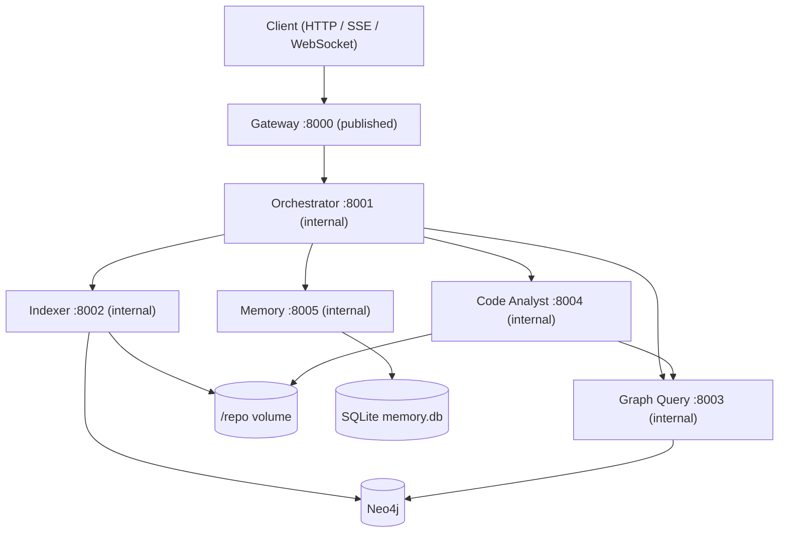
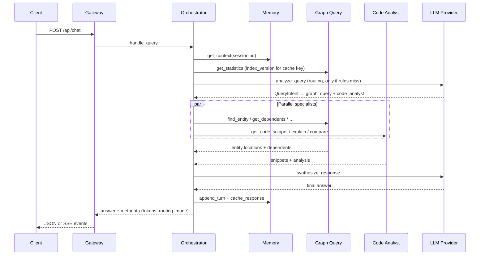

# Walkthrough — FastAPI Repository Chat Agent

Written walkthrough for the assignment submission. It covers the six items the brief asks for: architecture and design decisions, setup, indexing, multi-agent queries, communication and synthesis, and observability.

A timed presenter script for a 10–15 minute recording lives in [docs/walkthrough.md](docs/walkthrough.md). This document is the readable version: you can follow it on a laptop, or treat each section as a chapter of a demo.

---

## What the system does

Users ask natural-language questions about the [FastAPI](https://github.com/fastapi/fastapi) codebase. A FastAPI gateway is the only public surface. Behind it, five independent MCP servers collaborate over a Neo4j knowledge graph of the repo. The orchestrator decides who to call, runs specialists in parallel, and synthesizes one answer with `file:line` citations that resolve to real graph nodes.

Live evaluation (58 labelled turns, 2026-08-20):

| Tier | Pass rate | Notes |
| --- | ---: | --- |
| Simple | 100% | Name and docstring lookups |
| Medium | 92% | Inheritance, validation, scoped patterns |
| Complex | 92% | Lifecycle, DI, compare, design patterns |
| Trap | 100% refusal | Out-of-repo questions are not invented |
| Multi-turn | 88% | Pronouns resolve from session memory |

Citation precision is **1.00** on 50 scored turns: every printed `file:line` is a real node. 54 of 58 turns passed every gate. The two red metrics — entity recall and retrieval correctness, both 0.99 — are left red on purpose. They fail on one conceptual query that is outside the concept-mapping table; adding a dictionary entry would green the score and overfit the eval. Details: [docs/evaluation.md](docs/evaluation.md).

Indexed FastAPI graph (2026-08-18): **1,136 files, 16,372 nodes, 21,550 relationships**.

---

## 1. Architecture and agent design

The outside world talks only to the gateway on port 8000. Five MCP servers run as separate containers on an internal Docker network, each exposing streamable HTTP. That is a deliberate choice over a single process with stdio: each agent can be health-checked, restarted, and scaled on its own.



| Agent | Port | Responsibility |
| --- | --- | --- |
| **Orchestrator** | `:8001` | Classify intent, pick agents, run them concurrently, synthesize one answer, key the response cache, return degraded answers instead of failing the query |
| **Indexer** | `:8002` | Clone the repo, parse Python AST, batch-upsert Neo4j. **Only writer.** |
| **Graph Query** | `:8003` | Read-only guarded Cypher, entity resolution, dependency and import traversal. **Only reader.** |
| **Code Analyst** | `:8004` | Asks Graph Query for coordinates, then reads source from `/repo`. Never opens Neo4j. |
| **Memory** | `:8005` | SQLite session history plus an opaque response cache |

### Design decisions that matter at review time

**Logic lives in `core/`; agent packages are thin FastMCP adapters.** Parsing, Cypher, routing, and prompts are framework-free. Unit tests (`make test`) need no Docker and no API key. The offline suite is 496 passed at 87.25% coverage against a 79% gate.

**Write/read split on Neo4j.** Only Indexer writes. Only Graph Query reads. Code Analyst is a consumer of graph *results*, not a second Cypher client.

**Rules-first routing, LLM on ambiguity.** Simple name lookups never spend a routing call. Ambiguous or long queries escalate. Routing uses `anthropic/claude-sonnet-4.5` (61% routing-trap pass vs 33% for gpt-4.1-mini). Synthesis uses `openai/gpt-4.1-mini` (89% quality, 11.7s p95, $1.18/1k vs sonnet’s 82%, 19.9s, $14.43/1k). Sonnet’s p95 does not fit the ~18s synthesis reserve left after the plan phase. Model choice is measured, not taste. See [docs/design-decisions.md](docs/design-decisions.md).

**Typed graph, not properties stuffed onto a file.** Nodes: Module, Class, Function, Method, Parameter, Decorator, Import, Docstring, File, plus Meta for `index_version`. Relationships: CONTAINS, IMPORTS, INHERITS_FROM, CALLS, DECORATED_BY, HAS_PARAMETER, DOCUMENTED_BY, DEPENDS_ON.

**Degradation instead of a 500.** Partial results are never thrown away. When a specialist returns an error, its `degraded_note` is recorded and the answer is assembled from whatever Graph Query already found, marked `degraded: true`. Bad routing is a 422. Retrieval that succeeded is not discarded because synthesis timed out: the evidence is rendered as markdown and marked `evidence_only`.

One case did not honour that contract at submission time: a specialist whose **container is stopped** returned 503 rather than a degraded 200. It was a defect, not a scope cut, and it is now fixed — the recorded video and the submitted revision still show the 503. Root cause and evidence: [Failure handling](#failure-handling).

**Security defaults for a compose demo.** Secrets are exported, not committed. Compose will not invent a Neo4j password. The gateway API key is also the MCP shared secret, so agents are not callable even on the Docker network. Clone URLs are allowlisted to HTTPS on github.com. Rate limiting covers HTTP routes and every WebSocket message.

Full tool signatures: [docs/architecture.md](docs/architecture.md).

---

## 2. Setup and installation

Prerequisites: Docker Compose, and (for the live LLM path) an OpenRouter API key.

Secrets never go in the committed env files:

```bash
cd /path/to/devopsAgents
cp -n .env.example .env

export OPENROUTER_API_KEY=...          # required for live chat / eval
export NEO4J_PASSWORD=...              # required; compose has no default
export NEO4J_AUTH=neo4j/$NEO4J_PASSWORD
export GATEWAY_API_KEY=dev-gateway-key # compose default; also the MCP secret
```

Bring the stack up. Only port **8000** is published; 8001–8005 stay on the internal network.

```bash
docker compose up --build -d
curl -s http://localhost:8000/api/agents/health | jq .
```

Healthchecks call each agent’s MCP `health` tool, not a TCP port. If Neo4j is down, Graph Query reports unhealthy. Expect every agent at `"status": "ok"` before chatting. Interactive OpenAPI is at `http://localhost:8000/docs`.

Make targets for the rest of this walkthrough:

```bash
make index              # clone + index FastAPI (~minutes first run)
make smoke              # MCP: find_entity("FastAPI") → get_dependents → explain
make prove-incremental  # touch one file, reindex only that file
make test               # offline unit suite, no Docker, no API key
```

Configuration reference (every env var per agent): [docs/configuration.md](docs/configuration.md).

---

## 3. Indexing and knowledge graph

The Indexer clones FastAPI into the `/repo` volume, walks Python files, extracts AST entities, and writes the graph with Cypher `UNWIND` — batched upserts, not one round-trip per node. Default mode is **incremental**: a content hash per file skips anything unchanged. `mode=full` re-parses every file.

Indexing is a background job with a job id, so a slow repo does not hold an HTTP connection open.

```bash
export KEY=dev-gateway-key
export GW=http://localhost:8000

JOB=$(curl -s "$GW/api/index" \
  -H 'Content-Type: application/json' -H "X-API-Key: $KEY" \
  -d '{"mode":"incremental"}' | jq -r '.job_id')
echo "job: $JOB"

curl -s "$GW/api/index/status/$JOB" -H "X-API-Key: $KEY" | jq .
```

When status is `done`, the report carries file counts. Graph statistics expose the `index_version` string that is one component of the response-cache key — a re-index invalidates stale answers automatically.

```bash
curl -s "$GW/api/graph/statistics" -H "X-API-Key: $KEY" | jq .
```

Expected shape after a full FastAPI index: roughly 1,100 files, 16k nodes, 21k relationships, plus `index_version`.

Files that vanish from the tree get their `:File` node detached. Decorator nodes are shared, so rewriting one file does not delete `@app.get` used elsewhere.

**File-granularity incremental proof.** `make prove-incremental` touches one Python file and reindexes only that path. The tree-level report shows most files skipped; the `index_file` report shows `files_seen` 1, `files_indexed` 1, `files_skipped` 0, and nodes written.

```bash
make prove-incremental
```

---

## 4. Example queries (multi-agent collaboration)

These are the nine queries the assignment lists: two simple, three medium, four complex. Use a **fresh** session id. The response cache is keyed on session as well as the query, so a rehearsal run otherwise serves cached answers and latencies look fake.

```bash
export SESSION=demo-$(date +%s)
```

```bash
Q=(
"What is the FastAPI class?"
"Show me the docstring for the Depends function"
"How does FastAPI handle request validation?"
"What classes inherit from APIRouter?"
"Find all decorators used in the routing module"
"Explain the complete lifecycle of a FastAPI request"
"How does dependency injection work and show me examples from the codebase"
"Compare how Path and Query parameters are implemented"
"What design patterns are used in FastAPI's core and why?"
)

n=0
for q in "${Q[@]}"; do
  n=$((n+1))
  jq -nc --arg m "$q" --arg s "$SESSION" '{message:$m,session_id:$s}' \
  | curl -s --max-time 180 "$GW/api/chat" \
      -H 'Content-Type: application/json' -H "X-API-Key: $KEY" -d @- \
  | tee "/tmp/nine-$n.json" \
  | jq -r --arg n "$n" \
      '"\($n)) \(.routing.routing_mode|ascii_upcase)  agents=\(.routing.agents|join("+"))  \(.done.latency_ms)ms  \(.done.tokens.total) tok  degraded=\(.done.degraded)"'
done
```

Two columns matter: **routing mode** and **agent set**. That is the multi-agent claim in one line.

Typical live routing (rules-first; seven of nine never touch the routing LLM):

| # | Query | Mode | Agents | Why |
| --- | --- | --- | --- | --- |
| 1 | What is the FastAPI class? | `RULES` | graph_query | Name lookup |
| 2 | Docstring for Depends | `RULES` | graph_query | Hits carry indexed docstring text |
| 3 | Request validation | `RULES` | graph_query + code_analyst | Conceptual → mapped to concrete symbols |
| 4 | Classes inherit from APIRouter | `RULES` | graph_query | `INHERITS_FROM` traversal |
| 5 | Decorators in the routing module | `RULES` | code_analyst | Path prefix scoped to `fastapi/routing.py` |
| 6 | Complete request lifecycle | `RULES` | graph_query + code_analyst | Mapped to `get_request_handler`, `run_endpoint_function`, `serialize_response` |
| 7 | Dependency injection + examples | `RULES` | graph_query + code_analyst | Mapped to `Depends`, `get_dependant`, `solve_dependencies` |
| 8 | Compare Path and Query | `LLM` | graph_query + code_analyst | Compare-shaped; escalate |
| 9 | Design patterns in core | `LLM` | code_analyst | Ambiguous enough to escalate |

Queries 3 and 6 are the interesting ones. There is no class called `RequestLifecycle`. Conceptual questions are mapped onto identifiers first; without that mapping they retrieve nothing.

Spot-check that answers cite real files, not the model’s memory of FastAPI:

```bash
for n in 1 2 5 8; do
  echo "--- $n"
  jq -r '.answer' "/tmp/nine-$n.json" | grep -oE '[a-zA-Z0-9_/]+\.py' | sort -u | head -4
done
```

Expected paths: (1) `fastapi/applications.py`, (2) `fastapi/param_functions.py`, (5) `fastapi/routing.py`, (8) `fastapi/params.py` and `fastapi/param_functions.py`.

### Traps: refuse instead of invent

Out-of-scope questions (Django ORM, Flask sessions, …) must refuse. If the graph and snippets come back empty, synthesis is skipped entirely — no LLM call, nothing to hallucinate with.

```bash
jq -nc --arg s "$SESSION" \
  '{message:"How does Django ORM lazy-load querysets?",session_id:$s}' \
| curl -s "$GW/api/chat" \
    -H 'Content-Type: application/json' -H "X-API-Key: $KEY" -d @- \
| jq '{tokens: .done.tokens.total, cost: .done.tokens.cost_usd, answer: .answer[0:300]}'
```

Expect: “Not in the indexed FastAPI codebase.”, no invented `django/` paths, **zero tokens**. Six trap cases in the eval set, 100% refusal, zero cost.

---

## 5. How agents communicate and synthesize

A real question on the wire:



The executor waits internally when Code Analyst needs graph coordinates it does not already have. After a round with insufficient evidence, a heuristic refinement expands keywords/entities and missing agents — not a second routing LLM call.

### Streaming: four event types

SSE and WebSocket share the same protocol. `curl -N` matters; without it curl buffers until the end.

```bash
curl -N "$GW/api/chat" \
  -H 'Content-Type: application/json' \
  -H "X-API-Key: $KEY" \
  -d "{\"message\":\"Compare FastAPI and APIRouter implementations, then show who depends on them\",\"session_id\":\"$SESSION\",\"stream\":true}" \
  | tee /tmp/q-complex.sse
```

| Event | What it shows |
| --- | --- |
| `routing` | Agent set and `tools_invoked` — the *executed* plan, not what the router intended |
| `agent_result` | Each orchestrator hop |
| `answer` | Live synthesis tokens as MCP progress notifications, not a blob at the end |
| `done` | Latency, tokens by model and purpose, cost, `correlation_id` |

The orchestrator FastMCP server uses streamable HTTP SSE so synthesis tokens leave the process as MCP progress notifications. Specialists keep JSON responses because they do not stream.

### MCP underneath, not just five HTTP services

```bash
make smoke
```

This opens real MCP sessions against Graph Query and Code Analyst and prints raw tool payloads: `find_entity("FastAPI")` (ranked hits, retrieval tier, file path, line range), then `get_dependents`, then `explain_implementation`. Named tools, typed arguments, structured results. The orchestrator does exactly this, with five agents and synthesis on top.

### Multi-turn over WebSocket

WebSocket is the third transport. Same four events, framed as JSON. Auth and the rate limiter run on the handshake and on every message after it. The second turn is the requirement: **"Who depends on it?"** has no entity in the sentence.

```bash
uv run --package gateway python - <<'PY'
import asyncio, json
from websockets.asyncio.client import connect

async def main():
    hdrs = {"X-API-Key": "dev-gateway-key"}
    async with connect("ws://localhost:8000/ws/chat", additional_headers=hdrs) as ws:
        for msg in ["What is APIRouter?", "Who depends on it?"]:
            print(f"\n>>> {msg}")
            await ws.send(json.dumps({"message": msg, "session_id": "ws-demo-1"}))
            while True:
                ev = json.loads(await ws.recv())
                if ev["type"] == "routing":
                    print("   routing:", ev["data"].get("agents"), ev["data"].get("routing_mode"))
                if ev["type"] == "done":
                    print("   done:", ev["data"]["latency_ms"], "ms")
                    break

asyncio.run(main())
PY
```

The orchestrator pulls the session from Memory, sees `APIRouter` in the previous turn, and carries it onto the pronoun. That is regex plus entity carry, not a coreference model — listed under limitations. Eval: 16 multi-turn cases, 88% pass.

If `additional_headers` errors, older `websockets` used `extra_headers`. SSE is the same event protocol on a different transport.

### Response cache

Ask question 1 again on the same session:

```bash
jq -nc --arg s "$SESSION" '{message:"What is the FastAPI class?",session_id:$s}' \
| curl -s "$GW/api/chat" \
    -H 'Content-Type: application/json' -H "X-API-Key: $KEY" -d @- \
| jq '{cached: .done.cached, latency_ms: .done.latency_ms}'
```

Expect `cached: true` and latency from seconds to under a tenth. Two things miss the cache: re-indexing (`index_version` moves), or the same question from a different session — so one user’s answer never lands in another’s transcript.

---

## 6. Monitoring and observability

### One correlation id across five agents

Every log line is JSON with a `correlation_id`. The gateway mints it; MCP `_meta` carries it into every specialist call. One question, one id, five services. Indexer only joins a *chat* trace when the question asks to reindex (write/read split, not a missing log).

```bash
curl -sD /tmp/q-five.hdr -o /tmp/q-five.json "$GW/api/chat" \
  -H 'Content-Type: application/json' \
  -H "X-API-Key: $KEY" \
  -d "{\"message\":\"Reindex the repository and explain dependency injection examples from the codebase\",\"session_id\":\"$SESSION\"}"

CID=$(awk 'tolower($1)=="x-correlation-id:"{print $2}' /tmp/q-five.hdr | tr -d '\r')
echo "CID=$CID"

docker compose logs --no-color --since 15m \
  orchestrator indexer graph_query code_analyst memory \
  | grep -- "$CID"
```

Five MCP services, one id: orchestrator routing and synthesis, memory context and cache writes, graph lookups, code-analyst explain, and indexer because this query asked to reindex. Grep a compare-query id instead and indexer is empty — expected.

OpenTelemetry spans share the same `correlation_id`. Set `OTEL_EXPORTER_OTLP_ENDPOINT` to export traces.

### Prometheus metrics

Every service exposes `/metrics` behind the API key.

```bash
curl -s "$GW/metrics" -H "X-API-Key: $KEY" \
  | grep -E '^repochat_(llm_tokens|llm_cost|request_duration|synthesis_duration|time_to_first_token|evidence_only|budget_exhausted)' \
  | head -12
```

Counters that matter in production: latency by route, synthesis duration, time to first token, tokens and cost by model and purpose, `repochat_budget_exhausted_total` (which ceiling tripped), and `repochat_evidence_only_total` (how often synthesis fell back to raw evidence).

There is no dashboard. JSON logs, one correlation id, grep, and these counters.

### Failure handling

Health probes are MCP `health` tools rather than TCP checks, so a stopped container fails honestly instead of showing a green port on a dead process.

```bash
docker compose stop code_analyst
sleep 2
curl -s "$GW/api/agents/health" -H "X-API-Key: $KEY" \
  | jq '{status, agents: (.agents|map_values(.status))}'
```

Aggregate status drops to `degraded`, `code_analyst` reports `error`, and Indexer, Graph Query, and Memory stay `ok`. Orchestrator also reports `error` here: its own `health` tool fans out to the stopped specialist and overruns the gateway's 2s probe budget.

Chat during the outage returns the contract: **HTTP 200**, `degraded: true`, and the graph evidence already gathered.

```bash
curl -s -o /tmp/q-degraded.json -w 'HTTP %{http_code}\n' "$GW/api/chat" \
  -H 'Content-Type: application/json' \
  -H "X-API-Key: $KEY" \
  -d "{\"message\":\"How does dependency injection work and show me examples from the codebase (degraded demo)\",\"session_id\":\"$SESSION\"}"

jq '{degraded: .done.degraded, answer: .answer[0:240]}' /tmp/q-degraded.json
```

Measured: HTTP 200 in 21.1s on a cold pool and 19.0s on a warm one, `degraded: true`, ~4,000-character answer built from graph hits alone. Retrieval that succeeded is never thrown away because something downstream failed.

> **Fixed after submission.** This path returned **HTTP 503** after the 90s gateway ceiling in the submitted revision, and the recorded video shows that behaviour. The fix landed on 2026-08-21, after submission; it is described below and tagged in git as the first commit after [`submission-2026-08-21`](#).

**Root cause.** Three defects stacked, and only the third produced the 503.

The orchestrator's specialist calls and the streaming synthesis call both used `asyncio.wait_for`, which waits for a cancelled task to finish — an MCP read that ignores cancellation held the request past every internal deadline. Both now use the cancellation-safe helper in `core/resilience/retry.py`. Separately, the session pool leaked a slot on every abandoned call, and `collect_downstream_health` raced `pool.call` with a second timer of the same length, stranding a session per probe until the bucket deadlocked.

With those fixed the 503 persisted, and the real cause was one exception class. `open_streamable_http_session` wrapped its setup in `except Exception`. The MCP client issues the `initialize` POST from a **child task** inside an `anyio` task group; when the stopped container's DNS entry is gone that child raises `ConnectError`, and anyio cancels the group's scope to unwind — delivering a bare `CancelledError` into the task awaiting `session.initialize()`. `CancelledError` derives from `BaseException`, so the handler never ran: the exit stack was never unwound in the task that entered it, and the cancellation escaped and killed the orchestrator's request task without writing a response. That is why an `asyncio` task dump taken during the hang showed the request task *gone* rather than blocked, and why the caller waited its full ceiling — 90.02s against a 90s `GATEWAY_CHAT_TIMEOUT_S`. The `RuntimeError: Attempted to exit cancel scope in a different task than it was entered in` was the wreckage of the orphaned stack being closed later from the pool's cleanup task, not the cause.

The fix catches `BaseException`, unwinds the stack in the entering task — which uncancels it and re-raises the underlying `ConnectError` — and translates that into a transient `ConnectionError` the existing degradation path already handles. `core/resilience/retry.py` distinguishes the same case defensively: a child that comes back cancelled when the caller was not cancelling it is transport teardown, not our timeout. Genuine caller cancellation still propagates as `CancelledError`; three regression tests in `core/tests/test_orchestration.py` pin both directions.

Restore Code Analyst before moving on:

```bash
docker compose start code_analyst
```

The synthesis-timeout policy is unaffected: evidence already gathered is rendered as markdown and marked `evidence_only`.

---

## What is deliberately unfinished

Scope cuts, each measured and reported by the eval suite rather than hidden. The one entry that was a bug rather than a decision — a stopped specialist returning 503 instead of a degraded 200 — was fixed after submission; see [Failure handling](#failure-handling).

| Limitation | Detail |
| --- | --- |
| `CALLS` edges | Resolved by callee name; no cross-module type inference |
| `find_patterns` | Three templates: decorator, dependency injection, factory |
| Incremental index | Per file, not per line |
| Index job list | In-process dict in the gateway; gone on restart |
| Lexical fallback | Hashing bag-of-words, off by default (`GQ_EMBEDDINGS_ENABLED`) |
| Follow-up “it” | Regex + entity carry, not a coreference model |
| Starlette symbols | No node of their own; we cite the FastAPI module that re-exports them |
| Concept mapping | Three families only (DI, lifecycle, validation). Query `c09` (“how do routing, OpenAPI, and dependencies connect”) is the 0.99 miss |
| Shared API key | Fine for a compose demo, not per-user auth |

The real fix for the red metrics is an embedding tier. The `EmbeddingProvider` protocol is already the seam for it.

---

## If you only run three things

```bash
docker compose up --build -d
make index
make smoke
```

Then one chat:

```bash
curl -s http://localhost:8000/api/chat \
  -H 'Content-Type: application/json' -H 'X-API-Key: dev-gateway-key' \
  -d '{"message":"What is the FastAPI class?","session_id":"demo-1"}' | jq .
```

Five MCP servers, one graph, one correlation id, and citations that resolve to real nodes.
