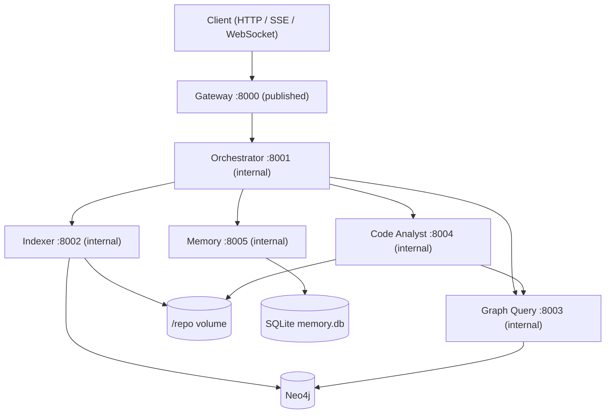
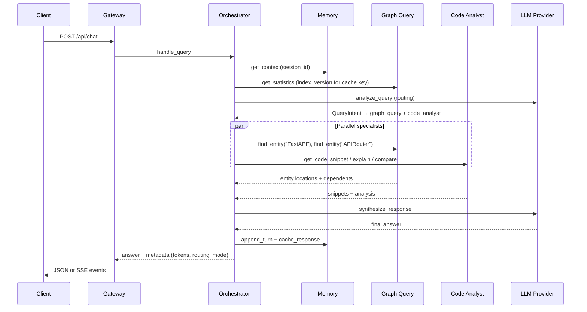

# Architecture

The system indexes a cloned Python repository into a typed Neo4j graph (modules, classes, functions, parameters, decorators, imports, docstrings, and their relationships). Users chat through the gateway; the orchestrator decides which agents to invoke, runs them in parallel where possible, and synthesizes a final answer. Context is queried on demand from the graph and Memory agent rather than baked into static prompt files.

## System diagram

## Complex query sequence

Example: *"Compare FastAPI and APIRouter implementations, then show who depends on them"*

---

## Agents

All agents expose FastMCP tools over streamable HTTP. Business logic lives in `core/`; agent packages are thin adapters.

### Orchestrator (`:8001`)

**Responsibility:** Route queries, execute a specialist set concurrently, synthesize one answer, manage response cache keys (`index_version + session_id + normalized query + resolved-entity fingerprint`), and return degraded answers instead of failing the query when specialists or synthesis fail. After a round with insufficient evidence, a heuristic refinement expands keywords/entities and missing agents (not an LLM replan).

**Tools**

| Tool | Signature | Returns |
| --- | --- | --- |
| `health()` | — | `HealthStatus` |
| `get_conversation_context(session_id, token_budget=3000)` | session + budget | `ConversationContext` |
| `analyze_query(query, context)` | NL query + context | `QueryIntent` (always LLM when called directly) |
| `route_to_agents(intent)` | `QueryIntent` | `ExecutionPlan` |
| `synthesize_response(query, agent_outputs, context)` | query + outputs | `str` |
| `handle_query(query, session_id)` | gateway entrypoint | `{answer, metadata}` |

**Design points:** Rules-first routing with LLM escalation on ambiguity (`ORCH_ROUTING_STRATEGY`, `ORCH_RULES_MAX_QUERY_TOKENS`). Cache lookup before routing. In-process token ledger per correlation ID. MCP client of the other four agents. `ExecutionPlan.agents` is a flat specialist set; the executor waits internally when `code_analyst` needs graph coordinates it does not already have. Comparison-shaped queries (`compare` in the text, including mixed “compare then who depends”) call `find_entity`, `compare_implementations`, and only the relationship tools the question names — not the full explanation/analyze/snippet set. Independent graph neighbor lookups still overlap the comparison call. Synthesis prompts are capped by `ORCH_SYNTHESIS_PROMPT_TOKEN_BUDGET` (order chosen from eval quality under budget pressure: snippet bodies, then long lists). If the synthesis LLM times out or errors after tokens have already been streamed, those tokens are returned as a partial answer (`metadata.partial=true`) instead of discarded. With no emitted tokens, `handle_query` returns an evidence-only markdown answer (`metadata.degraded=true`, `evidence_only=true`, `degraded_reason` = exception class) and the gateway responds HTTP 200 rather than discarding retrieved hits. Module citations omit line ranges (class and function ranges are kept). Coreference on follow-up turns is heuristic (pronoun regex + entity carry from recent user turns and the folded summary). The orchestrator FastMCP server uses streamable HTTP SSE (`json_response=False`) so synthesis tokens can leave the process as MCP progress notifications (`ctx.report_progress`). Specialist agents keep `json_response=True` because they do not stream. The gateway `handle_query` client forwards `progress_callback` through the session pool onto the existing SSE/WebSocket `answer` events. Clients that do not negotiate progress still get post-hoc chunks of the finished answer.

The orchestrator request budget and latency hierarchy — how the request deadline, plan deadline, per-agent timeouts, and synthesis reserve share one wall-clock — is documented in [design-decisions.md](design-decisions.md#request-budget-and-latency-hierarchy).

### Indexer (`:8002`)

**Responsibility:** Clone the target repo, parse Python AST, extract entities/relationships, and batch-upsert into Neo4j. Only agent that writes the graph.

**Tools**

| Tool | Signature | Returns |
| --- | --- | --- |
| `health()` | — | `HealthStatus` |
| `index_repository(repo_url=None, mode="incremental")` | optional URL override; `full` re-parses every file, `incremental` skips unchanged hashes | `IndexReport` |
| `index_file(path)` | repo-relative path | `IndexReport` |
| `parse_python_ast(path_or_code)` | file path or source | `ParsedFile` |
| `extract_entities(path_or_code)` | file path or source | `ExtractedGraph` |
| `get_index_status()` | — | `IndexStatus` (last report + live counts) |

**Design points:** Content-hash incremental indexing at file granularity (`mode="incremental"`, the default). `POST /api/index` `mode="full"` re-parses every file even when hashes match. Stale `:File` nodes whose paths disappeared from the walk are `DETACH DELETE`d. `UNWIND` batched writes. Shared `:Decorator` nodes survive file-subtree deletes. Async lock prevents concurrent full indexes. Default crawl includes `tests/` and `docs/`; set `INDEX_SKIP_TESTS=1` and `INDEX_SKIP_DOCS=1` for a fast profile.

The gateway does not await `index_repository` for the whole pass: that call outlives `GATEWAY_REQUEST_TIMEOUT_S` (default 10s). It fires the dispatch and follows the job by polling `get_index_status` (`GATEWAY_INDEX_POLL_INTERVAL_S`, `GATEWAY_INDEX_START_GRACE_S`, `GATEWAY_INDEX_TIMEOUT_S`). Job ids still live in an in-process gateway dict, so they are lost on restart. After structural upserts, the indexer embeds `Class` / `Function` / `Method` nodes in chunks (`EMBEDDING_BACKEND`, default `hash`) and records `embedding_fingerprint` on `:Meta` so graph_query can refuse a mismatched vector space.

### Graph Query (`:8003`)

**Responsibility:** Read-only Cypher over the knowledge graph. Template queries for common traversals plus guarded ad-hoc Cypher.

**Tools**

| Tool | Signature | Returns |
| --- | --- | --- |
| `health()` | — | `HealthStatus` |
| `find_entity(name, entity_type=None)` | name, phrase, or conceptual query | `EntityQueryResult` (ranked hits tagged `exact` / `fulltext` / `lexical`, each carrying `docstring_text` / `docstring_summary` when the entity is documented) |
| `get_docstring(qualified_name)` | qualified name or short entity name | `DocstringResult` (indexed `Docstring` text for `Module` / `Class` / `Function` / `Method`) |
| `get_dependencies(name)` | qualified name | `NeighborQueryResult` |
| `get_dependents(name)` | qualified name | `NeighborQueryResult` |
| `trace_imports(module, depth=5)` | module + depth cap | `ImportTraceResult` |
| `find_related(name, relationship_type)` | name + rel type | `RelatedQueryResult` |
| `execute_query(cypher, params=None)` | read-only Cypher | `QueryResult` (includes `cypher_executed`, `params`) |
| `get_statistics()` | — | `GraphStatistics` (`index_version`, label/rel counts) |

**Design points:** Write clauses rejected; default `LIMIT` injected. Trusted `CALL db.index.fulltext.queryNodes` is allowed for the `code_search` index over names, qualified names, and docstring text. Trusted `CALL db.index.vector.queryNodes` is allowed for the per-label embedding indexes. `find_entity` runs a cascade: exact name, then identifier re-export resolution via `(:Module)-[:IMPORTS]->(:Import)`, then full-text (package source before tests/docs), then optional vector search when `GQ_EMBEDDINGS_ENABLED=1`.

The re-export tier resolves once per query rather than per import edge: if any import edge joins to a real `Class` / `Function` / `Method` node, only those real nodes are returned (`fastapi.FastAPI` → `fastapi.applications.FastAPI`, one hit, not one per importer). Only when *no* edge resolves — the symbol is defined outside the indexed tree, as `WebSocket`, `JSONResponse`, `CORSMiddleware`, and `Request` are in starlette — does it fall back to the importing `Module` nodes, preferring FastAPI-local ones, so `fastapi/websockets.py` is still attributed. Fallback hits are real `Module` nodes scored 0.6; no coordinate is synthesized.

Hits are ordered by retrieval tier, package vs tests/docs, `fastapi/` locality, and filename affinity to the symbol. Conceptual questions are mapped onto concrete identifiers by `_CONCEPT_ENTITIES` for three families: dependency injection/resolution (`Depends`, `get_dependant`, `solve_dependencies`), request lifecycle (`APIRoute.get_request_handler`, `run_endpoint_function`, `serialize_response`), and request validation (`request_params_to_args`, `request_body_to_args`, `RequestValidationError`). The vector tier still tags hits `lexical`. Default backend is a 256-dim bag-of-words hash (`HashingEmbeddingProvider`); `EMBEDDING_BACKEND=openrouter` swaps in a real model behind the same `EmbeddingProvider` protocol and the same Neo4j vector indexes (`vector.dimensions` 256, cosine). Indexer and graph_query must share one backend: the indexer writes `embedding_fingerprint` on `:Meta`, and a mismatch disables the tier rather than ranking incomparable vectors. `:Meta` also stores `index_version` for cache invalidation.

### Code Analyst (`:8004`)

**Responsibility:** Read source from `/repo` using graph coordinates, run structured LLM analysis (explain, compare, pattern find).

**Tools**

| Tool | Signature | Returns |
| --- | --- | --- |
| `health()` | — | `HealthStatus` |
| `analyze_function(qualified_name)` | e.g. `fastapi.routing.APIRouter` | `FunctionAnalysis` |
| `analyze_class(qualified_name)` | class FQN | `ClassAnalysis` |
| `find_patterns(pattern, path_prefix=None)` | `decorator` \| `dependency_injection` \| `factory`, optionally scoped to a path fragment such as `fastapi/routing.py` | `PatternAnalysis` |
| `get_code_snippet(qualified_name=None, file_path=None, line_start=None, line_end=None)` | name or path range | `SnippetResult` |
| `explain_implementation(qualified_name)` | FQN | `ImplementationExplanation` |
| `compare_implementations(name_a, name_b)` | two FQNs | `ImplementationComparison` |

**Design points:** No direct Neo4j — graph lookup via Graph Query MCP. Path traversal guarded. `find_patterns` supports exactly three fixed Cypher templates, optionally scoped by `path_prefix`; the orchestrator derives that prefix from phrasing such as "in the routing module" (`core/querying/patterns.py`). `compare_implementations` clips each snippet to 120 lines before the LLM call so large class pairs (FastAPI / APIRouter) stay inside the specialist timeout. LLM-backed tools attach `usage` (prompt/completion/total/model) on the MCP payload so the orchestrator can record it in the request token ledger.

### Memory (`:8005`)

**Responsibility:** SQLite-backed session memory (rolling summary + recent turns) and opaque response cache keyed by orchestrator.

**Tools**

| Tool | Signature | Returns |
| --- | --- | --- |
| `health()` | — | `HealthStatus` |
| `append_turn(session_id, role, content)` | user/assistant turn | `{status: ok}` |
| `get_context(session_id, token_budget=3000)` | session + budget | `ConversationContext` |
| `summarize_session(session_id)` | fold older turns | `{summary}` |
| `cache_response(cache_key, response_json)` | caller-computed key | `{status: ok}` |
| `get_cached_response(cache_key)` | key | `CachedResponse \| null` |

**Design points:** Idempotent `folded_at` migration prevents double-summarization. Cache TTL configurable per agent. Data persisted on `memory_data` Docker volume. Multi-turn coreference is heuristic: regex pronoun detection plus entity carry from recent user turns and the folded session summary. It is not model-based resolution.

---

## Graph schema (reference)

**Node labels:** `Module`, `Class`, `Function`, `Method`, `Parameter`, `Decorator`, `Import`, `Docstring`, `File`, `Meta`

**Relationships:** `CONTAINS`, `IMPORTS`, `INHERITS_FROM`, `CALLS`, `DECORATED_BY`, `HAS_PARAMETER`, `DOCUMENTED_BY`, `DEPENDS_ON`

**Vectors:** `Class`, `Function`, and `Method` nodes store `embedding` (256 floats) and `embedding_text`. Three cosine vector indexes (`class_embeddings`, `function_embeddings`, `method_embeddings`) are created with `ensure_schema`. Changing the dimension requires dropping and recreating those indexes.

After indexing FastAPI (2026-08-18, `GET /api/graph/statistics`): 1136 files, 16372 nodes, 21550 relationships, `index_version` `aea924f3e4eb27dfba54c0bd76f871a139f10f2bd709388f7aa2c817a5205e5f`.
